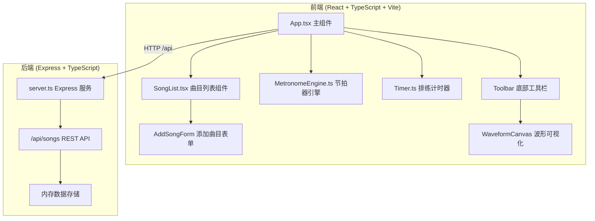
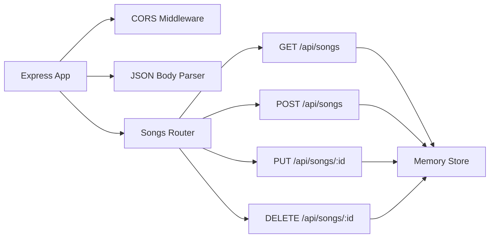
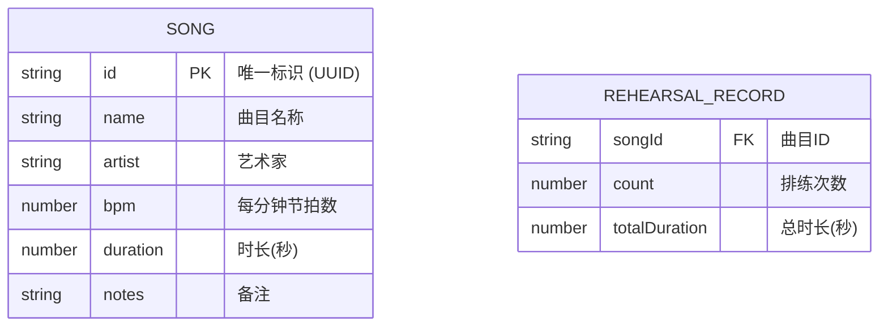

## 1. 架构设计



## 2. 技术描述

- **前端**：React 18 + TypeScript + Vite 5
  - 状态管理：React useState / useReducer / useRef
  - 样式：CSS Modules / 内联样式（遵循设计规范）
  - 音频：Web Audio API（AudioContext, OscillatorNode, GainNode）
  - 动画：CSS transition + 关键帧动画
  - 可视化：Canvas 2D API

- **后端**：Express 4 + TypeScript
  - CORS 支持
  - 内存数组存储曲目数据
  - RESTful API 设计

- **构建工具**：Vite 5
  - 开发端口：5173
  - 代理配置：/api → 后端端口 3001

- **代码组织**：
  - `src/` - 前端源代码
  - `src/components/` - React 组件
  - `server/` - 后端源代码

## 3. 路由定义

| 路由 | 用途 |
|------|------|
| / | 主页面（曲目列表 + 节拍器 + 计时器） |

## 4. API 定义

### 4.1 曲目数据类型

```typescript
interface Song {
  id: string;
  name: string;
  artist: string;
  bpm: number;
  duration: number; // 秒
  notes: string;
}
```

### 4.2 API 接口

| 方法 | 路径 | 描述 | 请求体 | 响应 |
|------|------|------|--------|------|
| GET | /api/songs | 获取所有曲目 | - | Song[] |
| POST | /api/songs | 添加新曲目 | Omit<Song, 'id'> | Song |
| PUT | /api/songs/:id | 更新曲目 | Partial<Song> | Song |
| DELETE | /api/songs/:id | 删除曲目 | - | { success: boolean } |

## 5. 服务器架构图



## 6. 数据模型

### 6.1 数据模型定义



### 6.2 初始数据

后端启动时内置若干示例曲目，方便用户立即体验。

## 7. 性能指标

- **节拍器精度**：±5ms 以内
- **音频缓冲延迟**：不超过 10ms
- **计时器误差**：每小时不超过 1 秒
- **动画帧率**：60fps
- **卡片过渡动画**：0.4秒弹性动画
