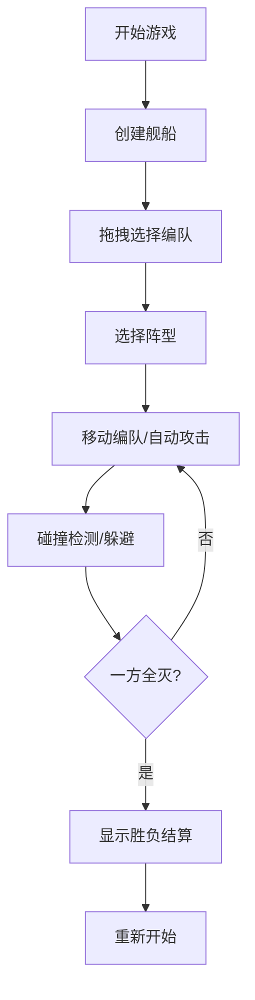

## 1. 产品概述
太空飞船编队对战模拟器是一款实时策略游戏应用，解决多单位协同路径规划与碰撞避免问题。玩家可指挥由战斗机、护卫舰、指挥舰组成的编队进行实时对战。

## 2. 核心功能

### 2.1 功能模块
1. **编队系统**：舰船创建、拖拽选择、编队阵型（三角形、雁形、纵队）、阵型平滑过渡
2. **战斗模拟**：自动攻击、攻击动画、粒子爆炸、碰撞检测
3. **战场状态面板**：实时状态显示、数字滚动动画、胜利/失败弹出层

### 2.2 页面详情
| 页面名称 | 模块名称 | 功能描述 |
|-----------|-------------|---------------------|
| 主游戏界面 | 编队系统 | 创建3种舰船类型，拖拽选择形成编队，支持三种阵型切换 |
| 主游戏界面 | 战斗模拟 | 自动攻击射程内敌方，激光/弹丸动画，粒子爆炸效果 |
| 主游戏界面 | 战场状态面板 | 显示双方总生命值、存活单位、DPS，数字滚动动画 |
| 主游戏界面 | 左侧操作面板 | 舰船创建按钮、阵型选择、编队控制 |
| 主游戏界面 | 右侧战斗日志 | 可滚动战斗日志，时间戳着色区分敌我 |

## 3. 核心流程
玩家进入游戏后，通过左侧操作面板创建不同类型舰船，在战场上拖拽选择多艘舰船形成编队，选择阵型后移动编队，编队自动攻击射程内敌方单位，战斗过程中实时显示战场状态，直至一方编队全灭触发胜负结算。

## 4. 用户界面设计

### 4.1 设计风格
- **主色调**：深空暗蓝 #0a0e27
- **辅助色**：淡蓝色脉冲光环、己方蓝色 #4a9eff、敌方红色 #ff4a4a
- **背景**：星云渐变效果
- **字体**：现代无衬线字体，Orbitron作为标题字体，Roboto作为正文字体
- **图标**：扁平几何风格（圆+三角形组合）
- **特效**：box-shadow脉冲动画2秒周期，backdrop-filter毛玻璃效果

### 4.2 页面设计概述
| 页面名称 | 模块名称 | UI元素 |
|-----------|-------------|-------------|
| 主游戏界面 | Canvas游戏区域 | 星云渐变背景、舰船几何图标、激光动画、粒子爆炸 |
| 主游戏界面 | 左侧操作面板 | 毛玻璃半透明、固定280px宽度、舰船创建按钮组、阵型选择器 |
| 主游戏界面 | 右侧战斗日志 | 可滚动区域、时间戳染色、条目淡入动画 |
| 主游戏界面 | 顶部状态栏 | 双方编队状态、数字滚动动画 |
| 主游戏界面 | 胜负弹出层 | 居中模态框、统计摘要、重新开始按钮 |

### 4.3 响应式
- 桌面优先设计，适配1440x900以上分辨率
- 屏幕宽度≤1280px时，左侧面板改为可折叠图标式
- Canvas自适应窗口大小

### 4.4 Canvas场景设计
- **背景**：多层星云渐变，随机星点闪烁效果
- **舰船**：扁平几何风格，战斗机为三角形+小圆，护卫舰为六边形，指挥舰为大圆+三角形装饰
- **编队高亮**：淡蓝色box-shadow脉冲动画，2秒周期循环
- **攻击效果**：激光束为渐变线条，弹丸为发光小圆，爆炸为放射状粒子

## 5. 性能要求
- 50个单位时帧率≥45FPS
- 碰撞检测每帧≤1ms
- 阵型切换过渡时间2秒
- 攻击动画持续0.3秒
- 数字滚动动画0.5秒
