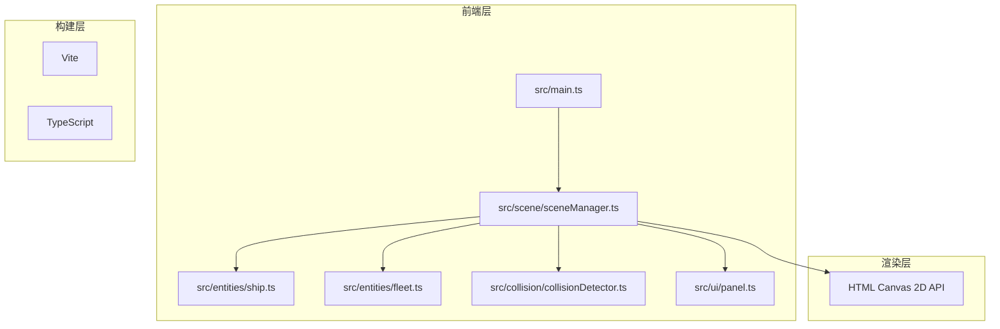

## 1. 架构设计



## 2. 技术栈
- **前端**：TypeScript + Vite + Canvas 2D API
- **构建工具**：Vite 5.x
- **语言**：TypeScript 5.x (严格模式，target ES2020)
- **无后端**：纯前端应用

## 3. 文件结构

```
e:\solo\SoloAutoDemoDuo\tasks\auto4\
├── package.json
├── vite.config.js
├── tsconfig.json
├── index.html
└── src/
    ├── main.ts
    ├── scene/
    │   └── sceneManager.ts
    ├── entities/
    │   ├── ship.ts
    │   └── fleet.ts
    ├── collision/
    │   └── collisionDetector.ts
    └── ui/
        └── panel.ts
```

## 4. 核心数据模型

### 4.1 舰船类型定义
```typescript
type ShipType = 'fighter' | 'frigate' | 'command';

interface ShipStats {
    speed: number;
    maxHealth: number;
    damage: number;
    attackRange: number;
    attackSpeed: number;
    size: number;
}

const SHIP_STATS: Record<ShipType, ShipStats> = {
    fighter: { speed: 4, maxHealth: 50, damage: 10, attackRange: 150, attackSpeed: 0.5, size: 12 },
    frigate: { speed: 2.5, maxHealth: 150, damage: 25, attackRange: 200, attackSpeed: 1, size: 18 },
    command: { speed: 1.5, maxHealth: 300, damage: 40, attackRange: 250, attackSpeed: 1.5, size: 24 }
};
```

### 4.2 阵型类型
```typescript
type FormationType = 'triangle' | 'wedge' | 'column';
```

### 4.3 舰船类
```typescript
interface Ship {
    id: string;
    type: ShipType;
    team: 'player' | 'enemy';
    x: number;
    y: number;
    targetX: number;
    targetY: number;
    health: number;
    maxHealth: number;
    speed: number;
    damage: number;
    attackRange: number;
    attackSpeed: number;
    lastAttackTime: number;
    fleet: Fleet | null;
    formationOffset: { x: number; y: number };
    isSelected: boolean;
}
```

### 4.4 编队类
```typescript
interface Fleet {
    id: string;
    ships: Ship[];
    formation: FormationType;
    centerX: number;
    centerY: number;
    targetX: number;
    targetY: number;
    team: 'player' | 'enemy';
    formationTransition: number;
    isUnderAttack: boolean;
}
```

### 4.5 碰撞检测
```typescript
interface AABB {
    x: number;
    y: number;
    width: number;
    height: number;
}

interface CollisionPair {
    a: Ship;
    b: Ship;
}
```

## 5. 性能优化策略

### 5.1 碰撞检测优化
- 使用空间网格划分（Spatial Grid）将战场划分为网格，只检测相邻网格内的单位
- AABB碰撞检测，避免复杂几何计算
- 碰撞检测循环控制在1ms以内

### 5.2 渲染优化
- Canvas 2D批量绘制，减少状态切换
- 离屏Canvas预渲染背景星云
- 对象池复用粒子和攻击效果

### 5.3 帧率控制
- requestAnimationFrame固定60FPS
- 固定时间步长更新逻辑，与渲染分离
- 50单位时确保≥45FPS

## 6. UI组件定义

### 6.1 左侧操作面板
- 固定宽度280px，backdrop-filter: blur(8px)
- 舰船创建按钮（战斗机、护卫舰、指挥舰）
- 阵型选择器（三角形、雁形、纵队）
- 编队控制按钮

### 6.2 右侧战斗日志
- 可滚动区域，最大高度600px
- 日志条目：时间戳 + 事件描述
- 己方蓝色#4a9eff，敌方红色#ff4a4a

### 6.3 顶部状态栏
- 双方编队总生命值（带数字滚动动画）
- 存活单位数
- 单位DPS

### 6.4 胜负弹出层
- 居中模态框
- 胜利/失败标题
- 统计摘要（击杀数、存活数、战斗时长）
- 重新开始按钮
