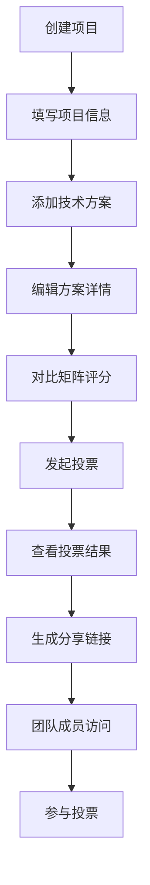

## 1. 产品概述

项目技术方案对比报告应用，帮助独立开发者和小型项目团队在技术选型阶段快速生成多方案对比报告，解决手动整理优劣耗时、团队决策缺乏统一视图的问题。

- **核心目标**：提供直观的技术方案对比平台，支持多维度评分、团队投票和结果可视化
- **目标用户**：独立开发者、技术负责人、小型项目团队
- **市场价值**：提升技术选型效率，减少决策偏差，促进团队共识

## 2. 核心功能

### 2.1 用户角色

| 角色 | 注册方式 | 核心权限 |
|------|----------|----------|
| 创建者 | 无需注册，本地身份 | 创建/编辑项目、添加方案、发起投票、生成分享链接 |
| 参与者 | 通过分享链接访问 | 查看对比矩阵、参与投票、查看结果统计 |

### 2.2 功能模块

1. **项目创建页面**：项目基本信息录入、技术方案管理
2. **对比矩阵页面**：多维度评分矩阵、响应式布局切换
3. **投票结果页面**：投票统计、可视化图表展示
4. **分享功能**：生成唯一短码链接、权限控制

### 2.3 页面详情

| 页面名称 | 模块名称 | 功能描述 |
|----------|----------|----------|
| 项目创建页 | 项目信息表单 | 名称（20字限制）、描述（150字限制）输入 |
| 项目创建页 | 方案卡片列表 | 可折叠卡片，支持增删改，包含名称、版本、优劣势、标签 |
| 对比矩阵页 | 评分矩阵 | 1-5星评分，多维度对比，悬停详情气泡 |
| 对比矩阵页 | 响应式布局 | 900px以下降级为卡片堆叠模式，横向滚动 |
| 投票页 | 投票操作 | 支持/反对/弃权三种投票选项 |
| 投票页 | 饼图统计 | Canvas绘制，支持hover高亮显示百分比 |
| 投票页 | 条形排行图 | 按票数降序，颜色渐变，0.5s动画切换 |
| 分享页 | 访问控制 | 只读模式，显示创建者水印 |

## 3. 核心流程

### 主流程描述
用户创建对比项目 → 添加多个技术方案 → 进入对比矩阵进行多维度评分 → 发起团队投票 → 查看投票结果和可视化图表 → 生成分享链接 → 团队成员通过链接查看和投票

## 4. 用户界面设计

### 4.1 设计风格
- **主色调**：#3b82f6（蓝色）
- **辅助色**：#818cf8（浅紫蓝）
- **中性色**：#f1f5f9（浅灰背景）、#ffffff（卡片背景）
- **评分星标**：选中#f59e0b（琥珀色），未选中#d1d5db（灰色）
- **标签样式**：圆角胶囊，背景#e0e7ff，文字#4338ca
- **条形图渐变色**：从#10b981（绿色）到#f59e0b（琥珀色）

### 4.2 组件样式
- **按钮**：圆角8px，点击涟漪扩散动画0.3s
- **卡片**：背景#ffffff，圆角12px，阴影0 2px 8px rgba(0,0,0,0.06)，悬停上浮2px加深阴影
- **列表过渡**：增删时淡入淡出0.4s ease，左滑删除效果
- **图表动画**：条形排名变化0.5s平滑过渡

### 4.3 页面设计概述

| 页面名称 | 模块名称 | UI元素 |
|----------|----------|--------|
| 项目创建页 | 表单区域 | 输入框、标签、限制字数提示 |
| 项目创建页 | 方案卡片 | 折叠展开按钮、版本号、优劣势列表、标签胶囊 |
| 对比矩阵页 | 左侧列表 | 350px固定宽度，背景#f8fafc，滚动区域 |
| 对比矩阵页 | 右侧矩阵 | 自适应网格，星标评分，悬停气泡 |
| 投票页 | 图表区域 | Canvas饼图、条形排行图，hover交互 |
| 分享页 | 顶部栏 | 项目名称、创建时间、只读标识 |
| 分享页 | 底部水印 | "由XXX创建"半透明文字 |

### 4.4 响应式设计
- **桌面端（1200px+）**：左右分栏布局，矩阵完整显示
- **平板端（900-1200px）**：分栏布局，矩阵保持网格
- **移动端（<900px）**：矩阵降级为卡片堆叠，横向滚动
- **移动端（<768px）**：单列布局，列表和矩阵垂直排列

### 4.5 动效设计
- **页面加载**：元素渐入，列表项staggered动画
- **卡片悬停**：上浮2px，阴影加深，0.2s过渡
- **按钮点击**：涟漪扩散效果，0.3s完成
- **列表操作**：新增淡入左移，删除右滑淡出
- **图表更新**：条形位置平滑过渡，饼图扇区高亮
