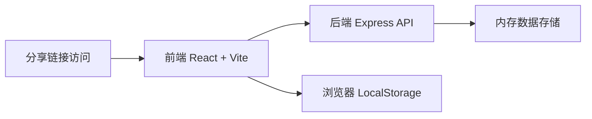
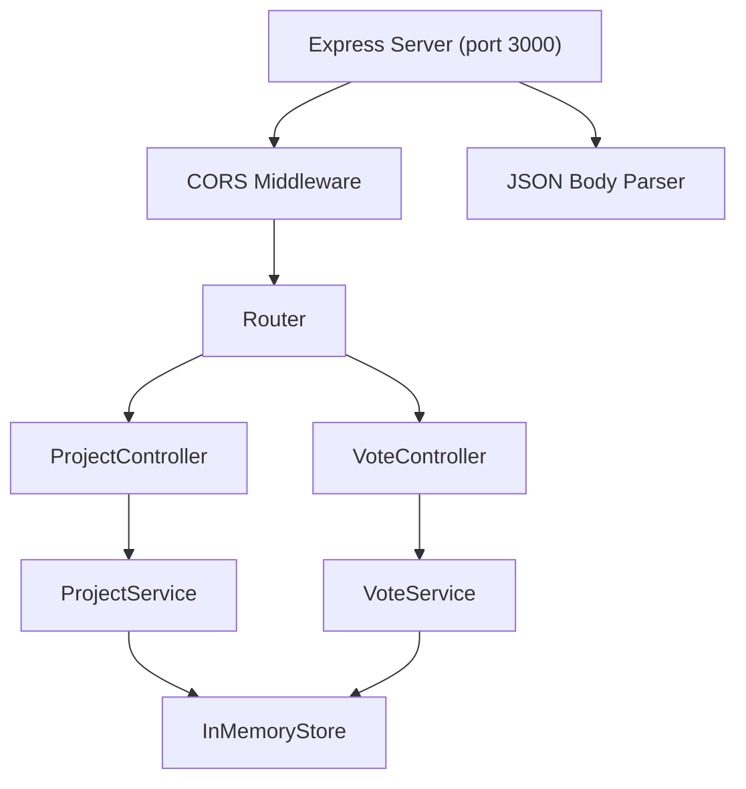
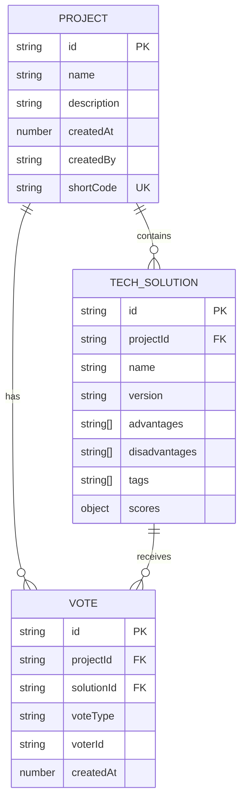

## 1. 架构设计



## 2. 技术描述

- **前端框架**：React 18 + TypeScript 5
- **构建工具**：Vite 5
- **样式方案**：原生CSS + CSS Modules
- **后端框架**：Express 4 + TypeScript
- **运行时**：Node.js 18+
- **数据存储**：后端内存数组（模拟持久化）
- **通信协议**：REST API + JSON
- **图表方案**：Canvas 2D API 原生绘制

## 3. 路由定义

| 路由 | 页面组件 | 功能 |
|------|----------|------|
| `/` | App.tsx | 项目列表/创建入口 |
| `/projects/:id` | ComparisonMatrix | 对比矩阵页面 |
| `/projects/:id/vote` | VotePage | 投票与结果统计页面 |
| `/share/:shortCode` | ComparisonMatrix（只读） | 分享访问页面 |

## 4. API 定义

### TypeScript 类型定义

```typescript
interface TechSolution {
  id: string;
  name: string;
  version: string;
  advantages: string[];
  disadvantages: string[];
  tags: string[];
  scores: {
    [dimension: string]: {
      rating: number; // 1-5
      description: string;
    };
  };
}

interface Project {
  id: string;
  name: string;
  description: string;
  createdAt: number;
  createdBy: string;
  shortCode: string;
  solutions: TechSolution[];
  votes: {
    solutionId: string;
    voteType: 'support' | 'oppose' | 'abstain';
    voterId: string;
  }[];
}

interface CreateProjectRequest {
  name: string;
  description: string;
  createdBy: string;
  solutions: Omit<TechSolution, 'id'>[];
}

interface VoteRequest {
  solutionId: string;
  voteType: 'support' | 'oppose' | 'abstain';
  voterId: string;
}
```

### API 接口列表

| 方法 | 路径 | 描述 | 请求体 | 响应 |
|------|------|------|--------|------|
| POST | `/projects` | 创建项目 | `CreateProjectRequest` | `{ id: string, shortCode: string }` |
| GET | `/projects/list` | 获取项目列表 | - | `Project[]` |
| GET | `/projects/:id` | 获取项目详情 | - | `Project` |
| POST | `/projects/:id/votes` | 提交投票 | `VoteRequest` | `{ success: boolean }` |
| GET | `/projects/:id/votes` | 获取投票结果 | - | `VoteResult` |
| GET | `/share/:shortCode` | 通过短码获取项目 | - | `Project` |

## 5. 服务器架构图



## 6. 数据模型

### 6.1 数据模型定义



### 6.2 内存数据结构

```typescript
// server/index.ts 内存存储
interface Store {
  projects: Project[];
  shortCodeMap: { [shortCode: string]: string }; // shortCode -> projectId
}

const store: Store = {
  projects: [],
  shortCodeMap: {}
};

// 生成唯一短码
function generateShortCode(): string {
  return Math.random().toString(36).substring(2, 8).toUpperCase();
}
```

## 7. 性能优化策略

### 7.1 渲染性能
- 使用 `React.memo` 包装矩阵单元格组件，避免不必要重渲染
- 使用 `useMemo` 缓存计算后的矩阵布局数据
- 星标评分组件使用纯函数组件，最小化props传递

### 7.2 动画性能
- 所有CSS动画使用 `transform` 和 `opacity`，避免触发重排
- Canvas图表使用 `requestAnimationFrame` 进行动画帧同步
- 列表过渡使用CSS `transition` 而非JS动画

### 7.3 响应式优化
- 使用 CSS `container queries` 和 `media queries` 组合
- 矩阵布局切换使用CSS Grid `auto-fit` 自适应
- 移动端禁用不必要的阴影和动画效果

## 8. 文件组织结构

```
auto1/
├── package.json
├── index.html
├── vite.config.js
├── tsconfig.json
├── server/
│   └── index.ts
└── src/
    ├── App.tsx
    ├── components/
    │   ├── ComparisonMatrix.tsx
    │   ├── ProjectForm.tsx
    │   └── VotePage.tsx
    └── utils/
        └── api.ts
```

## 9. 构建与启动

- **安装依赖**：`npm install`
- **开发启动**：`npm run dev`（同时启动前端Vite和后端Express）
- **前端端口**：5173（Vite默认）
- **后端端口**：3000
- **代理配置**：Vite代理 `/api` 到 `http://localhost:3000`
