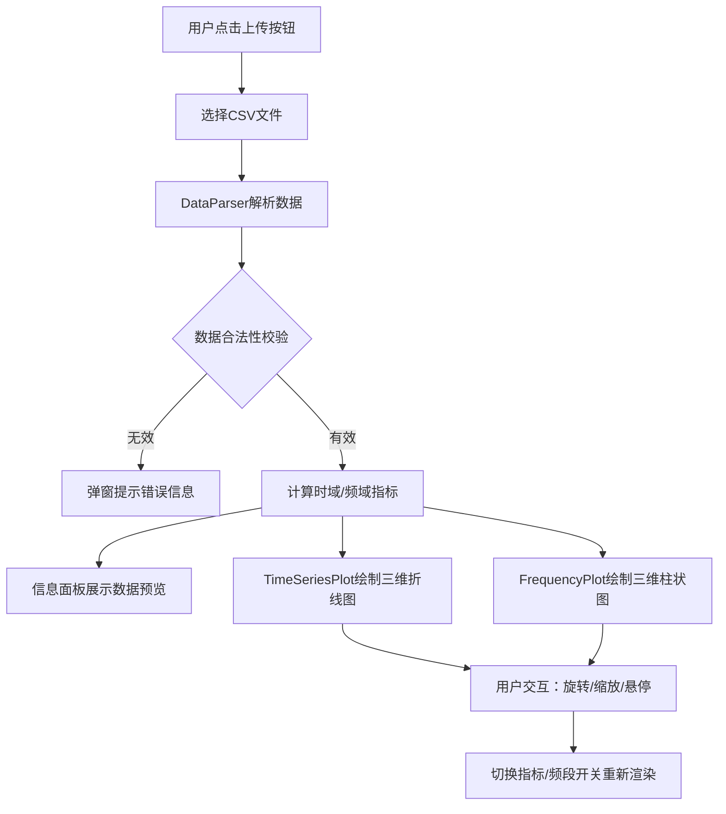

## 1. 产品概述

心率变异性(HRV)三维可视化分析应用，专为医疗研究人员和健康数据分析师设计，提供直观的三维交互界面用于分析心跳间隔数据的时域和频域特征。产品核心价值在于将抽象的生理指标转化为可交互的三维空间可视化，帮助用户快速发现数据规律和异常模式。

## 2. 核心功能

### 2.1 用户角色
| 角色 | 注册方式 | 核心权限 |
|------|----------|----------|
| 普通用户 | 无需注册，直接使用 | 上传数据、查看三维可视化、调节视图参数 |

### 2.2 功能模块
1. **主场景页面**：三维可视化画布、控制面板、数据信息面板
2. **数据解析模块**：CSV文件上传、格式校验、HRV指标计算
3. **时域可视化模块**：三维折线图展示RR间隔与时域指标
4. **频域可视化模块**：三维柱状图展示VLF/LF/HF频段功率分布

### 2.3 页面详情
| 页面名称 | 模块名称 | 功能描述 |
|----------|----------|----------|
| 主场景 | 三维画布 | Three.js渲染场景，支持拖拽旋转、滚轮缩放、右键平移 |
| 主场景 | 控制面板 | 文件上传、时域指标选择、频段开关、重置视角 |
| 主场景 | 信息面板 | 数据预览列表、时域/频域指标数值展示 |
| 主场景 | 时域折线图 | RR间隔序列三维可视化，支持数据点悬停提示 |
| 主场景 | 频域柱状图 | 多时间窗功率谱三维展示，LF/HF比值曲线叠加 |

## 3. 核心流程

用户操作流程：上传CSV文件 → 系统解析校验 → 数据预览展示 → 三维场景渲染时域/频域图表 → 用户交互探索（旋转/缩放/切换指标）

## 4. 用户界面设计

### 4.1 设计风格
- **主色调**：深蓝黑色渐变背景(#08081a到#0f0f2a)，科技感深色主题
- **强调色**：亮青色(#00e5ff)用于折线和按钮激活态，亮绿色(#4ade80)用于LF/HF曲线，蓝红渐变(#1e3a5f到#ff6b6b)用于功率柱体
- **按钮样式**：圆角设计，0.2s hover过渡，激活态亮青边框+发光效果
- **字体**：Inter字体，14px(主体)/12px(数据)，等宽字体(monospace)用于数值显示
- **布局风格**：全屏沉浸式三维场景，右侧悬浮控制面板，右下角信息面板，浮动式UI层

### 4.2 页面设计概述
| 页面名称 | 模块名称 | UI元素 |
|----------|----------|--------|
| 主场景 | 三维画布 | Three.js WebGL渲染器，占屏幕左侧 calc(100vw - 320px) × 100vh |
| 主场景 | 控制面板 | 半透明深色rgba(10,10,30,0.85)，圆角12px，宽280px，距顶部80px右侧20px |
| 主场景 | 信息面板 | rgba(20,20,50,0.9)背景，圆角8px，宽300px高200px，#333描边，固定底部右侧 |
| 主场景 | 时域折线 | 亮青色#00e5ff渐变透明度折线，3px白色发光数据点，白色网格线+浅灰刻度 |
| 主场景 | 频域柱体 | 蓝到红渐变柱体，亮绿色LF/HF比值曲线，时间窗步长滑块 |

### 4.3 响应式设计
- 桌面端优先设计，最小支持1280×720分辨率
- 控制面板固定定位，三维画布自适应剩余空间
- 触控设备支持：单指旋转、双指缩放

### 4.4 3D场景指导
- **环境氛围**：深蓝色宇宙/科技舱氛围，雾效增强空间深度感
- **光照设置**：环境光(0.3强度) + 方向光(0.8强度，从右上方照射) + 点光源增强数据点发光效果
- **相机设置**：PerspectiveCamera(60° FOV)，初始位置距离场景中心约150单位，观察角30°俯角
- **相机运动**：欧拉角旋转(灵敏度0.005)，滚轮缩放(0.5x~3x)，右键平移，平滑阻尼过渡
- **构图与焦点**：时域图居左，频域图居右，两图间距适中，整体重心偏左
- **交互与动画**：数据点悬停放大+高亮，视角切换平滑动画，柱体高度过渡动画
- **后处理效果**：轻微Bloom发光效果增强科技感，FXAA抗锯齿
- **性能预算**：单帧draw call < 50，5000数据点时帧率稳定60FPS
