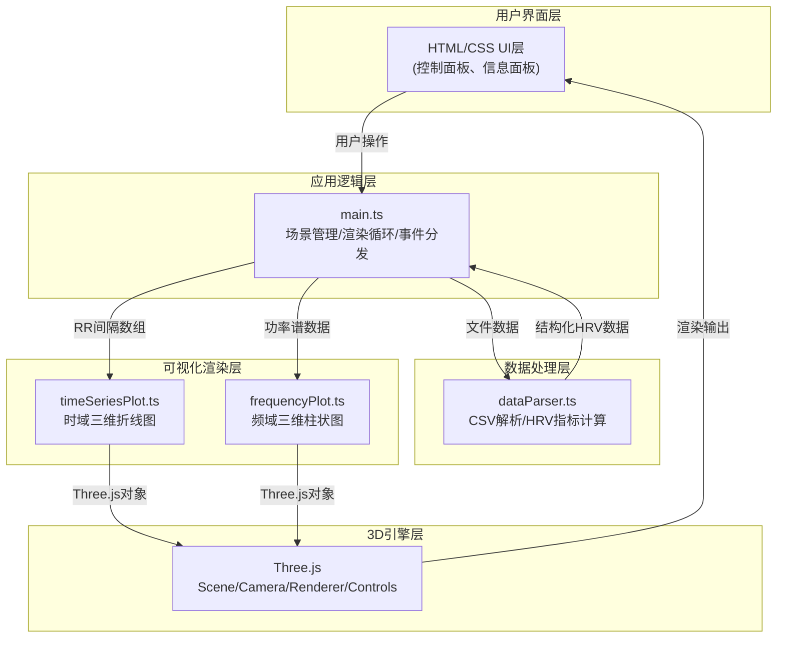

## 1. 架构设计



## 2. 技术描述

- **前端框架**：原生TypeScript (ES2020目标，严格模式)
- **构建工具**：Vite 5.x
- **3D渲染引擎**：Three.js r160+
- **数据解析**：PapaParse 5.x (CSV解析)
- **项目初始化工具**：vite-init (vanilla-ts模板)

## 3. 文件结构定义

| 文件路径 | 职责说明 |
|----------|----------|
| package.json | 项目依赖配置，包含 three、typescript、vite、@types/three、papaparse |
| vite.config.js | Vite构建配置，开发服务器端口、资源路径 |
| tsconfig.json | TypeScript配置，strict模式，target ES2020，module ESNext |
| index.html | 入口HTML，引入main.ts，包含canvas容器、控制面板、信息面板DOM结构 |
| src/main.ts | 应用入口：Three.js场景初始化、相机控制、渲染循环、UI事件绑定、数据流向调度 |
| src/dataParser.ts | CSV文件解析、RR间隔数据提取、SDNN/RMSSD/pNN50时域指标计算、基于FFT的频域功率谱估计(VLF/LF/HF) |
| src/timeSeriesPlot.ts | 三维折线图类：X轴心跳序号、Y轴间隔ms、Z轴时域指标，折线渐变透明度、数据点发光、悬停Tooltip、坐标轴网格线 |
| src/frequencyPlot.ts | 三维柱状图类：X轴频段标签、Y轴功率值、Z轴时间窗序号，柱体蓝红渐变色，LF/HF比值绿色曲线，步长滑块 |

## 4. 核心数据模型

### 4.1 TypeScript 类型定义

```typescript
interface RRIntervalData {
    index: number;
    timestamp?: number;
    interval: number;
    sdnn?: number;
    rmssd?: number;
    pnn50?: number;
}

interface FrequencyBand {
    vlf: number;
    lf: number;
    hf: number;
    lfHfRatio: number;
}

interface WindowedFrequencyData {
    windowIndex: number;
    bands: FrequencyBand;
}

interface HRVAnalysisResult {
    rrIntervals: number[];
    timeDomain: {
        sdnn: number;
        rmssd: number;
        pnn50: number;
        perPoint: { sdnn: number; rmssd: number; pnn50: number }[];
    };
    frequencyDomain: WindowedFrequencyData[];
    isValid: boolean;
    errorMessage?: string;
}

type TimeDomainMetric = 'sdnn' | 'rmssd' | 'pnn50';
```

## 5. 性能优化策略

### 5.1 Three.js 渲染优化
- 使用 `BufferGeometry` 而非 `Geometry`，减少内存占用和draw call
- 数据点使用 `InstancedMesh` 批量渲染，而非独立Mesh
- 折线使用单条 `Line` + `BufferAttribute` 存储顶点数据
- 启用 `renderer.setPixelRatio(Math.min(window.devicePixelRatio, 2))` 平衡画质与性能

### 5.2 数据处理优化
- HRV指标计算使用滑动窗口算法，避免重复计算
- FFT运算在512~2048点窗口内执行，超过部分降采样
- 大数据量(>2000点)自动启用抽稀策略，屏幕每像素最多1个数据点

### 5.3 交互流畅度
- 相机控制采用阻尼插值算法，避免抖动
- 所有UI事件使用 requestAnimationFrame 同步到渲染循环
- 鼠标拾取使用 Raycaster 每帧最多执行1次，闲置时降低频率
