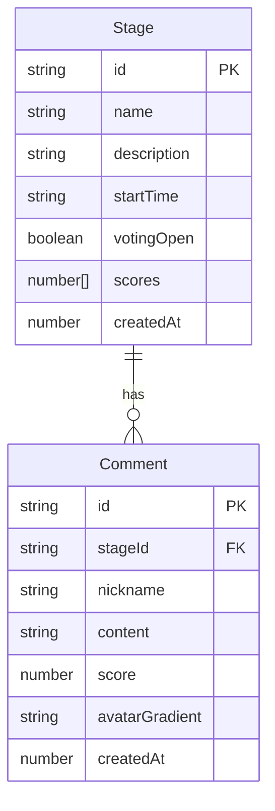

## 1. 架构设计

```mermaid
flowchart TB
    subgraph "前端 (React+Vite)"
        "LiveDashboard" --> "GET /api/stages"
        "LiveDashboard" --> "GET /api/comments"
        "VotingPanel" --> "POST /api/stages/:id/vote"
        "VotingPanel" --> "POST /api/comments"
        "AdminPanel" --> "GET /api/stages"
        "AdminPanel" --> "POST /api/stages"
        "AdminPanel" --> "POST /api/stages/:id/toggle"
    end
    subgraph "后端 (Express)"
        "REST API路由" --> "内存Map存储"
    end
    "前端" -->|"REST API"| "后端"
```

## 2. 技术说明

- **前端**：React@18 + TypeScript + Vite + TailwindCSS + Zustand
- **初始化工具**：vite-init (react-express-ts 模板)
- **后端**：Express@4 + TypeScript + cors + body-parser + uuid
- **数据库**：内存Map模拟持久化（无需真实数据库）
- **通信方式**：REST API（前端轮询后端获取实时数据）

## 3. 路由定义

| 路由 | 用途 |
|------|------|
| `/` | 主看板页面（热力图+评论墙+投票入口） |
| `/admin` | 后台管理面板 |

## 4. API 定义

### 4.1 舞台相关

**GET /api/stages**
- 响应：`Stage[]`
- 用途：查询所有舞台信息

**POST /api/stages**
- 请求体：`{ name: string; description: string; startTime: string }`
- 响应：`Stage`
- 用途：创建新舞台

**POST /api/stages/:id/toggle**
- 响应：`Stage`
- 用途：切换舞台投票开启/关闭状态

**POST /api/stages/:id/vote**
- 请求体：`{ score: number; seatNumber: string }`
- 响应：`{ success: boolean; message: string }`
- 用途：提交评分

**GET /api/ratings**
- 响应：`{ stages: StageRatings[] }`
- 用途：获取所有舞台评分数据（含平均分、投票人数、最高分）

### 4.2 评论相关

**GET /api/comments**
- 查询参数：`?stageId=xxx`（可选）
- 响应：`Comment[]`
- 用途：获取评论列表

**POST /api/comments**
- 请求体：`{ stageId: string; nickname: string; content: string; score: number }`
- 响应：`Comment`
- 用途：提交评论

### 4.3 类型定义

```typescript
interface Stage {
  id: string;
  name: string;
  description: string;
  startTime: string;
  votingOpen: boolean;
  scores: number[];
  createdAt: number;
}

interface StageRatings {
  stageId: string;
  stageName: string;
  averageScore: number;
  voteCount: number;
  maxScore: number;
}

interface Comment {
  id: string;
  stageId: string;
  nickname: string;
  content: string;
  score: number;
  avatarGradient: string;
  createdAt: number;
}
```

## 5. 服务器架构

```mermaid
flowchart LR
    "Express路由层" --> "业务逻辑层"
    "业务逻辑层" --> "内存存储层"
    subgraph "内存存储层"
        "stages: Map<string, Stage>"
        "comments: Comment[]"
    end
```

## 6. 数据模型

### 6.1 数据模型定义



### 6.2 数据定义

- 舞台数据存储在 `Map<string, Stage>` 中，键为舞台ID
- 评论数据存储在 `Comment[]` 数组中
- 评分数据嵌套在 `Stage.scores` 数组中
- 最多支持10个舞台同时在线
- 每个舞台可独立开启/关闭投票功能

## 7. 文件结构与调用关系

```
project/
├── package.json              # 依赖与启动脚本
├── vite.config.js            # Vite构建配置
├── tsconfig.json             # TypeScript严格模式配置
├── index.html                # 入口HTML页面
├── src/
│   ├── main.tsx              # React入口，渲染App
│   ├── App.tsx               # 路由配置（/ → LiveDashboard, /admin → AdminPanel）
│   ├── pages/
│   │   ├── LiveDashboard.tsx # 主看板页面 → 调用 GET /api/stages, GET /api/comments
│   │   └── AdminPanel.tsx    # 后台管理面板 → 调用 GET/POST /api/stages, POST /api/stages/:id/toggle
│   ├── components/
│   │   ├── HeatMap.tsx       # 热力图组件 → 接收stages数据，渲染渐变色网格
│   │   ├── CommentWall.tsx   # 评论墙组件 → 接收comments数据，渲染滚动列表
│   │   ├── VotingPanel.tsx   # 投票组件 → 调用 POST /api/stages/:id/vote, POST /api/comments
│   │   └── StarRating.tsx    # 星形评分组件 → 纯UI组件，返回选中星级
│   ├── store/
│   │   └── useAppStore.ts    # Zustand全局状态管理
│   └── utils/
│       └── api.ts            # API请求封装函数
├── server/
│   └── index.ts              # Express服务器，提供所有REST API，内存Map存储
└── shared/
    └── types.ts              # 前后端共享类型定义
```

**数据流向**：
- LiveDashboard 挂载时调用 `GET /api/stages` 获取所有舞台评分，每5秒轮询更新热力图
- LiveDashboard 每3秒轮询 `GET /api/comments` 获取新评论，新评论淡入显示
- VotingPanel 提交评分时调用 `POST /api/stages/:id/vote`，提交评论时调用 `POST /api/comments`
- AdminPanel 提交 `POST /api/stages` 创建舞台，点击开关调用 `POST /api/stages/:id/toggle`
