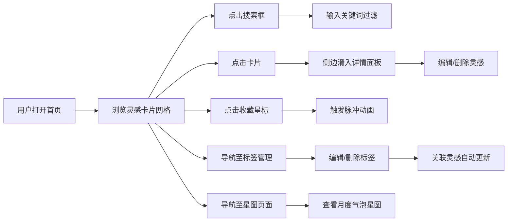

## 1. 产品概述

灵感碎片收纳盒是一款帮助用户捕捉、整理和可视化创意灵感的全栈应用。用户可以随时记录一闪而过的创意想法，通过标签分类管理，系统每月自动生成可视化灵感星图，让创意的积累过程变得直观且富有美感。

- **核心价值**：解决创意灵感稍纵即逝的痛点，提供美观、高效的灵感记录与可视化体验
- **目标用户**：创意工作者、设计师、开发者、学生等需要频繁记录想法的人群

## 2. 核心功能

### 2.1 用户角色
| 角色 | 注册方式 | 核心权限 |
|------|----------|----------|
| 普通用户 | 无需注册（本地数据） | 记录、编辑、删除灵感；管理标签；查看星图 |

### 2.2 功能模块
1. **首页**：网格卡片展示灵感列表、搜索过滤、卡片收藏、点击查看详情
2. **灵感详情页**：侧边滑入面板、内容展示、编辑删除操作
3. **标签管理页**：标签列表展示、编辑标签名称/颜色、删除标签自动归类
4. **灵感星图页**：Canvas 气泡图、标签密度可视化、粒子动画效果

### 2.3 页面详情
| 页面名称 | 模块名称 | 功能描述 |
|----------|----------|----------|
| 首页 | 卡片网格 | 220px 宽度卡片、深浅交替背景、悬停上移动效、标签徽章、收藏星标 |
| 首页 | 搜索框 | 右上角浮动搜索、关键词即时过滤、搜索历史下拉、焦点展开动画 |
| 灵感详情 | 侧边面板 | 420px 右侧滑入、标题/内容/时间/图片展示、编辑删除按钮 |
| 标签管理 | 标签列表 | 胶囊形状标签、编辑名称颜色、删除后关联灵感自动标记"未分类" |
| 灵感星图 | 气泡图 | 深蓝背景、气泡大小表示灵感数量、半透明连线、悬停信息框、粒子闪烁 |

## 3. 核心流程

## 4. 用户界面设计

### 4.1 设计风格
- **主色调**：浅色系背景（#ffffff），卡片深浅交替（#fafafa / #f0f4ff）
- **强调色**：标签色板（#ff6b6b、#4ecdc4、#ffe66d、#a29bfe），按钮蓝色 #3b82f6，删除红色 #ef4444
- **星图背景**：深蓝色 #0a0e27
- **字体**：采用富有设计感的衬线+无衬线组合，标题使用 Playfair Display，正文使用 Lato
- **圆角规范**：全站统一使用 16px 圆角，小元素使用 8px 圆角
- **动画规范**：过渡时间 0.3s-0.4s ease-out，滑入使用 cubic-bezier(0.4,0,0.2,1)
- **交互细节**：卡片悬停上移 4px + 阴影，星标点击缩放脉冲，搜索框焦点展开

### 4.2 页面设计概览
| 页面名称 | 模块名称 | UI 元素 |
|----------|----------|----------|
| 首页 | 卡片网格 | 固定宽度 220px、自动高度、深浅交替背景、16px 圆角、悬停上移 + 阴影动画 |
| 首页 | 标签徽章 | 8px 圆角、4px 8px 内边距、10px 字体、随机标签色 |
| 首页 | 收藏星标 | 右侧定位、点击填充色、0.4s 缩放脉冲动画 |
| 首页 | 搜索框 | 240px 宽、36px 高、18px 圆角、#f1f5f9 背景、焦点展开至 300px |
| 灵感详情 | 侧边面板 | 420px 宽、右侧滑入、0.35s 缓出动画 |
| 灵感详情 | 操作按钮 | 编辑蓝/删除红、80px 宽、36px 高、8px 圆角 |
| 标签管理 | 标签胶囊 | 圆角胶囊、标签色填充、白色字体、hover 亮度提升 10% |
| 灵感星图 | 气泡图 | 气泡 30-120px、半透明白线连接、悬停信息框、100 个粒子闪烁 |

### 4.3 响应式设计
- **桌面端**（≥960px）：基础宽度 960px，多列网格布局
- **平板端**（768px-959px）：自适应网格列数
- **移动端**（<768px）：单列布局，卡片宽度 100%，汉堡菜单，顶部滑出全屏半透明导航
- **触摸优化**：按钮最小触摸区域 44px，移除 hover 依赖的关键操作

## 5. 性能要求
- 灵感星图生成和渲染 ≤ 300ms
- 搜索过滤响应延迟 ≤ 150ms
- 所有动画保持 60fps
- 首屏加载时间 ≤ 2s
