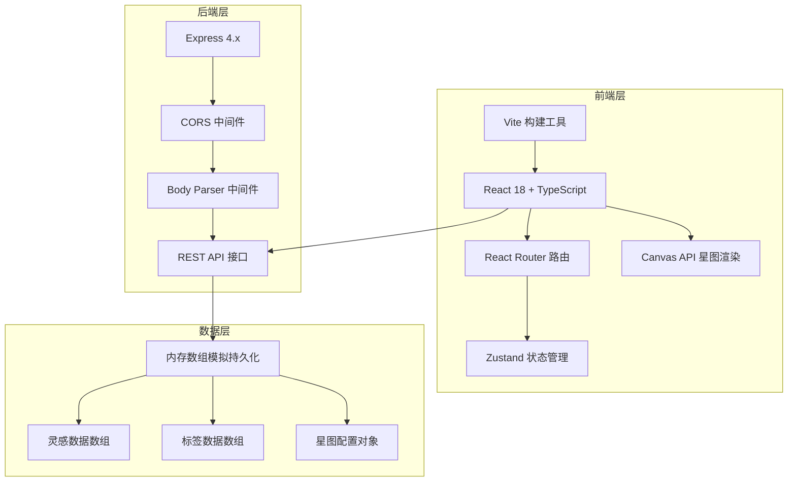
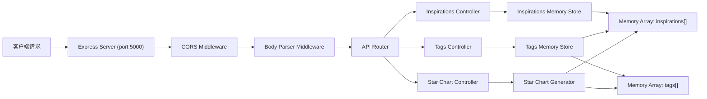
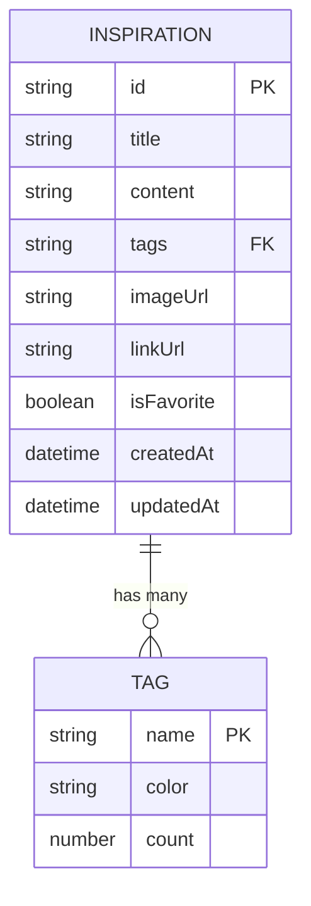

## 1. 架构设计



## 2. 技术栈描述

- **前端**：React 18 + TypeScript + Vite 5 + React Router DOM 6 + Zustand
- **样式**：CSS Modules + CSS Variables，不使用 Tailwind CSS（按用户需求）
- **图标**：Lucide React
- **后端**：Node.js + Express 4.x + CORS + Body Parser + UUID
- **数据持久化**：内存数组模拟（服务运行时保持数据）
- **初始化工具**：vite-init 模板 react-express-ts

## 3. 路由定义

| 路由 | 页面/组件 | 用途 |
|------|----------|------|
| `/` | HomePage | 首页，灵感卡片网格展示 |
| `/tags` | TagManager | 标签管理页面 |
| `/star-chart` | StarChart | 灵感星图页面 |
| `*` | HomePage | 404 重定向至首页 |

## 4. API 定义

### 4.1 TypeScript 类型定义
```typescript
interface Inspiration {
  id: string;
  title: string;
  content: string;
  tags: string[];
  imageUrl?: string;
  linkUrl?: string;
  isFavorite: boolean;
  createdAt: string;
  updatedAt: string;
}

interface Tag {
  name: string;
  color: string;
  count: number;
}

interface StarChartData {
  month: string;
  tags: TagBubble[];
  connections: BubbleConnection[];
}

interface TagBubble {
  name: string;
  color: string;
  count: number;
  x: number;
  y: number;
  radius: number;
}

interface BubbleConnection {
  from: string;
  to: string;
}

interface SearchHistoryItem {
  keyword: string;
  timestamp: number;
}
```

### 4.2 REST API 接口

| 方法 | 路径 | 请求参数 | 响应 | 用途 |
|------|------|----------|------|------|
| GET | `/api/inspirations` | 无 | `Inspiration[]` | 获取灵感列表 |
| GET | `/api/inspirations/:id` | id: string | `Inspiration` | 获取单条灵感详情 |
| POST | `/api/inspirations` | `{ title, content, tags, imageUrl?, linkUrl? }` | `Inspiration` | 创建新灵感 |
| PUT | `/api/inspirations/:id` | id: string, body: `Partial<Inspiration>` | `Inspiration` | 更新灵感 |
| DELETE | `/api/inspirations/:id` | id: string | `{ success: boolean }` | 删除灵感 |
| GET | `/api/tags` | 无 | `Tag[]` | 获取标签列表 |
| PUT | `/api/tags/:name` | name: string, body: `{ name?: string, color?: string }` | `Tag` | 更新标签 |
| DELETE | `/api/tags/:name` | name: string | `{ success: boolean }` | 删除标签（关联灵感变为"未分类"） |
| GET | `/api/star-chart` | 无 | `StarChartData` | 生成星图数据 |

## 5. 服务器架构



## 6. 数据模型

### 6.1 ER 图



### 6.2 内存数据结构

```javascript
// 灵感数据内存数组
let inspirations = [
  {
    id: 'uuid-1',
    title: '可编程LED冰箱磁贴',
    content: '把冰箱磁贴做成可编程的LED点阵，可以显示天气、时间、留言...',
    tags: ['科技', '生活'],
    imageUrl: 'https://example.com/led.jpg',
    linkUrl: 'https://example.com/project',
    isFavorite: true,
    createdAt: '2026-06-15T10:30:00Z',
    updatedAt: '2026-06-15T10:30:00Z'
  }
];

// 标签数据内存数组
let tags = [
  { name: '科技', color: '#4ecdc4', count: 5 },
  { name: '艺术', color: '#ff6b6b', count: 3 },
  { name: '生活', color: '#ffe66d', count: 8 },
  { name: '未分类', color: '#a29bfe', count: 2 }
];

// 预设标签色板
const TAG_COLORS = ['#ff6b6b', '#4ecdc4', '#ffe66d', '#a29bfe'];
```

## 7. 项目文件结构

```
auto105/
├── package.json
├── vite.config.js
├── tsconfig.json
├── index.html
├── client/
│   └── src/
│       ├── App.tsx              # 主应用组件
│       ├── main.tsx             # 入口文件
│       ├── index.css            # 全局样式
│       ├── types/
│       │   └── index.ts         # 类型定义
│       ├── store/
│       │   └── useStore.ts      # Zustand 状态管理
│       ├── components/
│       │   ├── HomePage.tsx     # 首页组件
│       │   ├── InspirationCard.tsx  # 灵感卡片组件
│       │   ├── InspirationDetail.tsx # 详情面板
│       │   ├── TagManager.tsx   # 标签管理
│       │   ├── StarChart.tsx    # 星图组件
│       │   ├── SearchBox.tsx    # 搜索框组件
│       │   ├── Navigation.tsx   # 导航组件
│       │   └── MobileMenu.tsx   # 移动端菜单
│       └── utils/
│           └── api.ts           # API 请求封装
└── server/
    └── index.js                 # Express 后端服务
```

## 8. 性能优化策略

1. **星图渲染优化**：
   - 使用 requestAnimationFrame 确保动画流畅
   - 粒子对象池复用，避免频繁 GC
   - 离屏 Canvas 预渲染静态元素

2. **搜索过滤优化**：
   - 前端使用 useMemo 缓存过滤结果
   - 防抖处理搜索输入（100ms）
   - 索引化标签和标题字段

3. **React 性能优化**：
   - 使用 React.memo 包裹列表项
   - useCallback 缓存事件处理函数
   - 合理拆分组件，避免不必要重渲染

4. **动画优化**：
   - 使用 CSS transform 而非 top/left
   - 开启 will-change 提升动画性能
   - 避免动画期间触发重排重绘
