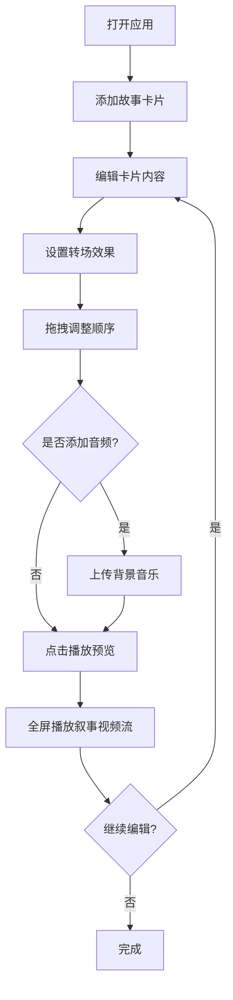

## 1. 产品概述

时间轴互动故事编辑器是一款基于浏览器的创作工具，让用户可以按时间顺序排列图文卡片、添加转场效果和背景音乐，并预览最终生成的叙事视频流。目标用户为内容创作者、教育工作者和故事叙事爱好者。

- 核心价值：通过直观的拖拽式时间轴编辑体验，将零散的图文素材组织为富有节奏感的叙事视频流
- 差异化：实时转场动画预览 + 音频同步播放 + 60fps流畅播放引擎

## 2. 核心功能

### 2.1 用户角色

| 角色 | 注册方式 | 核心权限 |
|------|----------|----------|
| 创作者 | 无需注册 | 创建、编辑和预览故事 |

### 2.2 功能模块

1. **编辑页面**：时间轴卡片管理、转场设置、音频管理、播放工具栏

### 2.3 页面详情

| 页面名称 | 模块名称 | 功能描述 |
|----------|----------|----------|
| 编辑页面 | 时间轴区域 | 水平/垂直滚动的卡片列表，支持拖拽重排、新增、删除卡片 |
| 编辑页面 | 故事卡片 | 展示标题、正文、背景色/图片，设置转场类型和持续时长 |
| 编辑页面 | 播放工具栏 | 播放/暂停按钮、添加音频、音量调节 |
| 编辑页面 | 预览播放器 | 全屏播放模式，卡片逐张展示，进度条和播放控制 |

## 3. 核心流程

用户打开应用 → 在时间轴中添加故事卡片 → 编辑卡片内容（标题、正文、背景） → 设置转场效果和持续时长 → 拖拽调整卡片顺序 → 添加背景音乐 → 点击播放进入全屏预览 → 观看叙事视频流 → 返回编辑

## 4. 用户界面设计

### 4.1 设计风格

- 主色调：深蓝黑背景 #0f172a，时间轴区域 #1e293b
- 强调色：蓝紫色系（indigo #6366f1, violet #8b5cf6, blue #3b82f6）
- 卡片：白色背景 #ffffff，文字深灰 #1e293b，选中边框 2px #3b82f6
- 字体：系统默认无衬线字体，字号 14px
- 按钮/滑块：圆角 8px，蓝紫色渐变
- 整体风格：暗色系专业创作工具，沉浸式体验

### 4.2 页面设计概览

| 页面名称 | 模块名称 | UI元素 |
|----------|----------|--------|
| 编辑页面 | 顶部工具栏 | 播放按钮、添加音频按钮、音量滑块、音频文件名显示 |
| 编辑页面 | 时间轴区域 | 水平滚动列表，卡片缩略图240x180px，选中高亮蓝框，新增卡片按钮 |
| 编辑页面 | 故事卡片 | 标题输入（30字）、正文输入（200字）、背景色选择器、图片URL输入、转场下拉选择、持续时长调节、删除按钮 |
| 编辑页面 | 预览播放器 | 全屏黑色背景，卡片居中展示+光晕阴影，渐变进度条，播放/暂停/快进/后退按钮 |

### 4.3 响应式设计

- 桌面优先设计（≥768px）：时间轴水平滚动
- 移动端（<768px）：时间轴改为垂直滚动，卡片宽高比不变
- 触控优化：拖拽操作支持触摸事件

### 4.4 动画规范

- 卡片拖拽：0.3秒跟随动画，半透明效果
- 转场动画：淡入淡出/滑动/缩放，时长0.5-3秒可调
- 播放器全屏：0.5秒淡入淡出过渡
- 进度条：渐变色 #6366f1 → #8b5cf6
- GPU加速：所有动画使用 transform 和 opacity 属性
