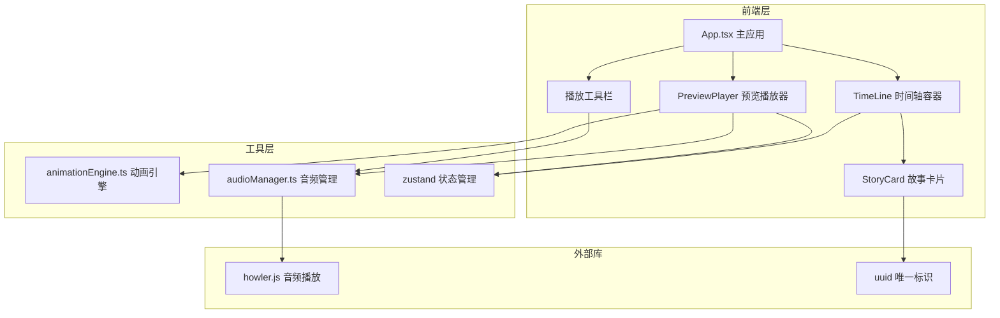

## 1. 架构设计



## 2. 技术说明

- 前端：React@18 + TypeScript + Vite
- 初始化工具：vite-init (react-ts 模板)
- 状态管理：zustand
- 样式：CSS Modules + CSS变量
- 后端：无（纯前端应用）
- 数据库：无（内存状态管理）

## 3. 路由定义

| 路由 | 用途 |
|------|------|
| / | 主编辑页面（单页应用，无路由切换） |

## 4. API定义

无后端API，所有数据存储在内存中（zustand store）。

## 5. 数据模型

### 5.1 核心数据类型

```typescript
type TransitionType = 'fadeInOut' | 'slideUp' | 'slideDown' | 'slideLeft' | 'slideRight' | 'zoom';

interface StoryCardData {
  id: string;
  title: string;
  content: string;
  bgColor: string;
  imageUrl: string;
  transition: TransitionType;
  duration: number;
  order: number;
}

interface AudioState {
  src: string;
  fileName: string;
  volume: number;
  isPlaying: boolean;
}

interface PlayerState {
  isPlaying: boolean;
  currentIndex: number;
  elapsedTime: number;
  totalDuration: number;
}
```

### 5.2 Zustand Store结构

```typescript
interface AppStore {
  cards: StoryCardData[];
  selectedCardId: string | null;
  audio: AudioState | null;
  player: PlayerState;
  
  addCard: () => void;
  removeCard: (id: string) => void;
  updateCard: (id: string, updates: Partial<StoryCardData>) => void;
  reorderCards: (fromIndex: number, toIndex: number) => void;
  selectCard: (id: string | null) => void;
  setAudio: (audio: AudioState) => void;
  setVolume: (volume: number) => void;
  setPlayerState: (state: Partial<PlayerState>) => void;
}
```

## 6. 模块职责

| 模块 | 职责 |
|------|------|
| animationEngine.ts | 使用 requestAnimationFrame 驱动播放序列，管理转场动画时序和叠加，提供 playSequence/pause/resume 控制函数 |
| audioManager.ts | 基于 howler 管理背景音乐播放，音量调节（0-100），淡入淡出效果，与播放器时间轴同步 |
| TimeLine.tsx | 卡片列表排序管理，新增/删除卡片，拖拽重排（HTML5 Drag & Drop），水平/垂直滚动容器 |
| StoryCard.tsx | 单张卡片渲染，标题/正文输入，背景色/图片设置，转场类型选择器，持续时长调节 |
| PreviewPlayer.tsx | 全屏预览模式，逐张播放卡片，渐变进度条，播放/暂停/快进/后退控制 |
