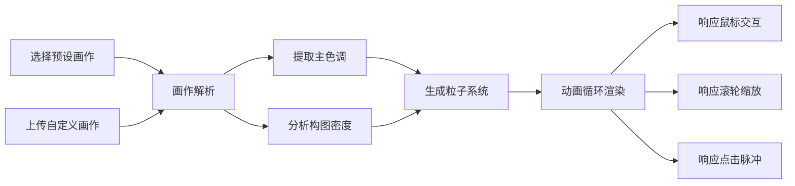

## 1. 产品概述

抽象艺术视觉动画应用，通过动态粒子系统与颜色流动将抽象艺术作品的情感与韵律直观呈现，解决普通观众难以理解抽象艺术内涵的问题。

- 核心目的：让抽象艺术可感知、可互动，通过视觉动画帮助用户理解艺术作品的情感表达
- 目标用户：艺术爱好者、学生、普通观众
- 市场价值：创新的艺术欣赏方式，将静态艺术转化为动态沉浸式体验

## 2. 核心功能

### 2.1 功能模块
1. **画作选择模块**：预设5幅经典抽象画作缩略图选择，支持用户上传自定义画作
2. **画作解析模块**：自动提取主色调（最多8种）和构图元素（点、线、块分布密度）
3. **粒子动画模块**：全屏粒子系统（3000-5000粒子），流动路径运动，彩色光晕叠加
4. **交互控制模块**：鼠标斥力场、滚轮缩放、点击颜色脉冲

### 2.2 页面详情

| 页面名称 | 模块名称 | 功能描述 |
|---------|---------|---------|
| 主页面 | 画作选择区 | 左侧横向缩略图卡片，选中高亮，支持上传自定义图片 |
| 主页面 | Canvas动画区 | 右侧全屏粒子动画展示，60fps流畅渲染 |
| 主页面 | 顶部控制栏 | 画作加载进度条、交互提示图标、上传按钮 |

## 3. 核心流程

用户选择或上传画作 → 系统解析颜色与构图 → 生成粒子动画参数 → 启动动画循环 → 响应用户交互事件

## 4. 用户界面设计

### 4.1 设计风格
- **主色调**：深蓝 #16213e、亮红 #e94560、白色 #eee
- **背景**：深灰 #1a1a2e 到深蓝 #16213e 渐变
- **字体**：Inter 无衬线字体
- **按钮样式**：渐变色按钮（#e94560 到 #0f3460），悬停亮度提升1.2倍，圆角设计
- **卡片样式**：120x80px 缩略图，8px圆角，1px描边 #e94560，选中时3px描边亮显
- **特殊效果**：毛玻璃控制栏（backdrop-filter: blur(6px)），彩色渐变进度条

### 4.2 页面设计概述

| 页面名称 | 模块名称 | UI元素 |
|---------|---------|--------|
| 主页面 | 画作选择区 | 横向缩略图卡片、上传按钮、选中状态高亮 |
| 主页面 | Canvas动画区 | 全屏粒子动画、彩色光晕层、鼠标交互反馈 |
| 主页面 | 顶部控制栏 | 加载进度条、交互提示图标（鼠标/滚轮/点击手势） |

### 4.3 响应式
- 桌面端优先设计
- 画布区域自适应窗口大小
- 画作选择区在小屏幕时调整布局
- 触摸设备优化手势交互

## 5. 性能要求

- 动画稳定60fps（requestAnimationFrame）
- 3000粒子时帧率不低于55fps
- 页面加载时间不超过3秒
- 上传图片最大5MB，支持jpg/png格式
