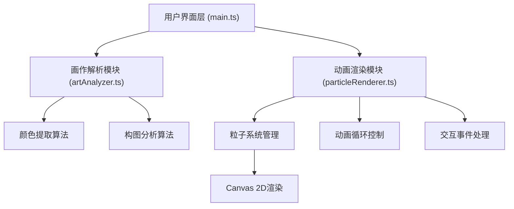

## 1. 架构设计



## 2. 技术描述

- **前端框架**：原生 TypeScript + Vite（按用户需求，不使用React/Vue）
- **构建工具**：Vite 5.x
- **编程语言**：TypeScript 5.x（严格模式，target ES2020）
- **核心依赖**：
  - `chroma-js`：颜色空间转换与调色板提取
  - `canvas-confetti`：庆祝效果（可选扩展）
- **渲染引擎**：HTML5 Canvas 2D API
- **动画机制**：requestAnimationFrame 实现60fps渲染循环

## 3. 目录结构

```
.
├── package.json
├── vite.config.js
├── tsconfig.json
├── index.html
└── src/
    ├── main.ts              # UI初始化、事件绑定、模块协调
    ├── artAnalyzer.ts       # 画作解析模块
    └── particleRenderer.ts  # 动画渲染模块
```

## 4. 核心模块定义

### 4.1 画作解析模块 (artAnalyzer.ts)

```typescript
export interface ArtworkAnalysis {
  colors: string[];           // 主色调数组，最多8种
  composition: {
    pointDensity: number;     // 点密度 0-1
    lineDensity: number;      // 线密度 0-1
    blockDensity: number;     // 块密度 0-1
    dominantDirection: number;// 主线条方向角度 0-360
  };
}

export function analyseArtwork(image: HTMLImageElement): Promise<ArtworkAnalysis>;
```

### 4.2 动画渲染模块 (particleRenderer.ts)

```typescript
export interface ParticleAnimationConfig {
  colors: string[];
  particleCount: number;      // 3000-5000
  composition: ArtworkAnalysis['composition'];
}

export class ParticleAnimation {
  constructor(canvas: HTMLCanvasElement, config: ParticleAnimationConfig);
  start(): void;
  stop(): void;
  updateConfig(config: Partial<ParticleAnimationConfig>): void;
  handleMouseMove(x: number, y: number): void;
  handleWheel(delta: number): void;
  handleClick(x: number, y: number): void;
}
```

### 4.3 预设画作数据

```typescript
export interface PresetArtwork {
  id: string;
  name: string;
  artist: string;
  thumbnail: string;  // Base64或图片URL
  year: string;
}
```

## 5. 关键技术实现

### 5.1 颜色提取
- 使用 Canvas 2D 获取图像像素数据
- 色彩量化算法（K-means 或中位切分）提取主色调
- 使用 chroma-js 进行颜色空间转换和排序

### 5.2 构图分析
- 边缘检测算法（Sobel算子）分析线条密度
- 局部方差分析识别点和块分布
- 霍夫变换检测主线条方向

### 5.3 粒子系统
- 对象池管理粒子，避免频繁GC
- Perlin噪声场控制粒子流动路径
- 径向渐变实现彩色光晕叠加层
- 鼠标位置影响粒子速度（斥力场算法）

### 5.4 性能优化
- requestAnimationFrame 驱动渲染循环
- 离屏Canvas预渲染光晕层
- 粒子批量绘制减少drawCall
- 根据设备性能动态调整粒子数量
