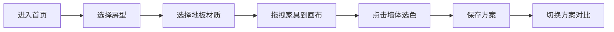

## 1. 产品概述

家居软装搭配展示工具，帮助用户在线上虚拟空间中布置和预览家居软装方案，让装修前或租房的用户能通过拖拽家具和调整墙面颜色，快速看到不同风格组合在房间里的整体效果。

- 核心价值：降低家居搭配决策成本，提供沉浸式软装预览体验
- 目标用户：准备装修的业主、租房改造人群、家居爱好者
- 市场定位：轻量级、无需安装的在线家居设计工具

## 2. 核心功能

### 2.2 功能模块

1. **房间设置模块**：房型选择、地板材质切换、2D俯视图渲染
2. **家具拖拽模块**：家具库面板、拖拽放置、网格吸附、删除功能
3. **墙面配色模块**：墙体点击选择、颜色选择器、过渡动画、风格命名
4. **方案管理模块**：方案保存、缩略图展示、一键切换、对比预览

### 2.3 页面详情

| 页面名称 | 模块名称 | 功能描述 |
|-----------|-------------|---------------------|
| 主画布页 | 房间设置模块 | 支持3种房型（正方形12㎡、长方形20㎡、L形不规则），3种地板材质（仿木纹、灰色瓷砖、浅色地毯），按1:20比例渲染2D俯视图 |
| 主画布页 | 家具拖拽模块 | 右侧家具库展示5种家具（沙发、茶几、书架、床头柜、落地灯），拖拽到画布后吸附到25px网格，可点击删除 |
| 主画布页 | 墙面配色模块 | 点击墙体弹出8色选择器，0.3秒过渡动画切换颜色，左侧实时显示风格名称 |
| 主画布页 | 方案管理模块 | 底部工具栏横向滚动展示最多5个保存方案，120x90px缩略图，0.5秒淡入淡出切换动画 |

## 3. 核心流程

用户进入首页 → 选择房型和地板 → 从右侧面板拖拽家具到画布 → 点击墙体选择配色 → 保存当前方案 → 切换不同方案对比效果

## 4. 用户界面设计

### 4.1 设计风格

- 主背景色：米白 #fdfaf6
- 主色按钮：暖棕色 #8b5e3c，白色文字，圆角8px
- 卡片风格：白色 #ffffff，分隔线 #e5e5e5
- 家具面板：宽280px，背景#fafafa，圆角12px，顶部阴影
- 底部工具栏：高70px，背景#ffffff，上边阴影
- 字体：Inter
- 墙线：#666666，3px，墙体填充#f0f0f0半透明
- 网格线：#e0e0e0，间距25px
- 交互效果：悬停时亮度+5%，轻微上浮translateY(-2px)
- 预设配色8种：暖白#f5e6d0、莫兰迪绿#a3b8a5、雾霾蓝#b0c4de、奶茶色#d2b48c、深灰#4a4a4a、珊瑚粉#f4a460、芥末黄#d4b96a、浅紫#c8b4d8

### 4.2 页面设计概述

| 页面名称 | 模块名称 | UI元素 |
|-----------|-------------|-------------|
| 主画布页 | 房间设置模块 | 房型选择下拉、地板材质切换按钮、2D俯视图画布 |
| 主画布页 | 家具拖拽模块 | 右侧280px宽面板、圆角矩形家具块、垃圾桶删除图标 |
| 主画布页 | 墙面配色模块 | 8色圆形选择器、左侧风格名称标签、平滑过渡动画 |
| 主画布页 | 方案管理模块 | 底部70px高工具栏、横向滚动卡片、120x90px缩略图 |

### 4.3 响应式

- 桌面端：画布居中，右侧280px家具面板，底部70px工具栏
- 移动端（<900px）：右侧家具面板折叠为底部浮层，画布区域占比增大
- 触控优化：家具拖拽支持触摸操作，点击目标尺寸≥44px

### 4.4 性能要求

- 所有拖拽和颜色切换操作60fps
- 页面首次加载时间≤3秒
- 使用requestAnimationFrame确保动画流畅
- 避免不必要的重绘重排
