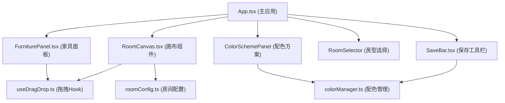
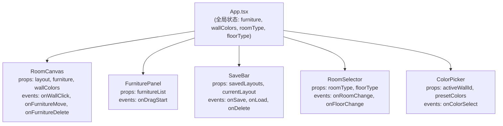

## 1. 架构设计



## 2. 技术描述

- **前端框架**：React 18 + TypeScript
- **构建工具**：Vite 5
- **状态管理**：React Hooks (useState, useReducer, useCallback)
- **依赖库**：
  - react, react-dom (UI框架)
  - typescript (类型系统)
  - vite (构建工具)
  - @vitejs/plugin-react (React插件)
  - uuid (唯一ID生成)

## 3. 文件结构

| 文件路径 | 用途 |
|---------|------|
| `package.json` | 项目依赖和脚本配置 |
| `index.html` | HTML入口，挂载#root，引入Inter字体 |
| `tsconfig.json` | TypeScript配置（严格模式，jsx: react-jsx） |
| `vite.config.js` | Vite配置，React插件 |
| `src/main.tsx` | ReactDOM挂载入口 |
| `src/App.tsx` | 主应用组件，整合所有模块 |
| `src/hooks/useDragDrop.ts` | 拖拽逻辑Hook，导出useDrag和useDrop |
| `src/modules/roomConfig.ts` | 房间配置，房型、网格、家具数据 |
| `src/modules/colorManager.ts` | 墙面配色管理，状态和过渡动画 |
| `src/components/RoomCanvas.tsx` | 画布组件，渲染房间和家具 |
| `src/components/FurniturePanel.tsx` | 右侧家具库面板 |
| `src/components/SaveBar.tsx` | 底部保存方案工具栏 |
| `src/types/index.ts` | TypeScript类型定义 |

## 4. 核心类型定义

```typescript
// 房型类型
type RoomType = 'square' | 'rectangle' | 'lShape';

// 地板材质
type FloorType = 'wood' | 'tile' | 'carpet';

// 家具类型
interface FurnitureItem {
  id: string;
  type: 'sofa' | 'coffeeTable' | 'bookshelf' | 'nightstand' | 'floorLamp';
  name: string;
  width: number;  // 实际尺寸cm
  height: number; // 实际尺寸cm
  color: string;
  x: number;      // 画布位置
  y: number;      // 画布位置
  rotation: number;
}

// 墙体类型
interface Wall {
  id: string;
  x: number;
  y: number;
  width: number;
  height: number;
  color: string;
  position: 'top' | 'bottom' | 'left' | 'right';
}

// 房间布局
interface RoomLayout {
  type: RoomType;
  name: string;
  area: number;
  walls: Wall[];
  floor: FloorType;
  windowPosition: { x: number; y: number; width: number };
  scale: number; // 1:20
}

// 保存方案
interface SavedLayout {
  id: string;
  name: string;
  thumbnail: string; // base64
  roomType: RoomType;
  floorType: FloorType;
  furniture: FurnitureItem[];
  wallColors: Record<string, string>;
  createdAt: number;
}

// 配色方案
interface ColorScheme {
  name: string;
  colors: string[];
}
```

## 5. 核心模块设计

### 5.1 useDragDrop Hook
- `useDrag(elementRef, data)`: 使元素可拖拽，返回拖拽状态
- `useDrop(containerRef, onDrop)`: 使容器可接收拖拽元素，处理放置逻辑
- 使用原生拖拽API + requestAnimationFrame确保60fps
- 支持鼠标和触摸事件

### 5.2 roomConfig 模块
- `getRoomLayout(type: RoomType): RoomLayout`: 获取指定房型布局数据
- `getFurnitureList(): Omit<FurnitureItem, 'id' | 'x' | 'y'>[]`: 获取家具库列表
- `snapToGrid(value: number, gridSize: number = 25): number`: 网格吸附计算
- 预设3种房型、3种地板、5种家具的尺寸和颜色数据

### 5.3 colorManager 模块
- `useColor(initialColor: string)`: 管理单个墙体颜色状态
- `applyColorTransition(element: HTMLElement, targetColor: string, duration: number = 300)`: 执行颜色过渡动画
- `detectColorScheme(wallColors: string[]): string`: 根据墙体颜色识别配色风格名称
- 预设8种流行色和对应风格名称映射

## 6. 组件数据流



## 7. 性能优化策略

1. **React.memo**: 对纯展示组件使用memo避免不必要重渲染
2. **useCallback**: 事件处理函数使用useCallback缓存
3. **requestAnimationFrame**: 拖拽和动画使用RAF确保60fps
4. **CSS transforms**: 家具拖拽使用transform而非top/left
5. **will-change**: 对动画元素设置will-change提升性能
6. **localStorage缓存**: 方案数据本地存储，避免重复请求
7. **按需渲染**: 画布外元素不渲染，缩略图使用canvas生成
