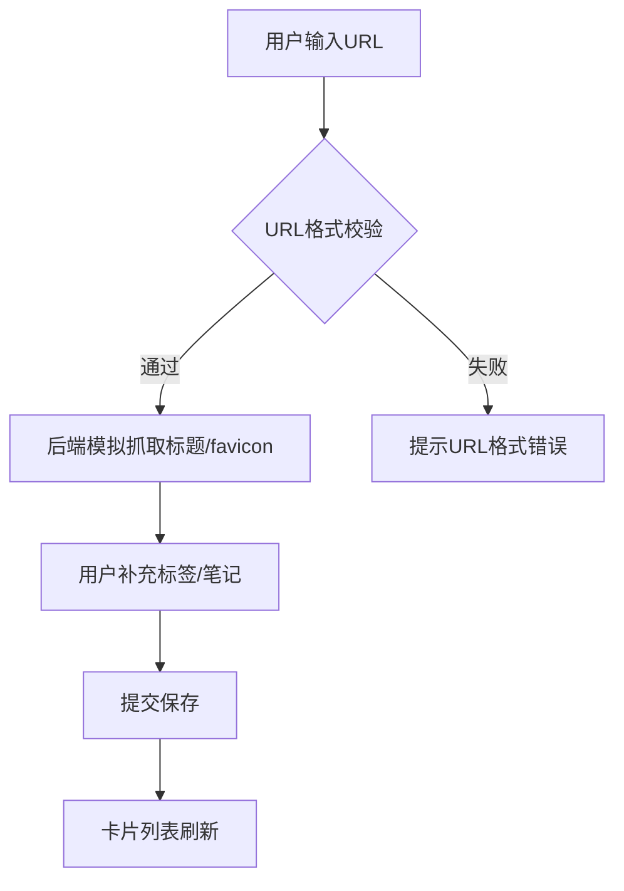

## 1. 产品概述

跨平台书签管理与灵感收藏应用——帮助用户一键收藏网页链接，通过自定义标签和笔记组织灵感，支持按标签筛选、全文搜索和批量操作，实现高效的知识管理。

- 目标用户：频繁收藏网页的研究者、设计师、开发者等知识工作者
- 核心价值：提供快速收藏、智能分类、高效检索的一站式书签管理体验

## 2. 核心功能

### 2.1 用户角色

| 角色 | 注册方式 | 核心权限 |
|------|----------|----------|
| 普通用户 | 无需注册 | 收藏、编辑、删除、搜索、分享书签 |

### 2.2 功能模块

1. **书签管理页面**：书签添加/编辑表单、卡片网格展示、搜索筛选、批量操作
2. **收藏夹管理**：文件夹创建/折叠、拖拽移动、紧凑列表视图

### 2.3 页面详情

| 页面名称 | 模块名称 | 功能描述 |
|----------|----------|----------|
| 书签管理页面 | 顶部导航栏 | 搜索栏（防抖300ms）、标签筛选下拉（多选）、清除按钮 |
| 书签管理页面 | 书签添加表单 | URL输入（http/https校验）、自动抓取标题/favicon、手动修改标题、添加笔记、最多5个标签（从已有标签选择或新增） |
| 书签管理页面 | 书签卡片网格 | 每行4张卡片（桌面），显示favicon、标题、URL、标签徽章、笔记预览，悬浮阴影上移动画 |
| 书签管理页面 | 批量操作 | 长按/右键选中多个书签，批量删除/添加标签/移动至收藏夹 |
| 书签管理页面 | 收藏夹区域 | 创建文件夹、拖拽书签入文件夹、折叠展开、紧凑列表视图 |
| 书签管理页面 | 分享功能 | 生成6位随机码短链接，复制到剪贴板，绿色提示2秒消失 |
| 书签管理页面 | 空状态 | 无结果时显示插画+文字提示 |
| 书签管理页面 | 错误提示 | 红色错误提示条，可关闭 |
| 书签管理页面 | 骨架屏 | 加载时灰色脉冲动画1.5s |

## 3. 核心流程

### 3.1 添加书签流程
用户输入URL → 后端校验URL格式 → 后端模拟返回标题和favicon → 用户补充标签和笔记 → 提交保存 → 卡片列表刷新

### 3.2 搜索筛选流程
用户输入搜索词/选择标签 → 防抖300ms → 调用搜索API → 更新书签列表 → 无结果显示空状态

### 3.3 批量操作流程
用户长按/右键进入批量模式 → 勾选多个书签 → 选择操作（删除/添加标签/移动） → 执行操作 → 刷新列表

## 4. 界面设计

### 4.1 设计风格

- 主色：#3b82f6（蓝色），悬停色：#2563eb
- 背景色：#f3f4f6（浅灰）
- 导航栏：深灰#1f2937，白色字体，高56px
- 卡片：白色#ffffff，圆角12px，1px边框#e5e7eb
- 标题颜色：深灰#1f2937，14px加粗
- URL颜色：#6b7280，12px
- 标签徽章：圆角6px，内边距2px 6px，11px，预设色盘
- 按钮/输入框：8px圆角
- 选中状态：蓝色边框#3b82f6，左上角勾选图标0.2s淡入

### 4.2 页面设计概览

| 页面名称 | 模块名称 | UI元素 |
|----------|----------|--------|
| 书签管理页面 | 顶部导航栏 | 深灰背景、居中标题、搜索栏（最大400px，圆角8px，清除按钮）、标签筛选下拉 |
| 书签管理页面 | 书签卡片网格 | 4列网格（桌面），260px宽卡片，favicon+标题、URL、标签徽章、笔记预览 |
| 书签管理页面 | 收藏夹区域 | 可折叠文件夹，紧凑列表（高40px，交替背景），拖拽占位动画 |
| 书签管理页面 | 批量操作栏 | 底部浮出操作栏，批量删除/添加标签/移动按钮 |
| 书签管理页面 | 分享按钮 | 卡片内分享图标，点击弹出复制提示 |

### 4.3 响应式适配

- 桌面（>=1024px）：四列网格
- 平板（768px-1023px）：两列网格
- 手机（<768px）：单列网格，导航栏收缩为汉堡菜单

### 4.4 动效规范

- 卡片悬浮：0.3s ease，阴影0 8px 24px rgba(0,0,0,0.08)，上移3px
- 选中勾选：0.2s淡入动画
- 拖拽：半透明占位，弹性动画0.3s cubic-bezier
- 骨架屏：灰色脉冲动画1.5s
- 提示消息：2秒自动消失
