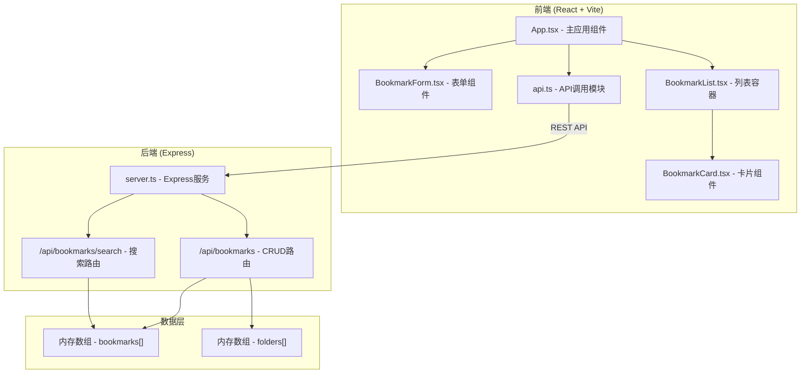
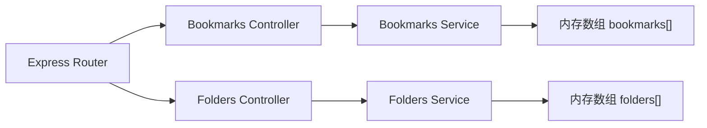
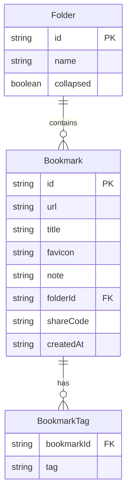

## 1. 架构设计



## 2. 技术说明

- 前端：React@18 + TypeScript + Vite + TailwindCSS
- 初始化工具：vite-init (react-express-ts模板)
- 后端：Express@4 + TypeScript + cors + body-parser + uuid
- 数据库：内存数组模拟持久化

## 3. 路由定义

| 路由 | 用途 |
|------|------|
| / | 书签管理主页面 |

## 4. API定义

### 4.1 数据类型

```typescript
interface Bookmark {
  id: string;
  url: string;
  title: string;
  favicon: string;
  note: string;
  tags: string[];
  folderId: string | null;
  createdAt: string;
  shareCode: string | null;
}

interface Folder {
  id: string;
  name: string;
  collapsed: boolean;
  bookmarkIds: string[];
}

interface ApiResponse<T> {
  success: boolean;
  data?: T;
  error?: string;
}
```

### 4.2 接口定义

| 方法 | 路径 | 请求体 | 响应 | 描述 |
|------|------|--------|------|------|
| GET | /api/bookmarks | - | Bookmark[] | 获取所有书签 |
| GET | /api/bookmarks/search?q=keyword&tags=tag1,tag2 | - | Bookmark[] | 搜索书签 |
| GET | /api/bookmarks/tags | - | string[] | 获取所有标签 |
| POST | /api/bookmarks | { url, title?, note?, tags? } | Bookmark | 添加书签 |
| POST | /api/bookmarks/fetch-url | { url } | { title, favicon } | 模拟抓取URL信息 |
| PUT | /api/bookmarks/:id | Partial<Bookmark> | Bookmark | 更新书签 |
| DELETE | /api/bookmarks/:id | - | { success: true } | 删除书签 |
| POST | /api/bookmarks/batch-delete | { ids: string[] } | { success: true } | 批量删除 |
| POST | /api/bookmarks/batch-tag | { ids: string[], tags: string[] } | { success: true } | 批量添加标签 |
| POST | /api/bookmarks/batch-move | { ids: string[], folderId: string } | { success: true } | 批量移动 |
| POST | /api/bookmarks/:id/share | - | { shareCode: string } | 生成分享链接 |
| GET | /api/folders | - | Folder[] | 获取收藏夹列表 |
| POST | /api/folders | { name: string } | Folder | 创建收藏夹 |
| PUT | /api/folders/:id | Partial<Folder> | Folder | 更新收藏夹 |
| DELETE | /api/folders/:id | - | { success: true } | 删除收藏夹 |

## 5. 服务端架构



## 6. 数据模型

### 6.1 数据模型定义



### 6.2 初始化数据

后端启动时预设3个示例书签和1个收藏夹，确保首次访问即有展示内容。
