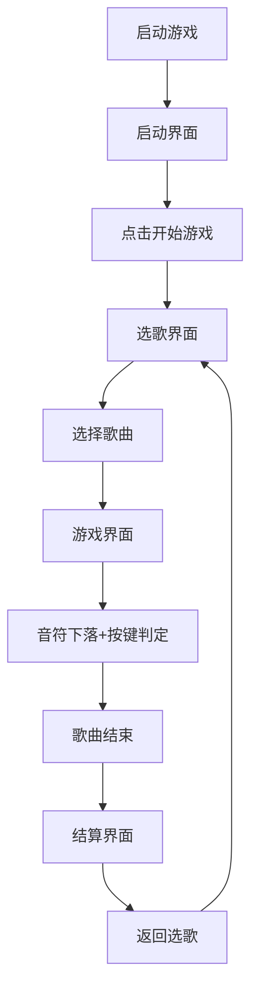

## 1. 产品概述
"节奏陷阱"是一款基于浏览器的2D音乐节奏游戏，玩家需要跟随音乐节奏点击屏幕上垂直下落的音符获得分数并保持连击。
- 主要目的：提供休闲娱乐的音乐游戏体验，通过精确的按键判定和连击系统带来爽快感
- 目标用户：喜欢音乐节奏类游戏的休闲玩家

## 2. 核心功能

### 2.1 用户角色
| 角色 | 注册方式 | 核心权限 |
|------|---------------------|------------------|
| 玩家 | 无需注册 | 完整游戏体验 |

### 2.2 功能模块
1. **启动界面**：游戏标题、开始游戏按钮
2. **选歌界面**：3首预设歌曲选择、歌曲信息展示
3. **游戏界面**：音符下落、按键判定、连击系统、得分系统、进度条、粒子特效
4. **结算界面**：得分展示、最大连击、判定分布、评级系统

### 2.3 页面详情
| 页面名称 | 模块名称 | 功能描述 |
|-----------|-------------|---------------------|
| 启动界面 | 标题区域 | 显示"节奏陷阱"游戏标题，橙红色(#ff6b35)粗体，0.5秒脉动动画 |
| 启动界面 | 开始按钮 | 白色背景圆角12px，悬停变橙色并放大1.05倍 |
| 选歌界面 | 歌曲列表 | 3首预设歌曲卡片，点击选择进入游戏 |
| 游戏界面 | 音符系统 | 4条轨道音符垂直下落，圆形直径30px，不同轨道不同颜色 |
| 游戏界面 | 判定系统 | 判定线在底部上方80px，按键D/F/J/K对应4条轨道 |
| 游戏界面 | 判定等级 | 完美(±20ms金色PERFECT+光晕)、良好(±50ms银色GOOD)、失误(灰色MISS+连击重置) |
| 游戏界面 | 粒子特效 | 完美击打产生6-8个同色粒子扩散0.3秒 |
| 游戏界面 | UI显示 | 顶部进度条(绿到红渐变)、左侧得分、右侧连击数 |
| 结算界面 | 结果展示 | 得分、最大连击、判定分布、S/A/B/C评级 |
| 结算界面 | BGM | 歌曲淡化版继续播放 |

## 3. 核心流程
玩家启动游戏 → 进入启动界面 → 点击开始游戏 → 进入选歌界面 → 选择歌曲 → 进入游戏界面 → 跟随节奏击打音符 → 歌曲结束 → 进入结算界面 → 可返回选歌界面

## 4. 用户界面设计

### 4.1 设计风格
- 主背景色：#0a0a23，启动界面背景：#0f0f23
- 主色调：橙红色(#ff6b35)、青色(#00d2d3)作为霓虹点缀
- 按钮风格：圆角12px，弹性缩放过渡0.2秒
- 字体：使用现代无衬线字体，标题粗体醒目
- 布局：全屏Canvas，响应式适配1920x1080和1366x768
- 动效：所有交互元素transform: scale弹性过渡，判定线和音符带drop-shadow发光

### 4.2 页面设计概述
| 页面名称 | 模块名称 | UI元素 |
|-----------|-------------|-------------|
| 启动界面 | 标题区域 | 深色背景#0f0f23，居中布局，橙红色粗体标题，脉动缩放动画 |
| 启动界面 | 开始按钮 | 白色背景圆角12px，hover橙色+scale(1.05)，弹性过渡 |
| 选歌界面 | 歌曲卡片 | 深色霓虹风格卡片，悬停发光效果，显示歌曲名称和时长 |
| 游戏界面 | 音符区域 | 4条垂直轨道，彩色圆形音符，底部半透明判定线 |
| 游戏界面 | 判定反馈 | 顶部显示判定文字(金色PERFECT/银色GOOD/灰色MISS) |
| 游戏界面 | 粒子特效 | 完美击打产生同色粒子扩散效果 |
| 游戏界面 | 顶部UI | 80%宽度进度条(绿→红渐变)，左侧得分24px白色，右侧连击28px橙色 |
| 结算界面 | 评级展示 | 金属质感渐变+3D旋转效果的评级字符 |
| 结算界面 | 统计数据 | 判定分布柱状图，得分和最大连击醒目展示 |

### 4.3 响应性
- 桌面优先设计，适配1920x1080和1366x768分辨率
- 所有元素使用比例布局，确保不同分辨率下界面比例正常
- Canvas自适应窗口大小，保持游戏区域比例

### 4.4 性能要求
- 游戏运行帧率稳定60fps
- CPU占用不超过20%
- 使用requestAnimationFrame实现主循环
- 粒子系统使用对象池优化性能
