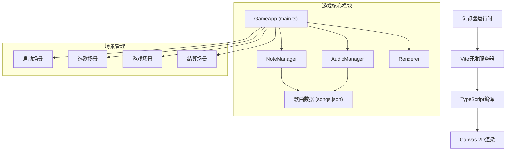

## 1. 架构设计



## 2. 技术描述
- 前端：TypeScript + Canvas 2D + Vite
- 构建工具：Vite@5
- 语言：TypeScript@5（严格模式，target ES2020）
- 后端：无（纯前端项目）
- 数据存储：本地JSON文件（songs.json）存储歌曲元数据和音符轨道数据
- 音频：Web Audio API（AudioContext）处理音频加载和播放
- 渲染：Canvas 2D API，requestAnimationFrame实现60fps主循环

## 3. 目录结构
```
project/
├── package.json
├── vite.config.js
├── tsconfig.json
├── index.html
├── data/
│   └── songs.json
└── src/
    ├── main.ts          # 游戏主循环、场景管理
    ├── audioManager.ts  # 音频管理
    ├── noteManager.ts   # 音符管理、判定逻辑
    └── renderer.ts      # 渲染器
```

## 4. 核心类定义

### 4.1 GameApp (main.ts)
```typescript
class GameApp {
  private canvas: HTMLCanvasElement;
  private ctx: CanvasRenderingContext2D;
  private audioManager: AudioManager;
  private noteManager: NoteManager;
  private renderer: Renderer;
  private currentScene: 'start' | 'select' | 'game' | 'result';
  private currentSong: Song | null;
  private score: number;
  private combo: number;
  private maxCombo: number;
  private perfectCount: number;
  private goodCount: number;
  private missCount: number;
  
  constructor(canvas: HTMLCanvasElement);
  public init(): Promise<void>;
  private gameLoop(timestamp: number): void;
  public startGame(songId: string): void;
  public endGame(): void;
  public changeScene(scene: string): void;
}
```

### 4.2 AudioManager (audioManager.ts)
```typescript
class AudioManager {
  private audioContext: AudioContext | null;
  private currentBuffer: AudioBuffer | null;
  private currentSource: AudioBufferSourceNode | null;
  private gainNode: GainNode | null;
  private startTime: number;
  private isPlaying: boolean;
  
  constructor();
  public loadAudio(url: string): Promise<AudioBuffer>;
  public play(buffer?: AudioBuffer, startTime?: number): void;
  public pause(): void;
  public stop(): void;
  public getCurrentTime(): number;
  public setVolume(volume: number): void;
  public getDuration(): number;
}
```

### 4.3 NoteManager (noteManager.ts)
```typescript
interface Note {
  id: number;
  track: number;  // 0-3 对应 D/F/J/K
  time: number;   // 击打时间点(ms)
  y: number;      // 当前Y坐标
  hit: boolean;
  missed: boolean;
}

interface JudgeResult {
  type: 'perfect' | 'good' | 'miss';
  track: number;
  noteId: number;
}

class NoteManager {
  private notes: Note[];
  private currentTime: number;
  private judgeLineY: number;
  private noteSpeed: number;  // 像素/秒
  private trackKeys: string[];  // ['d', 'f', 'j', 'k']
  private pendingJudgements: JudgeResult[];
  
  constructor();
  public loadNotes(songData: Song): void;
  public update(currentTime: number, canvasHeight: number): void;
  public handleKeyDown(key: string): JudgeResult | null;
  public getActiveNotes(): Note[];
  public getNotes(): Note[];
  public reset(): void;
}
```

### 4.4 Renderer (renderer.ts)
```typescript
interface Particle {
  x: number;
  y: number;
  vx: number;
  vy: number;
  color: string;
  life: number;
  maxLife: number;
  size: number;
}

class Renderer {
  private ctx: CanvasRenderingContext2D;
  private canvas: HTMLCanvasElement;
  private particles: Particle[];
  private lastJudgeResult: JudgeResult | null;
  private judgeResultTimer: number;
  
  constructor(ctx: CanvasRenderingContext2D, canvas: HTMLCanvasElement);
  public clear(): void;
  public drawBackground(scene: string): void;
  public drawStartScreen(animationTime: number, hoverButton: boolean): void;
  public drawSelectScreen(songs: Song[], selectedIndex: number): void;
  public drawGameScreen(
    notes: Note[],
    score: number,
    combo: number,
    progress: number,
    judgeLineY: number
  ): void;
  public drawResultScreen(
    score: number,
    maxCombo: number,
    perfect: number,
    good: number,
    miss: number,
    grade: string,
    animationTime: number
  ): void;
  public spawnParticles(x: number, y: number, color: string, count: number): void;
  public updateParticles(deltaTime: number): void;
  public showJudgeResult(result: JudgeResult): void;
  public resize(width: number, height: number): void;
}
```

## 5. 数据模型 (songs.json)
```json
{
  "songs": [
    {
      "id": "song1",
      "title": "霓虹节拍",
      "artist": "Rhythm Master",
      "duration": 35000,
      "bpm": 120,
      "audioUrl": "/data/song1.mp3",
      "notes": [
        { "time": 1000, "track": 0 },
        { "time": 1500, "track": 1 },
        ...
      ]
    }
  ]
}
```

## 6. 判定系统
- 判定窗口：
  - PERFECT：±20ms
  - GOOD：±50ms
  - MISS：超过±50ms或音符越过判定线未击打
- 分数计算：
  - PERFECT：100分 × (1 + combo/100)
  - GOOD：50分 × (1 + combo/100)
  - MISS：0分，连击重置
- 评级标准：
  - S级：90%以上完美
  - A级：70%以上完美
  - B级：50%以上完美
  - C级：其他

## 7. 性能优化策略
1. **Canvas渲染优化**：
   - 使用requestAnimationFrame实现60fps主循环
   - 避免每帧创建新对象，复用对象池
   - 粒子系统使用对象池管理

2. **音符管理优化**：
   - 只更新和渲染屏幕可见范围内的音符
   - 已击打或错过的音符及时清理

3. **音频处理**：
   - 预加载音频文件并解码
   - 使用Web Audio API的AudioBufferSourceNode播放

4. **内存管理**：
   - 场景切换时及时清理不需要的对象
   - 粒子生命周期结束后回收

## 8. 启动脚本
```json
{
  "scripts": {
    "dev": "vite",
    "build": "tsc && vite build",
    "preview": "vite preview"
  }
}
```
