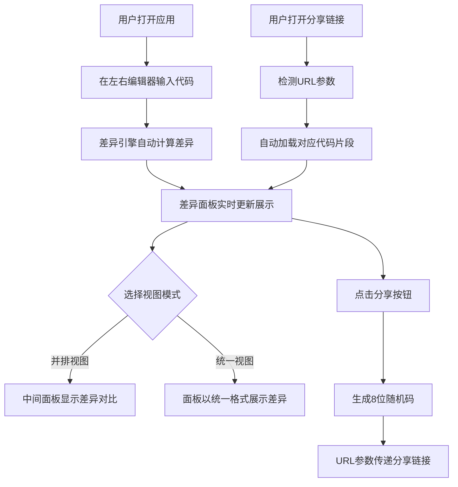

## 1. 产品概述

代码片段可视化对比与分享应用，让开发者可以输入或粘贴多个代码片段，以并排或差异视图查看代码差异（高亮行内变化），并生成永久分享链接。目标用户为开发者和代码审查人员。

## 2. 核心功能

### 2.1 用户角色
| 角色 | 注册方式 | 核心权限 |
|------|----------|----------|
| 匿名用户 | 无需注册 | 输入代码、查看差异、生成分享链接 |

### 2.2 功能模块
1. **主页面**：双栏代码编辑器 + 差异面板 + 工具栏

### 2.3 页面详情
| 页面名称 | 模块名称 | 功能描述 |
|----------|----------|----------|
| 主页面 | 工具栏 | 并排/统一视图切换按钮、语言选择下拉框、分享按钮 |
| 主页面 | 左侧编辑器 | 原始代码输入区域，支持语法高亮和行号显示 |
| 主页面 | 右侧编辑器 | 新代码输入区域，支持语法高亮和行号显示 |
| 主页面 | 差异面板 | 自动更新显示修改、新增、删除的行，不同背景色区分 |
| 主页面 | 分享功能 | 生成8位随机码，通过URL参数传递，页面加载时自动检测并加载 |

## 3. 核心流程

用户在左侧编辑器输入原始代码，右侧编辑器输入新代码，差异面板自动计算并展示两段代码的差异。用户可切换并排视图与统一视图。点击分享按钮后生成8位随机码，通过URL参数传递，其他用户可通过链接加载对应代码片段。

## 4. 用户界面设计

### 4.1 设计风格
- 主色调：深色代码区域（#1e1e1e）与浅色差异面板形成对比
- 强调色：蓝色#4A90D9（悬浮/聚焦边框）
- 差异色：新增绿色#d4edda、删除红色#f8d7da、修改黄色#fff3cd
- 字体：等宽字体（代码区域），14px字号，24px行高
- 布局：三列左右2:1:2比例分割，顶部工具栏50px
- 背景色：浅灰色#f5f5f5
- 圆角：8px，1px实线边框#ddd
- 交互：边框悬浮蓝色+箱体阴影，视图切换0.3秒动画，分享按钮勾号反馈+toast提示

### 4.2 页面设计概览
| 页面名称 | 模块名称 | UI元素 |
|----------|----------|--------|
| 主页面 | 工具栏 | 50px高度，视图切换按钮（并排/统一），语言下拉选择，分享按钮，背景#f5f5f5 |
| 主页面 | 左侧编辑器 | 深色背景#1e1e1e，白色文字，等宽字体，左侧行号列40px宽背景#f0f0f0，圆角8px边框#ddd |
| 主页面 | 右侧编辑器 | 同左侧编辑器样式 |
| 主页面 | 差异面板 | 浅色背景，新增行绿#d4edda，删除行红#f8d7da，修改行黄#fff3cd，与两侧滚动同步 |
| 主页面 | Toast提示 | 白色背景，绿勾图标，底部弹出向上2秒后消失 |

### 4.3 响应式适配
- 桌面优先设计
- 视口宽度 < 768px 时：左右编辑器变为上下堆叠，差异面板居中，每部分高度33%
- 语言下拉菜单：白色背景，圆角4px，悬浮边框蓝色

### 4.4 3D场景指引
- 不适用
