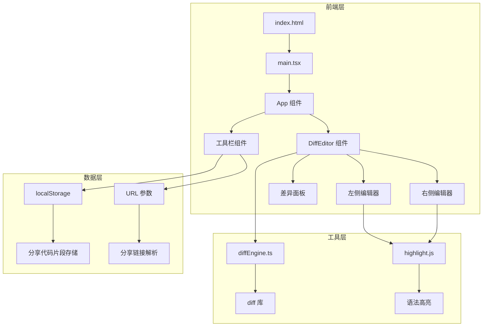
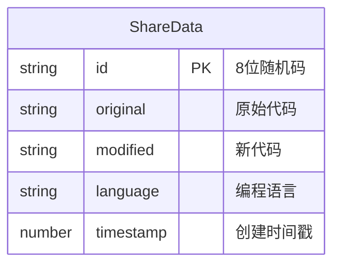

## 1. 架构设计



## 2. 技术说明
- 前端：React@18 + TypeScript + Vite
- 初始化工具：Vite
- 样式：CSS Modules + CSS 变量
- 后端：无（纯前端应用，分享数据存储在 localStorage）
- 数据库：无（使用 localStorage 模拟持久化存储）

## 3. 路由定义
| 路由 | 用途 |
|------|------|
| / | 主页面，双栏编辑器+差异面板 |
| /?s=<shareId> | 分享链接，自动加载对应代码片段 |

## 4. API 定义
- 无后端 API
- 分享功能通过 localStorage 实现：
  - `set('share_<id>', { original, modified, language })` — 存储分享数据
  - `get('share_<id>')` — 读取分享数据

## 5. 服务端架构图
- 不适用（纯前端应用）

## 6. 数据模型

### 6.1 数据模型定义



### 6.2 数据定义语言
- 存储格式：JSON
- Key格式：`share_<8位随机码>`
- Value格式：`{ "original": string, "modified": string, "language": string, "timestamp": number }`

## 7. 文件结构

```
├── package.json
├── vite.config.js
├── tsconfig.json
├── index.html
└── src/
    ├── main.tsx
    ├── App.tsx
    ├── App.css
    ├── components/
    │   └── DiffEditor.tsx
    └── utils/
        └── diffEngine.ts
```

## 8. 核心技术约束

- diffEngine.ts：接收两个字符串，调用 diff 库计算差异，返回包含行号、操作类型（added/removed/modified/unchanged）和文本的结构化数据
- DiffEditor.tsx：双栏编辑器组件，中间差异面板，上下滚动同步
- 代码编辑器输入延迟 < 50ms
- 差异对比计算（<1000字符）< 50ms
- 视图切换动画0.3秒ease-in-out
- 分享按钮点击反馈：图标变勾号0.5秒+toast底部弹出2秒消失
