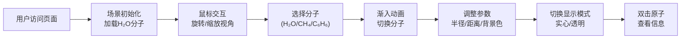

## 1. 产品概述

本产品是一个基于Web的分子结构交互式三维可视化工具，旨在解决科学传播和教学场景中分子结构展示静态化、抽象概念难以理解的问题。通过直观的三维交互，帮助学生、教师和科普爱好者理解分子的空间构型、原子间作用力和键角等核心化学概念。

- 解决的核心问题：传统静态图片和预渲染视频无法让观看者自由探索分子结构，缺乏交互性和沉浸感
- 目标用户：化学教育工作者、学生、科学传播者、科普爱好者
- 产品价值：将抽象的分子结构具象化，通过交互式操作降低学习门槛，提升科学传播效果

## 2. 核心功能

### 2.1 用户角色
| 角色 | 注册方式 | 核心权限 |
|------|----------|----------|
| 普通用户 | 无需注册，直接使用 | 自由选择分子、调整视角、切换显示模式、查看原子信息 |

### 2.2 功能模块
1. **分子选择模块**：下拉菜单选择预设分子（H₂O、CH₄、C₆H₆）
2. **三维渲染模块**：原子球体、化学键圆柱的实时渲染，支持两种显示模式
3. **交互控制面板**：原子半径缩放、相机距离调节、背景色切换、显示模式切换
4. **视角控制模块**：鼠标拖拽旋转、滚轮缩放、轨道控制器
5. **原子信息展示模块**：双击原子显示详细信息卡片

### 2.3 页面详情
| 页面名称 | 模块名称 | 功能描述 |
|---------|----------|----------|
| 主页面 | 3D场景画布 | 分子结构实时渲染区域，支持鼠标交互 |
| 主页面 | 左侧控制面板 | 分子选择、参数调节、模式切换 |
| 主页面 | 原子信息卡片 | 右上角展示双击原子的详细信息 |

## 3. 核心流程

用户打开页面 → 场景初始化并加载默认分子（H₂O）→ 用户可通过鼠标拖拽旋转/滚轮缩放观察分子 → 在控制面板选择不同分子 → 分子切换时播放渐入动画 → 调整原子半径缩放、相机距离、背景色等参数 → 双击原子查看详细信息 → 切换"实心填充"或"透明框架"显示模式

## 4. 用户界面设计

### 4.1 设计风格
- **设计方向**：深色科技风，契合科学可视化的专业感与沉浸感
- **主色调**：深蓝色 #0a0a2e（背景）、紫色 #6c63ff（交互元素）
- **辅助色**：氧红色 #ff4444、碳灰色 #808080、氢白色 #ffffff
- **按钮/控件风格**：圆角设计，滑块带渐变轨道，悬停有平滑过渡效果
- **字体**：系统无衬线字体，浅灰色 #e0e0e0 文字
- **布局风格**：左侧固定控制面板，主区域全屏3D画布，右上角浮动信息卡片
- **视觉效果**：半透明毛玻璃面板、背景模糊、平滑过渡动画

### 4.2 页面设计概述
| 页面名称 | 模块名称 | UI元素 |
|---------|----------|--------|
| 主页面 | 控制面板 | 毛玻璃效果背景，宽280px，圆角12px，内边距20px，控件间距12px |
| 主页面 | 下拉选择框 | 背景 #2a2a4a，白色文字，选中高亮 #6c63ff |
| 主页面 | 滑块控件 | 轨道 #3a3a5c，旋钮 #6c63ff，悬停 #8b83ff，过渡0.2s |
| 主页面 | 信息卡片 | 宽200px，半透明黑背景，圆角8px，内边距8px，淡出动画2秒 |
| 主页面 | 3D场景 | 全屏画布，背景色可切换，分子居中展示 |

### 4.3 响应式设计
- **桌面端（≥768px）**：左侧固定控制面板（宽280px），信息卡片在右上角
- **移动端（<768px）**：控制面板折叠为顶部工具栏，图标按钮形式，点击展开浮层面板；信息卡片移至左上角
- **触摸优化**：支持触摸滑动旋转、捏合缩放

### 4.4 3D场景设计指导
- **环境与氛围**：纯净单色背景，突出分子主体，避免干扰视觉元素
- **光照设置**：环境光 + 两盏方向光，确保原子球体有明显立体感和高光
- **相机设置**：透视相机，初始距离10单位，视角60度，轨道控制器带阻尼（0.1）
- **构图与焦点**：分子始终居中，原子和化学键有清晰的视觉层级
- **交互与动画**：分子切换时0.8秒渐入动画，背景色0.5秒平滑过渡，信息卡片2秒淡出
- **后期处理**：抗锯齿开启，确保边缘平滑
- **性能预算**：苯分子（12原子+12键）帧率≥55fps，参数更新≤16ms

## 5. 非功能性需求

### 5.1 性能要求
- 苯分子场景帧率 ≥ 55fps（轨道控制器启用时）
- 原子半径缩放更新时间 ≤ 16ms
- 背景色切换时间 ≤ 16ms
- 分子切换动画流畅无卡顿

### 5.2 浏览器兼容性
- 支持现代浏览器（Chrome、Firefox、Safari、Edge 最新版本）
- 需支持 WebGL 2.0

### 5.3 可访问性
- 控件有清晰的视觉反馈
- 颜色对比度符合可读性要求
- 支持键盘 Tab 键导航
