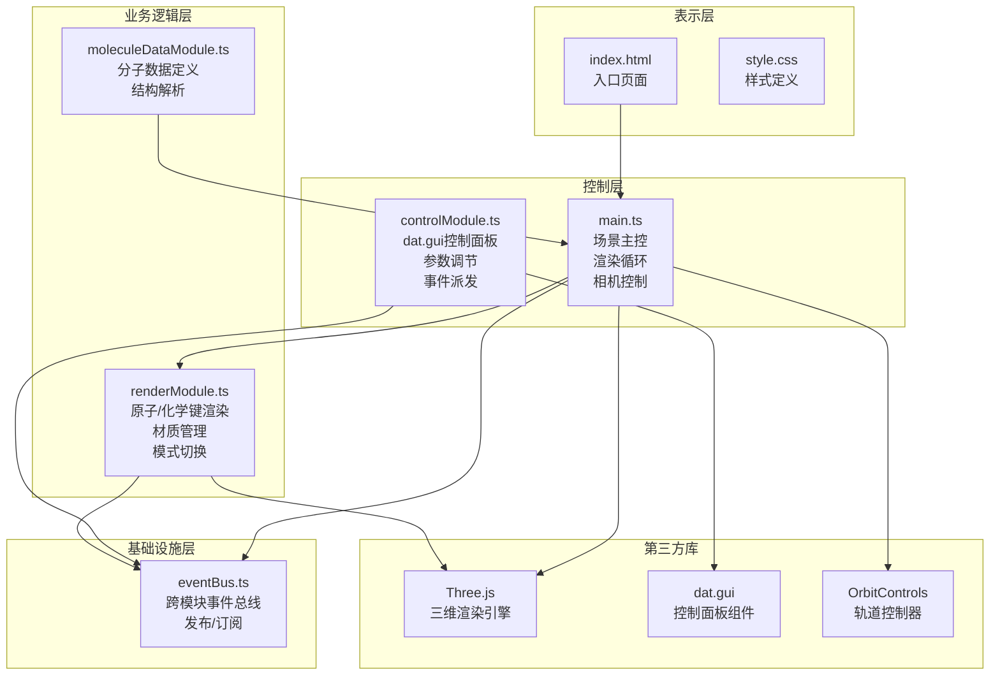

## 1. 架构设计

本项目采用模块化的前端架构，通过事件总线实现模块间的解耦通信。整体为纯前端应用，无需后端服务。



### 模块调用关系与数据流向

```
moleculeDataModule.ts
    ↓ (返回分子数据数组)
main.ts
    ↓ (传递分子数据)
renderModule.ts → 创建Mesh → 添加到Three.js场景
    ↑ (接收模式/半径更新)
eventBus.ts
    ↑ (订阅事件)    ↓ (发布事件)
controlModule.ts → 监听UI变化 → 派发事件
```

## 2. 技术描述

- **前端框架**: 原生 TypeScript 5.x（无UI框架）
- **构建工具**: Vite 5.x
- **三维渲染**: Three.js 0.160.x + @types/three
- **控制面板**: dat.gui 0.7.9
- **初始化方式**: 手动创建项目结构，npm install 安装依赖
- **后端**: 无（纯前端应用）
- **数据库**: 无（分子数据内置为常量）

## 3. 目录结构

```
project/
├── package.json              # 项目依赖与脚本
├── vite.config.js            # Vite构建配置
├── tsconfig.json             # TypeScript编译配置
├── index.html                # 入口HTML
└── src/
    ├── main.ts               # 主程序入口
    ├── eventBus.ts           # 事件总线
    ├── moleculeDataModule.ts # 分子数据模块
    ├── renderModule.ts       # 渲染模块
    ├── controlModule.ts      # 控制面板模块
    └── style.css             # 全局样式
```

## 4. 数据模型

### 4.1 数据类型定义

```typescript
// 原子类型
interface Atom {
  element: 'H' | 'C' | 'O' | 'N' | 'S';  // 元素符号
  elementName: string;                    // 元素中文名称
  atomicNumber: number;                   // 原子序号
  color: string;                          // 显示颜色
  position: [number, number, number];     // 三维坐标 [x, y, z]
  radius: number;                         // 原子半径（标准值）
}

// 化学键类型
interface Bond {
  atomIndex1: number;     // 第一个原子在atoms数组中的索引
  atomIndex2: number;     // 第二个原子在atoms数组中的索引
  bondOrder: number;      // 键级（1: 单键, 2: 双键, 3: 三键）
}

// 分子结构类型
interface Molecule {
  id: string;             // 分子唯一标识
  name: string;           // 分子名称（如"水"）
  formula: string;        // 分子式（如"H₂O"）
  atoms: Atom[];          // 原子列表
  bonds: Bond[];          // 化学键列表
}

// 显示模式类型
type DisplayMode = 'solid' | 'wireframe';

// 应用状态类型
interface AppState {
  currentMoleculeId: string;
  atomScale: number;           // 原子半径缩放比例 0.5-2.0
  cameraDistance: number;      // 相机距离 5-20
  backgroundColor: string;     // 背景色
  displayMode: DisplayMode;    // 显示模式
}
```

### 4.2 事件总线事件类型

```typescript
// 事件类型定义
type EventType =
  | 'molecule:change'        // 切换分子，载荷: moleculeId
  | 'atomScale:change'       // 原子缩放变化，载荷: scale
  | 'cameraDistance:change'  // 相机距离变化，载荷: distance
  | 'backgroundColor:change' // 背景色变化，载荷: color
  | 'displayMode:change'     // 显示模式变化，载荷: DisplayMode
  | 'molecule:loaded'        // 分子加载完成，载荷: Molecule
  | 'atom:doubleClick';      // 原子被双击，载荷: Atom

// 事件载荷类型
interface EventPayloadMap {
  'molecule:change': string;
  'atomScale:change': number;
  'cameraDistance:change': number;
  'backgroundColor:change': string;
  'displayMode:change': DisplayMode;
  'molecule:loaded': Molecule;
  'atom:doubleClick': Atom;
}
```

### 4.3 预设分子数据

```typescript
// 水分子 H2O
const WATER_MOLECULE: Molecule = {
  id: 'h2o',
  name: '水',
  formula: 'H₂O',
  atoms: [
    { element: 'O', elementName: '氧', atomicNumber: 8, color: '#ff4444', position: [0, 0, 0.12], radius: 0.66 },
    { element: 'H', elementName: '氢', atomicNumber: 1, color: '#ffffff', position: [0.76, 0, -0.48], radius: 0.31 },
    { element: 'H', elementName: '氢', atomicNumber: 1, color: '#ffffff', position: [-0.76, 0, -0.48], radius: 0.31 }
  ],
  bonds: [
    { atomIndex1: 0, atomIndex2: 1, bondOrder: 1 },
    { atomIndex1: 0, atomIndex2: 2, bondOrder: 1 }
  ]
};

// 甲烷分子 CH4
const METHANE_MOLECULE: Molecule = { ... };

// 苯分子 C6H6
const BENZENE_MOLECULE: Molecule = { ... };
```

## 5. 核心模块接口设计

### 5.1 eventBus.ts

```typescript
// 单例模式的事件总线
class EventBus {
  private static instance: EventBus;
  private listeners: Map<EventType, Set<Function>>;
  
  static getInstance(): EventBus;
  on<T extends EventType>(event: T, callback: (payload: EventPayloadMap[T]) => void): void;
  off<T extends EventType>(event: T, callback: (payload: EventPayloadMap[T]) => void): void;
  emit<T extends EventType>(event: T, payload: EventPayloadMap[T]): void;
}

export const eventBus = EventBus.getInstance();
```

### 5.2 moleculeDataModule.ts

```typescript
// 获取所有预设分子列表
export function getMoleculeList(): Molecule[];

// 根据ID获取分子
export function getMoleculeById(id: string): Molecule | undefined;
```

### 5.3 renderModule.ts

```typescript
// 创建分子三维对象组
export function createMoleculeGroup(
  molecule: Molecule,
  atomScale: number,
  displayMode: DisplayMode
): THREE.Group;

// 更新原子半径缩放
export function updateAtomScale(group: THREE.Group, scale: number): void;

// 更新显示模式
export function updateDisplayMode(group: THREE.Group, mode: DisplayMode): void;

// 播放渐入动画
export function fadeInGroup(group: THREE.Group, duration: number): Promise<void>;
```

### 5.4 controlModule.ts

```typescript
// 初始化控制面板
export function initControlPanel(
  moleculeList: Molecule[],
  initialState: AppState
): void;

// 更新控制面板状态（当外部改变时同步）
export function updateControlState(state: Partial<AppState>): void;
```

### 5.5 main.ts

```typescript
// 场景初始化
function initScene(): void;

// 切换分子
function changeMolecule(moleculeId: string): void;

// 渲染循环
function animate(): void;

// 处理窗口大小变化
function handleResize(): void;

// 处理原子双击
function handleAtomDoubleClick(atom: Atom): void;
```

## 6. 性能优化策略

1. **几何体复用**：使用共享的 SphereGeometry 和 CylinderGeometry，避免重复创建几何体
2. **材质池**：预先创建不同颜色/透明度的材质，复用到多个 Mesh
3. **矩阵自动更新优化**：设置 `matrixAutoUpdate = false` 手动控制更新
4. **事件节流**：滑块变化事件使用节流，避免频繁更新
5. **图层优化**：原子和化学键分离到不同 Group，便于批量操作
6. **光线优化**：使用最少的光源满足视觉需求（1环境光 + 2方向光）
7. **几何体分段数**：球体使用 32 分段，圆柱使用 8 分段，平衡质量与性能
8. **动画帧同步**：使用 `requestAnimationFrame` 同步渲染循环

## 7. 配置文件规范

### tsconfig.json
- 目标: ES2020
- 模块: ESNext
- 严格模式: true
- 模块解析: bundler
- 类型: three, dat.gui

### vite.config.js
- 启用 TypeScript 严格模式
- 开发服务器端口: 5173
- 生产构建 sourcemap: false
- 优化 three.js 的打包
