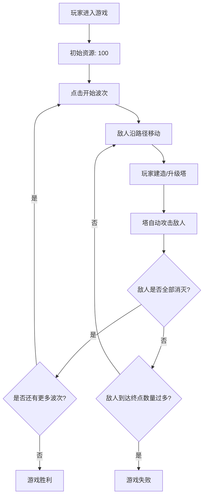

## 1. 产品概述
一款基于浏览器运行的2D像素风格塔防游戏，玩家通过建造不同种类的防御塔抵御一波波敌人的进攻，支持塔升级系统和关卡难度调整。

- 主要用途：提供休闲策略类游戏体验，玩家需要合理规划塔的布局和升级策略来守住防线
- 目标用户：喜欢塔防类游戏的休闲玩家
- 产品价值：无需下载安装，在浏览器中即可体验完整的塔防游戏玩法

## 2. 核心功能

### 2.1 用户角色
无需角色区分，单玩家游戏模式。

### 2.2 功能模块
1. **游戏主界面**：地图显示区、HUD信息面板、波次控制按钮
2. **塔建造系统**：三种防御塔类型选择、网格建造、可建区域高亮
3. **塔升级系统**：塔升级（最多三级）、塔出售、升级/出售按钮
4. **敌人波次系统**：自动生成敌人波次、多种敌人类型、Boss敌人
5. **战斗系统**：塔自动攻击、子弹发射、伤害计算、溅射伤害、减速效果
6. **游戏状态管理**：资源管理、得分系统、波次计数、胜负判定

### 2.3 页面详情

| 页面名称 | 模块名称 | 功能描述 |
|---------|---------|---------|
| 游戏主界面 | 地图显示区 | 10x10网格地图，显示路径、障碍物、塔、敌人 |
| 游戏主界面 | HUD信息面板 | 显示资源值、当前波次、敌人剩余数量、得分 |
| 游戏主界面 | 波次控制 | "开始波次"按钮，手动触发下一波敌人 |
| 游戏主界面 | 塔选择面板 | 三种塔类型选择器，显示塔属性和建造成本 |
| 游戏主界面 | 塔操作面板 | 选中塔后显示升级和出售按钮 |

## 3. 核心流程

1. 玩家打开游戏，进入主界面
2. 玩家点击"开始波次"按钮，触发敌人波次生成
3. 敌人沿预设路径从起点移动到终点
4. 玩家点击空地格子建造防御塔（消耗资源）
5. 防御塔自动锁定并攻击范围内的敌人
6. 敌人被击败，玩家获得得分和资源
7. 玩家可点击已有塔进行升级或出售
8. 所有波次通过则胜利，敌人到达终点过多则失败

## 4. 用户界面设计

### 4.1 设计风格
- **主色调**：深灰色背景 (#1e1e2e)，半透明暗色面板 (#2d2d44)
- **强调色**：绿色（箭塔 #00cc00，开始按钮 #28a745）、红色（炮塔 #cc0000）、蓝色（魔法塔 #0066ff）
- **网格颜色**：浅灰色分隔线 (#444)，路径浅色 (#aaa)，障碍物灰色 (#555)，可建区域半透明绿色 (#00ff0044)，不可建区域半透明红色 (#ff000044)
- **按钮样式**：圆角8px，悬停时颜色加深，点击时有0.2秒缩放动画
- **像素风格**：塔和敌人采用简单几何图形绘制（三角、方形、菱形、圆点）
- **字体**：等宽字体，保持像素游戏风格

### 4.2 页面设计概述

| 页面名称 | 模块名称 | UI元素 |
|---------|---------|---------|
| 游戏主界面 | 布局 | 左侧HUD面板(200px宽) + 中间地图区域 + 顶部开始按钮 |
| 游戏主界面 | HUD面板 | 半透明暗色背景，圆角8px，垂直排列资源/波次/剩余/得分信息 |
| 游戏主界面 | 地图 | 10x10网格，60px/格，居中显示，网格线分隔 |
| 游戏主界面 | 塔选择 | 建造模式下三种塔图标显示，鼠标悬停显示详情 |
| 游戏主界面 | 塔操作 | 选中塔后上方显示升级/出售图标按钮 |
| 游戏主界面 | 动画效果 | 建造高亮、按钮缩放、敌人移动、子弹飞行 |

### 4.3 响应式
桌面端优先设计，固定画布尺寸（600x600地图 + 200px HUD），暂不支持移动端适配。

### 4.4 性能要求
- 稳定30fps以上
- 敌人数量≤100时无卡顿
- 每帧绘制+碰撞检测总耗时≤10ms
