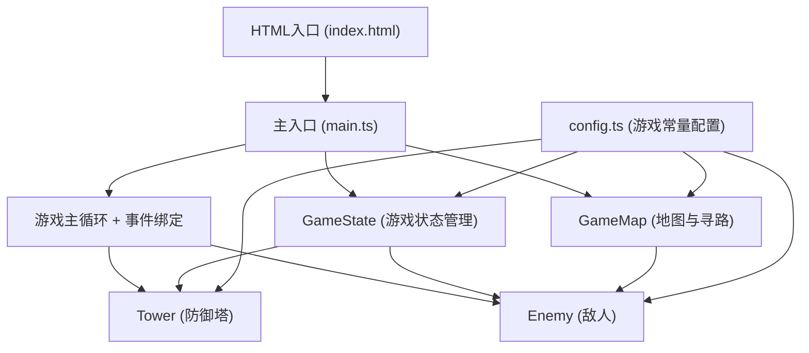

## 1. 架构设计



## 2. 技术描述

- **前端技术栈**：TypeScript + HTML5 Canvas + Vite
- **构建工具**：Vite（轻量级快速构建）
- **语言**：TypeScript（严格模式，目标ES2020）
- **渲染方式**：HTML5 Canvas 2D Context
- **状态管理**：自定义GameState类（无外部状态管理库）
- **无后端、无数据库**：纯前端游戏，所有数据存储在内存中

## 3. 文件结构

```
auto118/
├── package.json          # 依赖配置（typescript, vite）
├── vite.config.js        # Vite构建配置
├── tsconfig.json         # TypeScript配置（严格模式，ES2020）
├── index.html            # 入口HTML页面
└── src/
    ├── main.ts           # 游戏主循环，初始化、事件绑定、帧更新
    ├── config.ts         # 游戏常量：地图、塔、敌人、波次配置
    ├── GameMap.ts        # 地图网格类，障碍物、路径、寻路
    ├── Tower.ts          # 防御塔类：射击、升级、范围绘制
    ├── Enemy.ts          # 敌人类：移动、受击、生命值
    └── GameState.ts      # 游戏状态：资源、得分、波次、胜负
```

## 4. 核心数据模型

### 4.1 塔类型配置
```typescript
type TowerType = 'arrow' | 'cannon' | 'magic';

interface TowerConfig {
  type: TowerType;
  name: string;
  cost: number;
  fireRate: number;        // 每秒发射次数
  damage: number;
  range: number;           // 像素
  color: string;
  splashRadius?: number;   // 溅射半径（炮塔专属）
  slowPercent?: number;    // 减速百分比（魔法塔专属）
  slowDuration?: number;   // 减速持续时间秒
  size: number;            // 像素
  shape: 'triangle' | 'square' | 'diamond';
}
```

### 4.2 敌人类型配置
```typescript
type EnemyType = 'normal' | 'fast' | 'heavy' | 'boss';

interface EnemyConfig {
  type: EnemyType;
  color: string;
  speed: number;           // 像素/帧
  health: number;
  score: number;           // 击败得分
  size: number;            // 像素直径
}
```

### 4.3 游戏状态
```typescript
interface GameStateData {
  resources: number;       // 当前资源
  score: number;           // 得分
  wave: number;            // 当前波次
  enemiesRemaining: number;// 剩余敌人数
  lives: number;           // 剩余生命
  gameOver: boolean;
  victory: boolean;
  waveInProgress: boolean;
}
```

### 4.4 网格单元
```typescript
type CellType = 'empty' | 'path' | 'obstacle' | 'tower' | 'start' | 'end';

interface GridCell {
  x: number;               // 网格坐标
  y: number;
  type: CellType;
  tower?: Tower;
}
```

## 5. 核心算法

### 5.1 路径寻路
使用BFS（广度优先搜索）或预设路径点数组。由于地图固定，采用预设路径点序列的方式，敌人沿路径点依次移动。

### 5.2 碰撞检测
- 塔攻击范围检测：计算敌人与塔中心的欧几里得距离，与塔的range比较
- 子弹命中检测：子弹与敌人的圆形碰撞检测（半径相加比较距离）
- 溅射伤害检测：以爆炸点为中心，对splashRadius内的所有敌人造成伤害

### 5.3 帧更新循环
```
requestAnimationFrame驱动:
  1. 更新敌人位置（沿路径移动）
  2. 更新塔的冷却计时器，检测范围内敌人并发射子弹
  3. 更新子弹位置，检测命中
  4. 处理敌人死亡、到达终点
  5. 渲染所有元素（地图、塔、敌人、子弹、UI）
```

## 6. 性能优化策略

1. **空间分区**：将地图按网格划分，塔只需检查邻近格子的敌人
2. **对象池**：复用子弹对象，避免频繁GC
3. **距离计算优化**：使用距离平方比较避免开方运算
4. **渲染优化**：静态地图元素缓存到离屏Canvas
5. **帧率控制**：使用requestAnimationFrame，必要时采用固定时间步长
