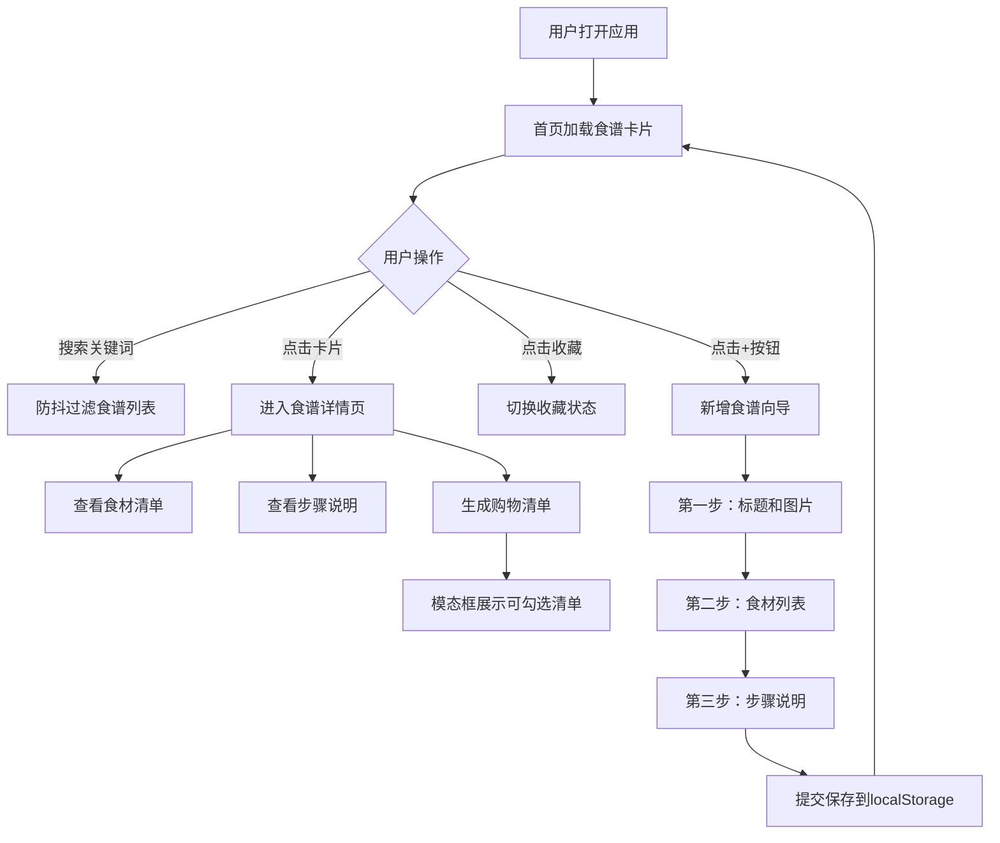

## 1. 产品概述

菜谱活页夹是一款在线食谱管理应用，让用户可以收藏、整理和浏览自己的食谱，记录食材清单、烹饪步骤和时间，并生成可打印的购物清单。
- 目标用户：家庭烹饪爱好者、需要管理食谱收藏的个人用户
- 核心价值：将散落的食谱数字化集中管理，提供便捷的购物清单生成功能，提升烹饪前的准备效率

## 2. 核心功能

### 2.1 用户角色

| 角色 | 注册方式 | 核心权限 |
|------|----------|----------|
| 普通用户 | 无需注册，本地使用 | 浏览、新增、收藏食谱，生成购物清单 |

### 2.2 功能模块

1. **首页**：顶部导航搜索栏、收藏食谱轮播区、食谱卡片网格
2. **食谱详情页**：食材清单、步骤说明、购物清单生成
3. **新增食谱页**：三步骤向导表单

### 2.3 页面详情

| 页面名称 | 模块名称 | 功能描述 |
|----------|----------|----------|
| 首页 | 顶部导航栏 | 固定60px高导航栏，含搜索输入框，0.3秒防抖实时过滤食谱 |
| 首页 | 收藏轮播区 | 横向滚动展示收藏食谱，左右箭头切换 |
| 首页 | 食谱卡片网格 | 网格布局展示所有食谱卡片（240×320px），悬停上移动画 |
| 首页 | 浮动新增按钮 | 右下角56px蓝色圆形按钮，点击进入新增向导 |
| 食谱详情页 | 食材清单 | 左侧flex-wrap排列，每项圆角12px灰底 |
| 食谱详情页 | 步骤说明 | 右侧编号步骤列表，虚线分隔 |
| 食谱详情页 | 购物清单按钮 | 底部按钮，点击弹出模态框 |
| 食谱详情页 | 购物清单模态框 | 半透明遮罩，无序列表可勾选划掉 |
| 新增食谱页 | 第一步 | 填写标题和封面图片URL |
| 新增食谱页 | 第二步 | 添加食材（名称+用量），可动态增减 |
| 新增食谱页 | 第三步 | 添加步骤，多行文本，可拖动排序 |

## 3. 核心流程

用户打开应用后，首页以网格卡片展示所有食谱。用户可通过搜索栏实时过滤，也可点击心形按钮收藏食谱。点击卡片进入详情页查看食材和步骤，并可生成购物清单。点击右下角浮动按钮可新增食谱，通过三步向导完成创建，数据存入localStorage。

## 4. 用户界面设计

### 4.1 设计风格

- 主色调：灰白（背景#f9fafb，文字#1f2937），蓝色交互色（#3b82f6），橘色突出色（#f59e0b）
- 按钮风格：圆角按钮，带过渡动画
- 字体：Noto Sans SC（中文）+ DM Sans（英文/数字），标题18px粗体，正文14px
- 布局风格：卡片网格布局，顶部固定导航
- 图标风格：使用emoji和简洁SVG图标

### 4.2 页面设计概览

| 页面名称 | 模块名称 | UI元素 |
|----------|----------|--------|
| 首页 | 导航栏 | 白色背景60px高，底部浅灰边框，居中搜索框 |
| 首页 | 收藏轮播 | 横向滚动区域，左右箭头按钮，心形图标 |
| 首页 | 卡片网格 | 240×320px白色卡片，20px圆角，浅灰1px边框，悬停上移6px+阴影 |
| 首页 | 浮动按钮 | 56px蓝色圆形，白色+号，悬停放大1.1倍 |
| 详情页 | 食材区 | 圆角12px灰底标签，flex-wrap布局 |
| 详情页 | 步骤区 | 编号列表，灰色虚线分隔 |
| 详情页 | 模态框 | 圆角16px白色，半透明黑色遮罩，☑可勾选列表 |
| 新增页 | 向导表单 | 三步骤进度指示，表单输入，拖拽排序 |

### 4.3 响应式设计

- 桌面优先设计，卡片网格自适应列数
- 最小宽度320px可用，卡片保持240px宽度，通过列数调整适配
- 触摸设备上收藏按钮和卡片交互保持可用

### 4.4 性能指标

- 首页卡片渲染≤200ms（含50张卡片）
- 搜索响应≤100ms（输入后到过滤结果显示）
- localStorage同步≤50ms
