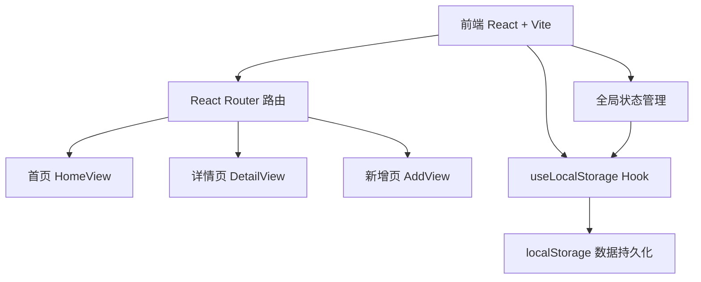
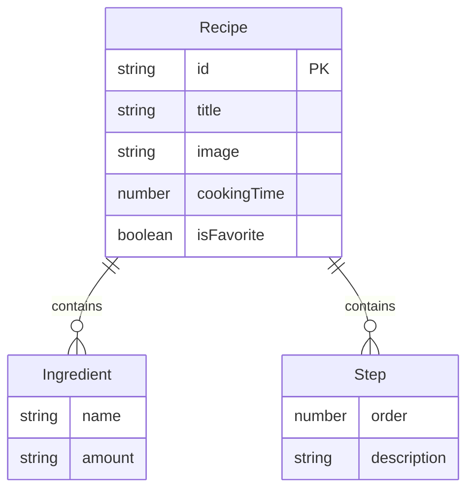

## 1. 架构设计



## 2. 技术说明

- 前端：React 18 + TypeScript + Vite
- 初始化工具：Vite
- 后端：无（纯前端应用）
- 数据库：localStorage（浏览器本地存储）
- UI方案：CSS Modules / 内联样式（无外部UI框架）

## 3. 路由定义

| 路由 | 用途 |
|------|------|
| / | 首页，展示食谱卡片网格、搜索栏、收藏轮播 |
| /recipe/:id | 食谱详情页，展示食材、步骤、购物清单 |
| /add | 新增食谱向导表单 |

## 4. API定义

无后端API，所有数据操作通过 localStorage 完成。

数据读写接口由 `useLocalStorage` Hook 封装：
- `getRecipes(): Recipe[]` — 获取所有食谱
- `saveRecipe(recipe: Recipe): void` — 保存/更新食谱
- `deleteRecipe(id: string): void` — 删除食谱
- `toggleFavorite(id: string): void` — 切换收藏状态

## 5. 数据模型

### 5.1 数据模型定义



### 5.2 数据定义

```typescript
interface Ingredient {
  name: string;
  amount: string;
}

interface Step {
  order: number;
  description: string;
}

interface Recipe {
  id: string;
  title: string;
  image: string;
  cookingTime: number;
  ingredients: Ingredient[];
  steps: Step[];
  isFavorite: boolean;
}
```

localStorage Key: `recipe-binder-recipes`，值为 `Recipe[]` 的 JSON 序列化字符串。

## 6. 文件结构

```
├── index.html
├── package.json
├── vite.config.js
├── tsconfig.json
└── src/
    ├── App.tsx
    ├── types.ts
    ├── hooks/
    │   └── useLocalStorage.ts
    └── components/
        ├── RecipeCard.tsx
        ├── RecipeDetail.tsx
        └── AddRecipe.tsx
```
