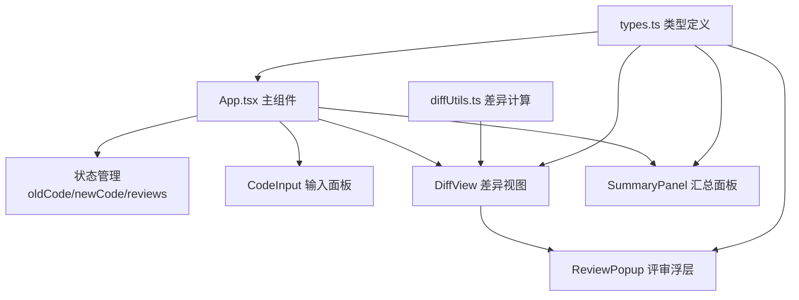
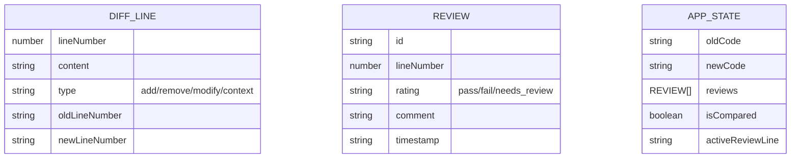

## 1. 架构设计

纯前端单页应用，所有数据存储在React组件状态中，无需后端服务。采用组件化架构，按职责分离模块。



## 2. 技术描述
- **前端框架**：React@18 + TypeScript@5
- **构建工具**：Vite@5 + @vitejs/plugin-react@4
- **差异计算**：diff@5
- **语法高亮**：highlight.js@11
- **唯一ID生成**：uuid@9
- **开发服务器端口**：3000
- **目标浏览器**：ES2020

## 3. 路由定义
| 路由 | 用途 |
|------|------|
| / | 主应用页面（单页应用，无多路由） |

## 4. 数据模型

### 4.1 数据模型定义



### 4.2 类型定义

```typescript
// src/types.ts
export type DiffLineType = 'add' | 'remove' | 'modify' | 'context';
export type ReviewRating = 'pass' | 'fail' | 'needs_review';

export interface DiffLine {
  lineNumber: number;
  oldLineNumber: number | null;
  newLineNumber: number | null;
  content: string;
  type: DiffLineType;
}

export interface Review {
  id: string;
  lineNumber: number;
  rating: ReviewRating;
  comment: string;
  timestamp: number;
}

export interface AppState {
  oldCode: string;
  newCode: string;
  reviews: Review[];
  isCompared: boolean;
  activeLine: number | null;
}
```

## 5. 文件结构与调用关系

```
src/
├── main.tsx              # 入口 → 渲染App
├── App.tsx               # 主组件 → 管理状态，调用子组件
├── types.ts              # 类型定义 → 被所有组件引用
├── utils/
│   └── diffUtils.ts      # 差异计算工具 → DiffView调用
├── components/
│   ├── CodeInput.tsx     # 代码输入组件 → App调用
│   ├── DiffView.tsx      # 差异渲染组件 → App调用，使用diffUtils
│   ├── ReviewPopup.tsx   # 评审浮层组件 → DiffView调用
│   └── SummaryPanel.tsx  # 汇总面板组件 → App调用
└── styles/
    └── index.css         # 全局样式
```

**数据流向**：
1. 用户输入 → CodeInput → 更新App.state.oldCode/newCode
2. 点击对比 → App计算差异 → 传递给DiffView
3. 点击差异行 → DiffView触发 → ReviewPopup显示
4. 提交评审 → ReviewPopup → 更新App.state.reviews
5. 评审更新 → App传递给SummaryPanel → 实时展示统计
