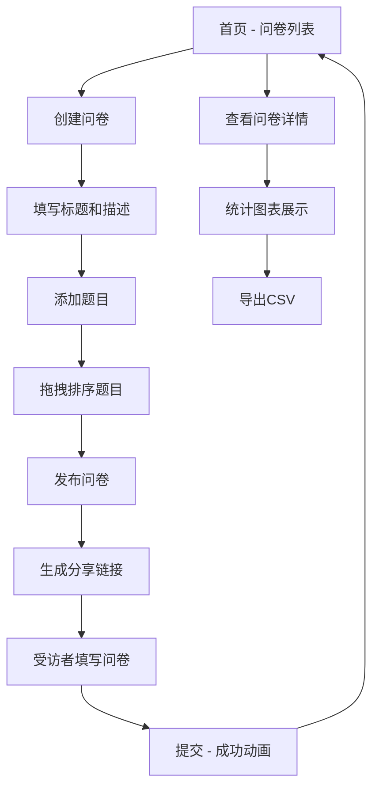

## 1. 产品概述

微型问卷工坊是一款轻量级的前端问卷工具，让用户能够快速创建、发布和收集微型问卷（每次最多5个问题），支持选择题（单选/多选）和量表题（1-5分），并实时查看回答统计图表和导出结果。所有数据在前端内存中管理，无需后端服务器。
- 目标用户：需要快速收集反馈的个人或小团队
- 核心价值：零配置、即开即用、实时可视化统计

## 2. 核心功能

### 2.1 用户角色
| 角色 | 注册方式 | 核心权限 |
|------|----------|----------|
| 模拟用户 | 固定登录(test@example.com) | 创建问卷、填写问卷、查看统计、导出数据 |

### 2.2 功能模块
1. **首页**：问卷列表展示、创建问卷入口
2. **创建问卷页**：填写标题描述、添加/排序题目、设置必答
3. **填写问卷页**：简洁填写界面、进度条、提交动画
4. **问卷详情页**：统计图表展示、导出CSV

### 2.3 页面详情
| 页面名称 | 模块名称 | 功能描述 |
|----------|----------|----------|
| 首页 | 问卷卡片列表 | 展示所有已创建问卷，深浅交错卡片，悬停上移动效，状态标签 |
| 首页 | 创建按钮 | 点击跳转创建问卷页面 |
| 创建问卷页 | 标题描述表单 | 标题限20字，描述限100字 |
| 创建问卷页 | 题目编辑区 | 添加题目（淡入动画），拖拽排序（放大+阴影），必答设置，红色星号标识 |
| 创建问卷页 | 生成链接 | 创建成功后生成 /response/:id 分享链接 |
| 填写问卷页 | 进度条 | 已答题数/总题数，填充动画0.4s ease-in-out |
| 填写问卷页 | 提交按钮 | 圆角12px，蓝渐变背景，悬停亮度1.1倍 |
| 填写问卷页 | 成功动画 | 绿色对勾旋转出现，0.5s后跳转首页 |
| 问卷详情页 | 统计图表 | 选择题饼图（12色，图例右侧），量表题柱状图（渐变色#6366f1，圆角4px） |
| 问卷详情页 | 导出CSV | 点击导出按钮，加载旋转动画0.3s后自动下载 |

## 3. 核心流程

用户打开应用 → 首页查看问卷列表 → 点击创建问卷 → 填写标题描述 → 添加题目（选择题/量表题）→ 设置必答和排序 → 发布生成分享链接 → 受访者通过链接填写 → 提交后成功动画 → 返回首页 → 问卷创建者查看详情页 → 查看实时统计图表 → 导出CSV

## 4. 用户界面设计

### 4.1 设计风格
- 主色调：蓝灰色系（背景#f0f4ff，卡片白色，文字#1e293b）
- 强调色：蓝色（#3b82f6 → #2563eb渐变）用于按钮，紫色（#6366f1）用于图表
- 状态色：绿色（#22c55e）进行中，灰色（#9ca3af）已结束
- 按钮风格：圆角12px，渐变背景，悬停亮度变化
- 字体：系统字体栈，标题16-20px，正文14px，辅助12px
- 布局风格：卡片式布局，顶部导航栏60px

### 4.2 页面设计概览
| 页面名称 | 模块名称 | UI元素 |
|----------|----------|--------|
| 首页 | 问卷卡片列表 | 260×200px卡片，16px圆角，深浅交错背景(#f9fafb/#f3f4f6)，悬停上移5px+阴影，状态标签 |
| 首页 | 导航栏 | 高60px，左侧蓝色圆形图标(32px含白色问号)，右侧用户邮箱 |
| 创建问卷页 | 标题描述区 | 白色卡片，输入框带字数限制提示 |
| 创建问卷页 | 题目编辑区 | 题目卡片淡入动画，拖拽时1.02倍缩放+阴影，红色星号必答标识 |
| 填写问卷页 | 进度条 | 顶部显示，0.4s ease-in-out填充动画 |
| 填写问卷页 | 提交按钮 | 圆角12px，#3b82f6→#2563eb渐变，悬停亮度1.1倍 |
| 填写问卷页 | 成功动画 | 绿色对勾旋转出现，0.5s后跳转 |
| 问卷详情页 | 统计图表 | 白色卡片背景，16px圆角，1px #e5e7eb边框，饼图+柱状图 |

### 4.3 响应式设计
- 桌面优先设计
- 宽度<768px时卡片变为单列布局
- 导航栏在小屏幕上简化显示
