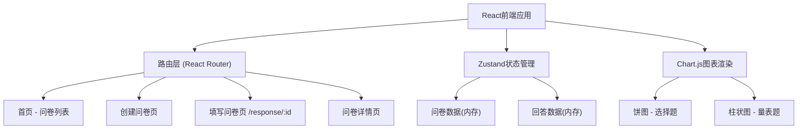
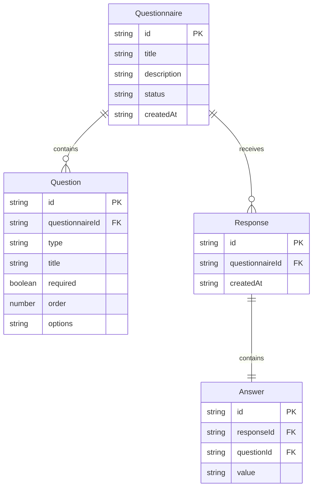

## 1. 架构设计



## 2. 技术说明
- 前端：React@18 + TypeScript + Vite
- 状态管理：Zustand（前端内存状态）
- 路由：React Router DOM
- 图表：Chart.js + react-chartjs-2
- 样式：Tailwind CSS + 自定义CSS动画
- 后端：无（纯前端，所有数据存储在内存中）
- 数据库：无（使用Zustand内存状态管理）
- ID生成：uuid

## 3. 路由定义
| 路由 | 用途 |
|------|------|
| / | 首页，展示所有已创建问卷列表 |
| /create | 创建新问卷页面 |
| /response/:id | 受访者填写问卷页面 |
| /detail/:id | 问卷详情页，查看统计图表和导出 |

## 4. API定义
无后端API，所有操作通过Zustand store直接操作内存数据。

### 数据操作接口
- `addQuestionnaire(q)` - 创建问卷
- `updateQuestionnaire(id, q)` - 更新问卷
- `deleteQuestionnaire(id)` - 删除问卷
- `addResponse(qId, answers)` - 提交问卷回答
- `getQuestionnaireById(id)` - 获取单个问卷
- `getResponsesByQuestionnaireId(qId)` - 获取问卷的所有回答

## 5. 数据模型

### 5.1 数据模型定义



### 5.2 TypeScript 类型定义

```typescript
type QuestionType = 'single' | 'multiple' | 'scale';

interface QuestionOption {
  label: string;
  value: string;
}

interface Question {
  id: string;
  type: QuestionType;
  title: string;
  required: boolean;
  order: number;
  options?: QuestionOption[];
}

interface Questionnaire {
  id: string;
  title: string;
  description: string;
  questions: Question[];
  status: 'active' | 'closed';
  createdAt: string;
}

interface Answer {
  questionId: string;
  value: string | string[];
}

interface Response {
  id: string;
  questionnaireId: string;
  answers: Answer[];
  createdAt: string;
}
```
