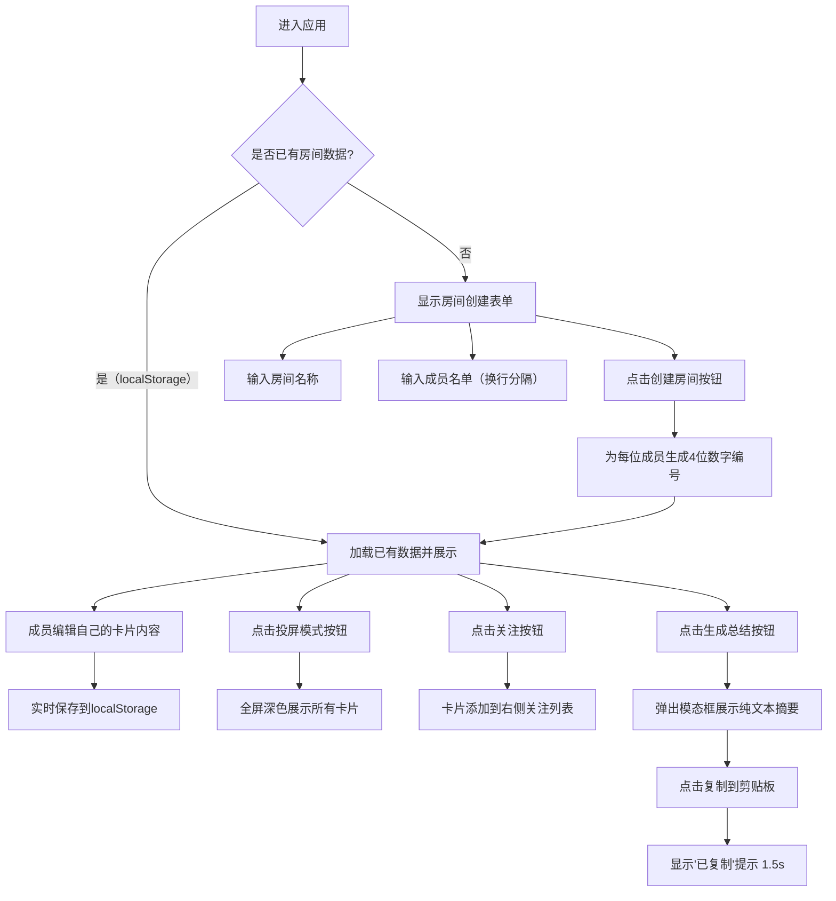

## 1. 产品概述

轻量级团队站会同步应用，解决远程/混合办公环境下每日站会发言零散、信息遗漏、跟进人不明确的问题。以卡片墙形式集中展示每位成员的站会发言，支持投屏展示、关注追踪和一键生成总结。

- 目标用户：3-15人规模的小团队，敏捷开发模式下的每日站会参与者
- 核心价值：结构化信息展示、零配置即开即用、本地持久化数据安全

## 2. 核心特性

### 2.1 用户角色

| 角色 | 注册方式 | 核心权限 |
|------|----------|----------|
| 团队成员 | 无需注册，输入房间名称即加入 | 编辑自己的发言卡片、关注任意卡片、生成总结、投屏展示 |
| 主持人 | 同上，无特殊角色区分 | 拥有所有成员权限，负责引导会议和追踪关注项 |

### 2.2 功能模块

1. **房间创建**：输入房间名称和成员名单，自动生成4位数字编号
2. **成员列表**（左栏）：展示所有成员，支持快速切换选中
3. **卡片墙**（中栏）：网格展示所有成员发言卡片，支持编辑
4. **关注列表**（右栏）：汇总被关注的卡片，方便追踪问题
5. **投屏模式**：全屏深色展示，字体放大适配会议大屏
6. **总结生成**：一键汇总纯文本摘要，支持复制到剪贴板

### 2.3 页面详情

| 页面名称 | 模块名称 | 功能描述 |
|----------|----------|----------|
| 主应用 | 房间创建区 | 首次进入显示，输入房间名和成员名单（换行分隔），点击创建即进入 |
| 主应用 | 成员列表（左栏） | 200px宽，成员项52px高10px圆角，悬停背景#f3f4f6，选中项左侧4px蓝色竖条 |
| 主应用 | 卡片墙（中栏） | 自适应网格，卡片280px宽12px圆角，悬停上移3px + 阴影，包含完成/计划/阻塞 |
| 主应用 | 关注列表（右栏） | 280px宽，背景#f9fafb，仅在有关注项时显示 |
| 主应用 | 投屏模式按钮 | 卡片墙顶部，点击进入全屏深色模式，字体1.5倍，无编辑入口 |
| 主应用 | 生成总结按钮 | 顶部操作区，点击弹出模态框700px宽，圆角16px，含复制功能 |
| 卡片组件 | 编辑区域 | textarea宽100%最小高80px，圆角8px，聚焦蓝色边框+0.2s阴影淡入 |
| 卡片组件 | 字数计数器 | 右下角12px #9ca3af，实时显示当前字数 |
| 卡片组件 | 关注按钮 | 24px圆形，默认灰色空心，点击#f97316实心+0.3s缩放动画 |
| 模态框 | 摘要展示 | 按完成/计划/阻塞分块汇总，高度可滚动，关闭按钮右上角 |
| 模态框 | 复制反馈 | 点击复制显示绿色"已复制"提示，1.5秒后消失 |

## 3. 核心流程

用户首次进入应用 → 填写房间名称和成员名单 → 创建房间 → 每位成员点击自己的编号卡片 → 编辑完成事项/明日计划/阻塞问题 → 主持人投屏展示逐个过站 → 成员点击关注按钮标记需要跟进的问题 → 站会结束点击生成总结 → 复制摘要发送到团队沟通群

## 4. 用户界面设计

### 4.1 设计风格

- 主色：#3b82f6（按钮、选中状态、链接）
- 辅助色：#f97316（关注状态、警告信息）
- 背景色：#f9fafb（主背景）、白色（卡片背景）
- 深色背景：#1f2937（投屏模式）、#f3f4f6（投屏卡片背景）
- 边框色：#e5e7eb（卡片边框）
- 中性色：#9ca3af（次要文字、计数器）
- 按钮风格：扁平化，圆角8px，主色背景白色文字
- 字体：系统默认无衬线（-apple-system, BlinkMacSystemFont, Segoe UI, Roboto），正文14px，标题16px粗体
- 布局：左中右三栏，桌面端优先
- 图标：使用内联 SVG / Unicode 字符，避免外部依赖
- 动画：0.3s ease-out（卡片悬停、模态框开闭、按钮状态），0.4s淡入上移（新增卡片）

### 4.2 页面设计概述

| 页面名称 | 模块名称 | UI 元素 |
|----------|----------|----------|
| 主应用 | 顶部操作栏 | 房间名称显示（左）、投屏模式按钮（中左）、生成总结按钮（中右）、重新创建房间（右） |
| 主应用 | 三栏布局容器 | flex布局，左栏200px、中栏flex-1、右栏280px（条件渲染） |
| 主应用 | 房间创建表单 | 居中卡片，两个输入框（房间名text/成员textarea），创建按钮主色 |
| 成员列表 | 成员项 | 52px高，头像色块+编号+名称，选中左侧4px #3b82f6竖条，悬停#f3f4f6背景10px圆角 |
| 卡片墙 | 网格容器 | grid布局，gap 24px，padding 24px |
| 卡片墙 | 发言卡片 | 280px宽，白色背景#e5e7eb边框，12px圆角，悬停上移3px+阴影 |
| 卡片墙 | 卡片头部 | 编号（粗体16px色块背景）、成员名、关注按钮（右上角） |
| 卡片墙 | 字段区块 | 完成事项（✅图标，最多5条）、明日计划（📌图标，最多3条）、阻塞问题（⚠️图标，最多2条） |
| 卡片墙 | 编辑状态 | textarea替换静态文本，字数计数右下角，保存按钮底部 |
| 关注列表 | 关注项卡片 | 紧凑卡片，显示编号+成员名+阻塞/计划摘要，点击跳转到对应卡片 |
| 投屏模式 | 全屏容器 | position fixed inset 0，#1f2937背景，z-index 9999 |
| 投屏模式 | 卡片网格 | gap 32px，卡片#f3f4f6背景，字体1.5倍放大，无编辑入口 |
| 投屏模式 | 退出按钮 | 右上角固定，白色文字圆角8px |
| 总结模态框 | 遮罩层 | 半透明黑色rgba(0,0,0,0.5)，点击关闭 |
| 总结模态框 | 内容区 | 700px宽，白色背景16px圆角，padding 32px，最大高度80vh overflow-auto |
| 总结模态框 | 顶部操作 | 标题"站会总结"（左）、关闭按钮×（右） |
| 总结模态框 | 摘要文本 | pre或div，等宽字体，每个成员分隔线分隔 |
| 总结模态框 | 复制按钮 | 主色背景白色文字，固定在右下角 |

### 4.3 响应式设计

- 设计策略：桌面端优先（≥1280px为最佳体验）
- 中等屏幕（900-1280px）：三栏布局保持，卡片墙每行减少列数
- 小屏幕（<900px）：右栏关注列表变为底部抽屉，成员列表可折叠
- 触摸屏优化：关注按钮、投屏按钮等可点击元素确保最小44px触控区域

### 4.4 动效细节

- 卡片进场：`opacity: 0 → 1` + `translateY: 20px → 0`，0.4s ease-out，使用 animation-delay 做错峰展示
- 卡片悬停：`translateY: -3px` + `box-shadow: 0 4px 12px rgba(0,0,0,0.1)`，0.25s ease-out
- 关注按钮：`scale: 1 → 1.3 → 1` 弹跳效果，0.3s ease-out，配合颜色切换
- 模态框开启：`scale: 0.9 → 1` + `opacity: 0 → 1`，0.3s ease-out
- 模态框关闭：`scale: 1 → 0.9` + `opacity: 1 → 0`，0.25s ease-in
- textarea聚焦：`border-color` 过渡 + `box-shadow: 0 0 0 3px rgba(59,130,246,0.15)` 淡入，0.2s
