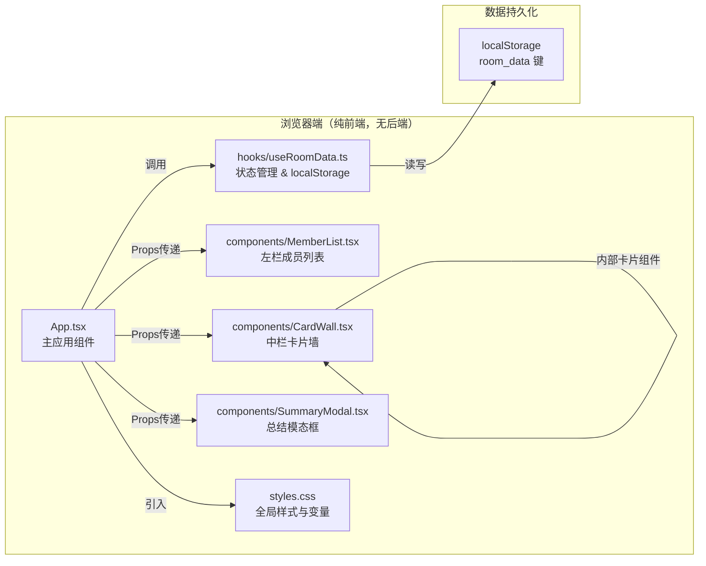

## 1. 架构设计



## 2. 技术说明

- 前端框架：React 18 + TypeScript 5（严格模式）
- 构建工具：Vite 5 + @vitejs/plugin-react 4
- 样式方案：原生 CSS（CSS变量 + BEM类命名），不引入Tailwind以减少包体积
- 数据存储：Browser localStorage（key: `standup_room_data_v1`）
- 初始化方式：手动创建文件结构，运行 `npm install && npm run dev`
- 后端服务：无（纯前端离线应用）
- 外部 CDN：无（完全本地依赖）

## 3. 文件结构定义

```
auto126/
├── package.json              # 依赖与脚本配置
├── vite.config.js            # Vite 构建配置（React插件、端口号）
├── tsconfig.json             # TS严格模式、ES2020目标、JSX: react-jsx
├── index.html                # Vite入口HTML，含root节点和meta标签
└── src/
    ├── App.tsx               # 主应用组件：三栏布局、房间创建、状态分发
    ├── styles.css            # 全局样式、CSS变量、动画关键帧、响应式
    ├── hooks/
    │   └── useRoomData.ts    # 自定义Hook：房间CRUD、localStorage持久化
    └── components/
        ├── CardWall.tsx      # 卡片墙 + 卡片组件 + 投屏模式 + 关注按钮
        ├── MemberList.tsx    # 左栏成员列表渲染
        └── SummaryModal.tsx  # 总结模态框、文本生成、复制功能
```

## 4. TypeScript 类型定义

```typescript
// 成员信息
interface Member {
  id: string;           // 唯一ID（时间戳+随机数）
  name: string;         // 成员姓名
  code: string;         // 4位数字编号，自动生成且唯一
}

// 单条发言项目（完成/计划/阻塞）
interface StandupItem {
  id: string;
  content: string;      // 不超过80字符
}

// 单张卡片（一位成员的今日发言）
interface StandupCard {
  memberId: string;
  done: StandupItem[];      // 完成事项，最多5条
  plan: StandupItem[];      // 明日计划，最多3条
  blocked: StandupItem[];   // 阻塞问题，最多2条
  followed: boolean;        // 是否被关注
  updatedAt: number;        // 最后更新时间戳
}

// 房间数据
interface RoomData {
  name: string;
  members: Member[];
  cards: Record<string, StandupCard>;  // key = memberId
  createdAt: number;
  lastOpenedAt: number;
}

// useRoomData 返回值
interface UseRoomDataReturn {
  room: RoomData | null;
  isLoading: boolean;
  createRoom: (name: string, memberNames: string[]) => void;
  resetRoom: () => void;
  updateCard: (memberId: string, patch: Partial<StandupCard>) => void;
  toggleFollow: (memberId: string) => void;
  getFollowedCards: () => Array<{ member: Member; card: StandupCard }>;
  generateSummaryText: () => string;
}
```

## 5. 核心模块职责

### 5.1 hooks/useRoomData.ts

| 功能 | 实现要点 |
|------|----------|
| 初始化 | `useEffect` 中从 localStorage 读取 JSON → 解析 → setRoom |
| 创建房间 | 生成 `Member[]`（code用1000~9999不重复随机数），初始化空卡片，写入localStorage |
| 重置房间 | 清除 localStorage 对应 key，state 置 null |
| updateCard | `patch` 合并到对应 memberId 的卡片，更新 `updatedAt = Date.now()`，写回 localStorage |
| toggleFollow | 切换 `card.followed` 布尔值 |
| getFollowedCards | 过滤 `followed === true` 的卡片，与 members 关联返回 |
| generateSummaryText | 遍历 members → 按格式拼接纯文本（===成员名 [#编号]=== / ✅ 完成 / 📌 计划 / ⚠️ 阻塞） |
| 持久化策略 | 每次 state 变更 useEffect 依赖 room 深度比较 → JSON.stringify → localStorage.setItem（防抖 200ms） |

### 5.2 components/MemberList.tsx

Props：`{ members: Member[]; selectedMemberId: string | null; onSelect: (id: string) => void }`

- 遍历 members 渲染 `<div class="member-item">`
- 选中状态判定 `selectedMemberId === member.id`，添加 `member-item--selected` 类
- 悬停时 `:hover` 切换背景，CSS 实现
- 每个成员项包含：彩色色块（code 派生颜色）、编号标签、姓名

### 5.3 components/CardWall.tsx

Props：
```
{
  members: Member[];
  cards: Record<string, StandupCard>;
  selectedMemberId: string | null;
  onUpdateCard: (memberId: string, patch: Partial<StandupCard>) => void;
  onToggleFollow: (memberId: string) => void;
}
```

内部组件：
- `<CardGrid>` — CSS grid 容器，`grid-template-columns: repeat(auto-fill, 280px)`
- `<StandupCardComponent>` — 单张卡片，含编辑/查看双态
  - 查看态：静态列表渲染，每条 item 支持删除按钮
  - 编辑态：textarea + 字数计数器 + 添加空项按钮
  - 关注按钮：绝对定位右上角，24px圆形，CSS 动画过渡
- `<CastingMode>` — 全屏投屏层，`position: fixed; inset: 0`，深色背景，`font-size: 1.5em`

### 5.4 components/SummaryModal.tsx

Props：`{ open: boolean; summaryText: string; onClose: () => void }`

- 遮罩层：`position: fixed; inset: 0; background: rgba(0,0,0,0.5)`，点击触发 onClose
- 内容框：宽 700px（max-width: 95vw），居中，scale 过渡动画
- 关闭按钮：右上角 32×32，× 符号
- 摘要区：`<pre>` 标签或 `<div class="summary-text">`，`max-height: 60vh; overflow-y: auto`
- 复制按钮：底部，`navigator.clipboard.writeText(summaryText)` → 状态切换为"已复制"绿色，1.5s 后恢复

### 5.5 App.tsx

核心状态：
```ts
const [selectedMemberId, setSelectedMemberId] = useState<string | null>(null);
const [showCreateRoom, setShowCreateRoom] = useState(!room); // room来自hook
const [castingMode, setCastingMode] = useState(false);
const [showSummary, setShowSummary] = useState(false);
```

布局：
- 无 room → 显示 `<CreateRoomOverlay>` 创建表单
- 有 room → 三栏 flex 布局（`member-list | card-wall-area | follow-sidebar`）
- 顶部操作栏：房间名 + 投屏按钮 + 生成总结按钮 + 重置按钮

### 5.6 styles.css

CSS 变量定义在 `:root`：
```css
--color-primary: #3b82f6;
--color-accent: #f97316;
--color-bg: #f9fafb;
--color-card-bg: #ffffff;
--color-border: #e5e7eb;
--color-muted: #9ca3af;
--color-text: #111827;
--color-cast-bg: #1f2937;
--color-cast-card: #f3f4f6;
--radius-sm: 8px;
--radius-md: 10px;
--radius-lg: 12px;
--radius-xl: 16px;
--anim-fast: 0.2s ease-out;
--anim-base: 0.3s ease-out;
--anim-slow: 0.4s ease-out;
```

关键动画：
- `@keyframes fadeInUp`：卡片入场
- `.card:hover`：transform + box-shadow
- `.follow-btn.active`：scale 弹跳（两层 transition 延迟）
- `.modal-enter` / `.modal-leave`：缩放 + 透明度

## 6. 性能与约束

| 指标 | 目标 | 手段 |
|------|------|------|
| 交互响应 | < 100ms | 所有 state 更新同步，无 setTimeout 阻塞，避免 re-render 泛滥 |
| 卡片编辑实时保存 | 无感知 | 防抖 200ms 写 localStorage，输入期间不阻塞 UI |
| 刷新不丢失 | 100% | 所有写操作立即持久化到 localStorage（防抖后） |
| 首屏渲染 | < 200ms | 无外部请求，纯本地数据，代码分包避免单文件过大 |
| 新增卡片动画 | 流畅 | CSS animation + animation-delay 错峰 50ms |
| 字数限制 | 严格执行 | textarea `maxlength` 属性 + JS 双重截断，计数器红色警告 |
| 条目数限制 | 严格执行 | 达到最大数量时"添加"按钮禁用变灰 |

## 7. 约束清单

- ✅ 不引入任何 UI 组件库（Ant Design / MUI 等），全部原生实现
- ✅ 不引入 Tailwind，使用原生 CSS + 变量
- ✅ 不引入状态管理库（Redux / Zustand），使用 useState + useReducer + 自定义 Hook
- ✅ 不引入图标库，使用 emoji 或内联 SVG
- ✅ localStorage 键名带版本号 `standup_room_data_v1` 便于后续迁移
- ✅ TypeScript 严格模式 `strict: true`，noImplicitAny、strictNullChecks 全部开启
- ✅ 目标 ES2020，Vite 转译，支持现代浏览器（Chrome 80+ / Edge 80+ / Firefox 72+ / Safari 14+）
