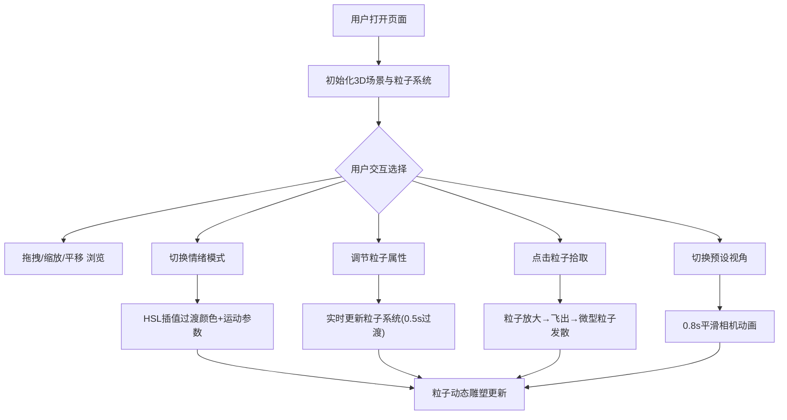

## 1. 产品概述

交互式3D粒子情感画布——让用户通过鼠标交互在三维空间中释放、移动和组合带色彩与动效的粒子群，根据"情绪选择"动态改变粒子颜色主题和运动轨迹，最终形成可旋转浏览的粒子动态雕塑。面向数字艺术创作者、情绪表达爱好者和创意工作者，提供一种直觉式的3D情感可视化工具。

## 2. 核心功能

### 2.1 用户角色
| 角色 | 注册方式 | 核心权限 |
|------|----------|----------|
| 访客 | 无需注册 | 使用全部交互功能 |

### 2.2 功能模块
1. **3D粒子画布页面**：全屏3D场景、粒子系统、情绪切换、参数调节、视角切换

### 2.3 页面详情
| 页面名称 | 模块名称 | 功能描述 |
|----------|----------|----------|
| 3D粒子画布 | 粒子生成与渲染 | 启动时自动生成1000个粒子（随机分布在-15到15的三维空间），圆形渐变色点（直径0.15-0.35），X/Y/Z三方向正弦波运动 |
| 3D粒子画布 | 视角交互控制 | 鼠标左键拖拽旋转（Y轴360度，X轴-60到60度），滚轮缩放（5-40单位），右键拖拽平移（范围各20单位） |
| 3D粒子画布 | 情绪模式切换 | 左上角四个情绪按钮（喜悦/宁静/忧愁/激昂），点击后1.5秒内HSL插值平滑过渡颜色，运动速度与振幅随情绪变化 |
| 3D粒子画布 | 粒子属性调节 | 右下角三个滑块：粒子数量（100-3000步长100）、粒子大小（0.1-0.8步长0.05）、运动速度（0.2-2.0步长0.1），实时更新带0.5秒过渡 |
| 3D粒子画布 | 粒子点击拾取 | 点击粒子放大3倍变白（0.3秒），沿随机方向飞出（2秒消散），飞出位置生成5个微型粒子发散 |
| 3D粒子画布 | 相机视角切换 | 键盘1/2/3切换预设视角（俯视45度/侧视90度/仰视30度），0.8秒平滑动画，左下角显示视角名称 |

## 3. 核心流程

用户打开页面后，自动进入全屏3D粒子场景，1000个粒子以默认情绪模式（喜悦）呈现正弦波运动。用户可：
1. 拖拽旋转/滚轮缩放/右键平移来浏览3D粒子雕塑
2. 点击左上角情绪按钮切换粒子颜色主题和运动模式
3. 通过右下角滑块实时调节粒子数量、大小和速度
4. 点击单个粒子触发"灵感迸发"效果
5. 按键盘1/2/3快速切换预设相机视角

## 4. 用户界面设计

### 4.1 设计风格
- **主色调**：深黑色背景 #000000
- **主题色**：喜悦 #FFD93D、宁静 #6BCB77、忧愁 #4D96FF、激昂 #FF6B6B
- **UI风格**：半透明毛玻璃效果（背景rgba(255,255,255,0.08)，边框1px solid rgba(255,255,255,0.15)，圆角12px，模糊8px）
- **字体**：白色无衬线字体 font-family: 'Inter', sans-serif
- **布局**：全屏沉浸式3D场景，UI浮层叠加
- **动画**：所有过渡使用ease-out缓动

### 4.2 页面设计概述
| 页面名称 | 模块名称 | UI元素 |
|----------|----------|--------|
| 3D粒子画布 | 情绪按钮面板 | 左上角浮层，4个圆形按钮(50px)，毛玻璃背景，悬停放大1.1倍(0.2s)，发光边框动画 |
| 3D粒子画布 | 参数滑块面板 | 右下角浮层，3个渐变滑块(透明→主题色)，圆头设计，毛玻璃背景 |
| 3D粒子画布 | 视角提示 | 左下角浮层，文字显示当前视角名称，毛玻璃背景 |
| 3D粒子画布 | 3D场景 | 全屏黑色背景，Three.js Canvas渲染粒子 |

### 4.3 响应式适配
- 桌面端优先设计
- 移动端（window.innerWidth < 768px）粒子数量自动减半
- 移动端UI控件折叠为可拖拽圆形菜单
- 触摸事件适配

### 4.4 3D场景指引
- **环境**：纯黑背景，无HDRI，粒子自发光
- **灯光**：无额外灯光，粒子使用自发光材质
- **相机**：透视相机，默认位置(0, 0, 20)，FOV 60度
- **交互**：OrbitControls，限制旋转角度和缩放范围
- **粒子渲染**：Points + BufferGeometry + ShaderMaterial，圆形渐变粒子纹理
- **性能目标**：1000粒子默认视角下55FPS以上

## 5. 技术栈
- TypeScript + React 18 + Vite
- Three.js + @react-three/fiber + @react-three/drei
- 状态管理：Zustand
