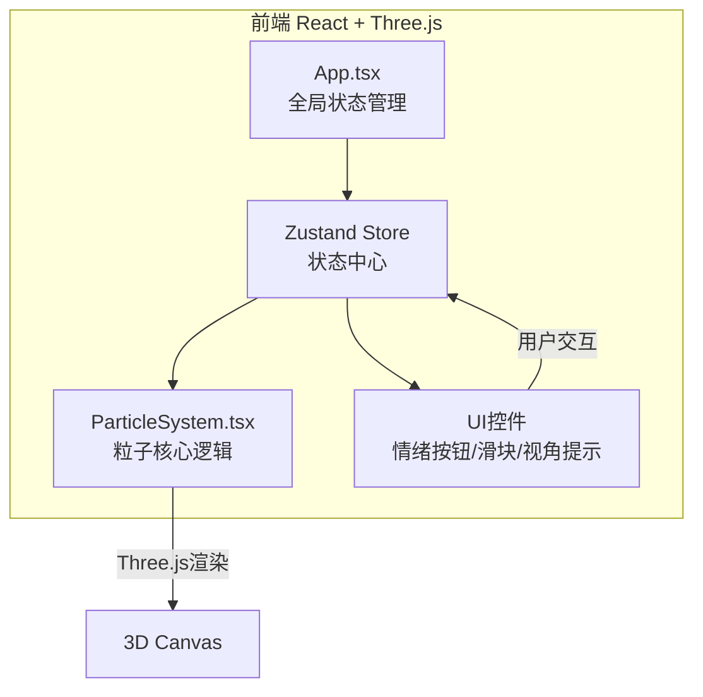

## 1. 架构设计



数据流向：用户交互 → Zustand Store → ParticleSystem / UI 更新 → Three.js 渲染

## 2. 技术说明
- **前端**：React 18 + TypeScript + Vite + Three.js + @react-three/fiber + @react-three/drei
- **初始化工具**：vite-init (react-ts模板)
- **状态管理**：Zustand
- **后端**：无
- **数据库**：无

## 3. 路由定义
| 路由 | 用途 |
|------|------|
| / | 3D粒子情感画布（单页应用） |

## 4. 文件结构

```
├── package.json
├── vite.config.js
├── tsconfig.json
├── index.html
├── src/
│   ├── main.tsx          # React DOM渲染入口
│   ├── App.tsx           # 主应用组件，全局状态+Canvas+UI
│   ├── store/
│   │   └── useStore.ts   # Zustand状态管理
│   ├── components/
│   │   ├── ParticleSystem.tsx  # 粒子系统核心组件
│   │   ├── EmotionPanel.tsx    # 情绪切换面板
│   │   ├── SliderPanel.tsx     # 粒子属性滑块面板
│   │   └── ViewIndicator.tsx   # 视角名称提示
│   └── styles/
│       └── global.css    # 全局样式
```

### 文件间调用关系
- `main.tsx` → 渲染 `App.tsx`
- `App.tsx` → 引用 `useStore`、`ParticleSystem`、`EmotionPanel`、`SliderPanel`、`ViewIndicator`
- `ParticleSystem.tsx` ← 接收 `useStore` 中的情绪模式、粒子数量、粒子大小、运动速度
- `EmotionPanel.tsx` → 更新 `useStore` 中的情绪模式
- `SliderPanel.tsx` → 更新 `useStore` 中的粒子数量/大小/速度
- `ViewIndicator.tsx` ← 读取 `useStore` 中的当前视角

## 5. Zustand Store 数据模型

```typescript
type EmotionMode = 'joy' | 'calm' | 'sorrow' | 'fervor';
type ViewPreset = 'top45' | 'side90' | 'bottom30';

interface StoreState {
  emotionMode: EmotionMode;
  particleCount: number;
  particleSize: number;
  motionSpeed: number;
  currentView: ViewPreset;
  setEmotionMode: (mode: EmotionMode) => void;
  setParticleCount: (count: number) => void;
  setParticleSize: (size: number) => void;
  setMotionSpeed: (speed: number) => void;
  setCurrentView: (view: ViewPreset) => void;
}
```

## 6. 情绪模式参数映射

| 情绪 | 颜色(HSL) | 运动速度倍率 | 振幅倍率 | 运动特征 |
|------|-----------|-------------|---------|----------|
| 喜悦 joy | #FFD93D (hsl(48,100%,62%)) | 1.5 | 1.8 | 快速散开 |
| 宁静 calm | #6BCB77 (hsl(128,50%,61%)) | 0.5 | 0.6 | 缓慢漂浮 |
| 忧愁 sorrow | #4D96FF (hsl(217,100%,65%)) | 0.8 | 1.0 | 低频下沉 |
| 激昂 fervor | #FF6B6B (hsl(0,100%,71%)) | 2.0 | 2.5 | 快速震荡 |

## 7. 关键技术实现

### 7.1 粒子渲染
- 使用 `@react-three/fiber` 的 `<Canvas>` 组件创建3D场景
- 使用 Three.js `Points` + `BufferGeometry` 渲染粒子群
- 使用 `ShaderMaterial` 自定义粒子外观（圆形渐变）
- 粒子位置/颜色通过 `BufferAttribute` 管理，useFrame 中更新

### 7.2 情绪过渡动画
- 颜色过渡：HSL空间插值，1.5秒内从当前色过渡到目标色
- 运动参数过渡：线性插值，1.5秒内平滑变化
- 使用 useFrame 中的 lerp 实现逐帧过渡

### 7.3 粒子点击拾取
- 使用 Raycaster 检测点击的粒子
- 点击后粒子放大3倍+变白0.3秒，然后沿随机方向飞出
- 飞出位置生成5个微型粒子，2秒后消散

### 7.4 相机视角切换
- 监听键盘事件（1/2/3键）
- 使用 drei 的 `useCamera` 或手动 lerp 相机位置
- 0.8秒 ease-out 过渡动画
