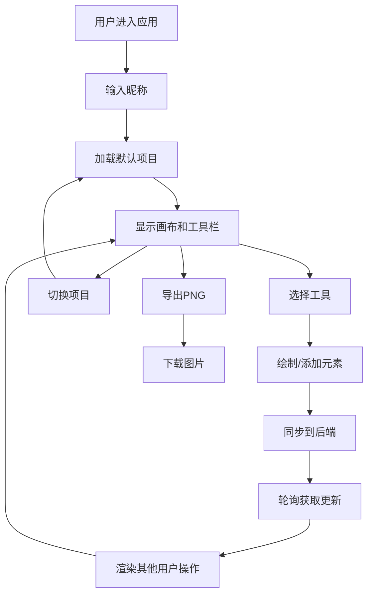

## 1. 产品概述

在线创意工作坊协作白板是一款面向团队的实时协作工具，支持多人在无限画布上共同绘制草图、添加便利贴和思维导图，适用于远程头脑风暴、创意讨论和项目规划场景。

- **主要目的**：提供一个可视化的协作空间，让团队成员能够实时共享创意和想法
- **解决的问题**：传统远程协作工具缺乏直观的视觉表达和实时互动体验
- **目标用户**：产品团队、设计团队、敏捷开发团队、教育工作者

## 2. 核心功能

### 2.1 用户角色

| 角色 | 加入方式 | 核心权限 |
|------|----------|----------|
| 协作用户 | 输入昵称加入项目 | 绘制、添加便利贴、移动元素、导出图片 |

### 2.2 功能模块

1. **无限画布**：支持自由绘制、便利贴、箭头连接，支持平移和缩放
2. **项目管理**：多项目创建与切换，缩略图预览
3. **工具栏**：画笔工具、便利贴工具、箭头工具、选择工具、橡皮擦
4. **多用户协作**：实时显示在线用户光标，分时轮询同步画布数据
5. **导出功能**：将画布导出为 PNG 图片

### 2.3 页面详情

| 页面名称 | 模块名称 | 功能描述 |
|-----------|----------|----------|
| 主工作区 | 顶部工具栏 | 工具切换、颜色选择、粗细选择、导出按钮 |
| 主工作区 | 左侧项目面板 | 项目列表、缩略图预览、创建新项目、折叠面板 |
| 主工作区 | 中心画布区域 | 无限画布、元素渲染、交互操作、缩放指示 |
| 主工作区 | 在线用户列表 | 显示当前在线用户及其光标颜色 |

## 3. 核心流程

用户进入应用后，首先看到默认项目的画布。用户可以选择工具进行绘制或添加便利贴，通过左侧面板切换或创建项目。多个用户可以同时在同一项目中协作，通过轮询机制实时同步彼此的操作。

## 4. 用户界面设计

### 4.1 设计风格

- **主色调**：暗色主题，背景 `#1a1a2e`，工具栏 `#16213e`，强调色 `#e94560`
- **辅助色**：`#0f3460`（深蓝渐变）、`#4ECDC4`（青绿色）、`#FF6B6B`（珊瑚红）、`#FFC107`（琥珀黄）
- **按钮风格**：渐变背景，圆角，悬停微放大效果
- **字体**：现代无衬线字体，清晰可读
- **布局风格**：三栏布局（左侧项目面板 + 中心画布 + 右侧可折叠工具栏）
- **图标风格**：Font Awesome 线性图标

### 4.2 页面设计概览

| 页面名称 | 模块名称 | UI 元素 |
|-----------|----------|----------|
| 主工作区 | 顶部工具栏 | 渐变按钮、颜色选择器网格、粗细选择器、导出按钮 |
| 主工作区 | 左侧面板 | 深色卡片、项目缩略图、折叠动画 |
| 主工作区 | 画布区域 | 无限画布、元素阴影、缩放标签、用户光标 |
| 主工作区 | 便利贴 | 圆角矩形、浅黄色背景、双击编辑、弹性动画 |

### 4.3 响应式

- 桌面端优先设计
- 左侧面板可折叠以适应小屏幕
- 画布区域自适应剩余空间
- 触摸设备支持手势缩放和平移

### 4.4 动效设计

- 工具切换：底部高亮指示条 0.2s 过渡
- 面板折叠：0.3s 平滑动画
- 元素选中：调节手柄淡入
- 便利贴移动：影子跟随、弹性让位动画 0.2s
- 项目切换：画布内容渐入 0.3s
- 缩放：平滑过渡 0.15s
- 箭头发光：脉冲动画 1s 周期
- 删除元素：缩小消失动画 0.2s
