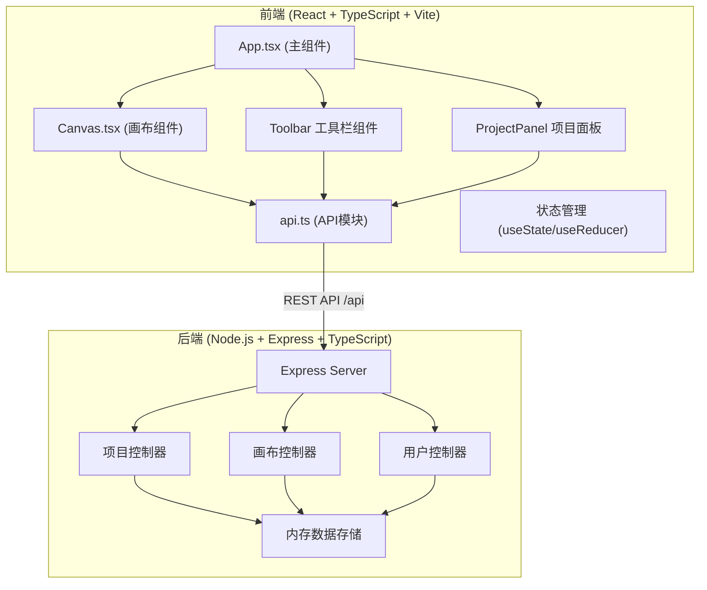
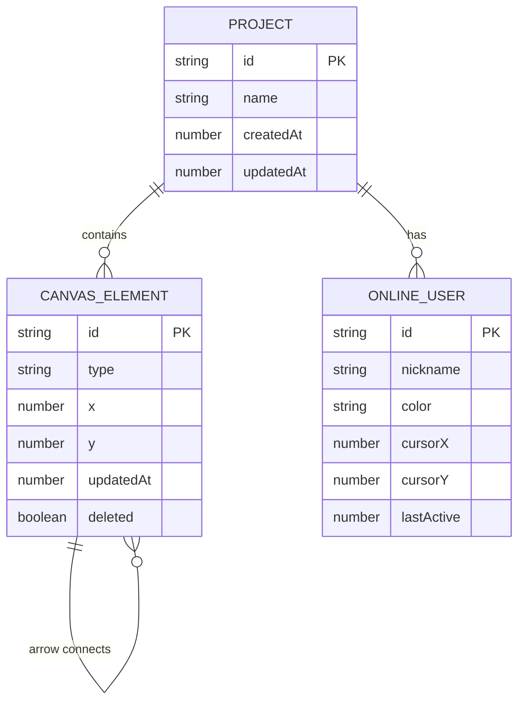

## 1. 架构设计



## 2. 技术描述

- **前端框架**：React 18 + TypeScript + Vite
- **前端样式**：CSS Modules / 内联样式，暗色主题
- **图标库**：Font Awesome (CDN引入)
- **画布技术**：HTML5 Canvas 2D API
- **状态管理**：React useState/useReducer + Context
- **后端框架**：Express 4 + TypeScript
- **数据存储**：内存数组模拟持久化
- **协作方式**：分时轮询（每2秒轮询一次）
- **构建工具**：Vite（开发服务器代理 /api 到后端 3001 端口）

## 3. 目录结构

```
.
├── package.json
├── index.html
├── vite.config.js
├── tsconfig.json
├── src/
│   ├── main.tsx          # React 应用入口
│   ├── App.tsx           # 主组件
│   ├── api.ts            # API 调用模块
│   ├── components/
│   │   ├── Canvas.tsx    # 画布组件
│   │   ├── Toolbar.tsx   # 工具栏
│   │   └── ProjectPanel.tsx  # 项目面板
│   └── types/
│       └── index.ts      # 类型定义
└── server/
    └── index.ts          # Express 服务端
```

## 4. API 定义

### 4.1 项目相关

| 方法 | 路径 | 描述 | 请求体 | 响应体 |
|------|------|------|--------|--------|
| GET | /api/projects | 获取项目列表 | - | Project[] |
| POST | /api/projects | 创建新项目 | { name: string } | Project |
| GET | /api/projects/:id | 获取项目详情 | - | Project |
| PUT | /api/projects/:id | 更新项目信息 | { name?: string } | Project |
| DELETE | /api/projects/:id | 删除项目 | - | { success: boolean } |

### 4.2 画布元素相关

| 方法 | 路径 | 描述 | 请求体 | 响应体 |
|------|------|------|--------|--------|
| GET | /api/projects/:id/elements | 获取画布所有元素 | - | CanvasElement[] |
| POST | /api/projects/:id/elements | 添加画布元素 | CanvasElement | CanvasElement |
| PUT | /api/projects/:id/elements/:elementId | 更新画布元素 | Partial<CanvasElement> | CanvasElement |
| DELETE | /api/projects/:id/elements/:elementId | 删除画布元素 | - | { success: boolean } |
| GET | /api/projects/:id/elements?since=timestamp | 获取增量更新 | - | { elements: CanvasElement[], deleted: string[] } |

### 4.3 用户相关

| 方法 | 路径 | 描述 | 请求体 | 响应体 |
|------|------|------|--------|--------|
| POST | /api/projects/:id/users | 用户加入项目 | { nickname: string } | { userId: string, color: string } |
| DELETE | /api/projects/:id/users/:userId | 用户离开项目 | - | { success: boolean } |
| GET | /api/projects/:id/users | 获取在线用户列表 | - | OnlineUser[] |
| PUT | /api/projects/:id/users/:userId | 更新用户状态（光标位置） | { x: number, y: number } | { success: boolean } |

## 5. 数据模型

### 5.1 数据类型定义

```typescript
// 项目
interface Project {
  id: string;
  name: string;
  createdAt: number;
  updatedAt: number;
}

// 画布元素基类
interface BaseElement {
  id: string;
  type: 'stroke' | 'sticky' | 'arrow';
  x: number;
  y: number;
  updatedAt: number;
  deleted?: boolean;
}

// 自由线条
interface StrokeElement extends BaseElement {
  type: 'stroke';
  points: { x: number; y: number }[];
  color: string;
  thickness: number;
}

// 便利贴
interface StickyElement extends BaseElement {
  type: 'sticky';
  width: number;
  height: number;
  text: string;
  bgColor: string;
  shape: 'rectangle' | 'circle' | 'hexagon';
}

// 箭头
interface ArrowElement extends BaseElement {
  type: 'arrow';
  startElementId: string;
  endElementId: string;
  color: string;
}

type CanvasElement = StrokeElement | StickyElement | ArrowElement;

// 在线用户
interface OnlineUser {
  id: string;
  nickname: string;
  color: string;
  cursorX: number;
  cursorY: number;
  lastActive: number;
}
```

### 5.2 数据模型关系图



## 6. 核心技术实现

### 6.1 无限画布实现
- 使用 Canvas 2D API
- 通过 transform（translate + scale）实现视口变换
- 坐标系统：世界坐标 → 屏幕坐标映射
- 支持 0.5x ~ 4x 缩放

### 6.2 元素渲染
- 自由线条：使用 Path2D 或连续 lineTo
- 便利贴：圆角矩形 + 文本渲染
- 箭头：计算元素边缘中点 + 箭头头部
- 选中状态：8个调节手柄

### 6.3 协作同步
- 客户端每 2 秒轮询一次增量更新
- 使用时间戳 since 参数获取增量
- 每个元素带 updatedAt 时间戳
- 软删除（deleted 标记）同步

### 6.4 性能优化
- Canvas 分层渲染
- 脏矩形局部重绘（可选）
- requestAnimationFrame 动画循环
- 元素离屏裁剪

## 7. 构建与启动

- **前端开发服务器**：Vite (默认 5173 端口)
- **后端服务器**：Express (3001 端口)
- **代理配置**：Vite 代理 `/api` 到 `http://localhost:3001`
- **启动命令**：`npm run dev` 同时启动前后端
