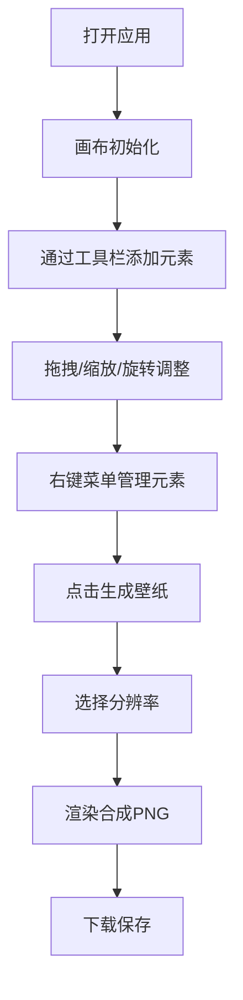

## 1. 产品概述

灵感画布是一款无边界数字白板Web应用，让用户在浏览器中自由创作，通过放置图片、文本和手绘涂鸦来捕捉灵感，并可一键将作品导出为高清壁纸。

- 核心目标：提供一个流畅、沉浸式的创意空间，支持无限画布操作与高质量内容导出
- 目标用户：设计师、创意工作者、普通用户用于灵感记录和壁纸创作

## 2. 核心功能

### 2.1 功能模块
1. **无限画布**：无边界画布，支持鼠标拖拽平移与滚轮缩放
2. **元素管理**：图片、文本、手绘涂鸦三种元素的添加、编辑、删除
3. **交互操作**：元素拖拽、缩放、旋转、Z轴排序、锁定
4. **工具栏**：左侧工具栏提供元素添加工具与画笔设置
5. **壁纸导出**：一键将画布内容导出为1920x1080或1080x1920高清PNG壁纸

### 2.2 功能详情

| 功能模块 | 子功能 | 描述 |
|---------|--------|------|
| 画布操作 | 平移 | 按住空格键+左键拖拽或右键拖拽，带惯性阻尼（减速系数0.92） |
| 画布操作 | 缩放 | 滚轮缩放，范围0.2x~5x，中心跟随鼠标位置，0.25秒平滑过渡 |
| 画布操作 | 背景 | 深蓝灰 #1a1a2e 基调，浅灰网格线 #333340，间隔40px |
| 图片元素 | 上传 | 支持 jpg/png，单张≤5MB |
| 图片元素 | 拖拽 | 0.15秒延迟反馈，浅金色虚线边框 |
| 图片元素 | 缩放 | 右下角手柄，最小50x50，最大300x300，0.5倍步进 |
| 图片元素 | 旋转 | 顶部手柄，每次45度，以元素中心为轴心 |
| 文本元素 | 创建 | 画布中心添加，默认PingFang SC 18px #e0e0e0 |
| 文本元素 | 编辑 | 双击进入编辑模式，支持换行、加粗、斜体 |
| 画笔元素 | 手绘 | 三档粗细：2px/4px/6px |
| 画笔元素 | 颜色 | #ff6b6b、#ffd93d、#6bcb77、#4d96ff、白色 |
| 画笔元素 | 笔触 | 0.3秒淡入起始点动画 |
| 元素交互 | 选中 | 渐变光晕呼吸动画（#e0aaff → 透明，3px宽，4px偏移，0.5秒循环） |
| 元素交互 | 右键菜单 | 删除、复制、置顶/置底、锁定位置（缩放淡入动画0.8x→1x，0.15秒） |
| 工具栏 | 样式 | 左侧固定64px宽，深色半透明 rgba(30,30,40,0.8)，圆角12px，悬停变纯色 #2c2c3e |
| 导出壁纸 | 触发 | 右上角按钮，背景 #6c5ce7，悬停 #7c6cf7 |
| 导出壁纸 | 分辨率 | 1920x1080 / 1080x1920 可选 |
| 导出壁纸 | 进度 | 渐变进度条 #6c5ce7 → #a29bfe，约1.5秒完成 |

## 3. 核心流程

用户打开应用 → 在无限画布上通过工具栏添加图片/文本/手绘 → 通过拖拽、缩放、旋转调整元素位置与大小 → 通过右键菜单管理元素 → 点击右上角"生成壁纸"按钮 → 选择分辨率 → 系统自动构图并渲染 → 导出PNG下载到本地

## 4. 用户界面设计

### 4.1 设计风格
- 主色调：深蓝灰 #1a1a2e
- 强调色：暖金色 #e0aaff、紫色 #6c5ce7
- 字体：PingFang SC 为默认字体
- 按钮：圆角设计，过渡动画 0.2秒
- 图标：线性风格，悬停填充主题色
- 整体氛围：沉浸式暗色调，创作专注感

### 4.2 页面布局

| 区域 | 位置 | UI元素 |
|------|------|--------|
| 工具栏 | 左侧固定，宽64px | 图片上传按钮、文本按钮、画笔按钮（含粗细/颜色子面板） |
| 画布 | 全屏主体 | 网格背景、所有元素、选中光晕、右键菜单 |
| 导出按钮 | 右上角 | "生成壁纸"按钮，8px圆角 |
| 进度条 | 弹出层居中 | 渐变进度条，导出时显示 |

### 4.3 响应性
- 桌面端优先设计
- 画布自适应浏览器窗口大小
- 支持触控板手势缩放
