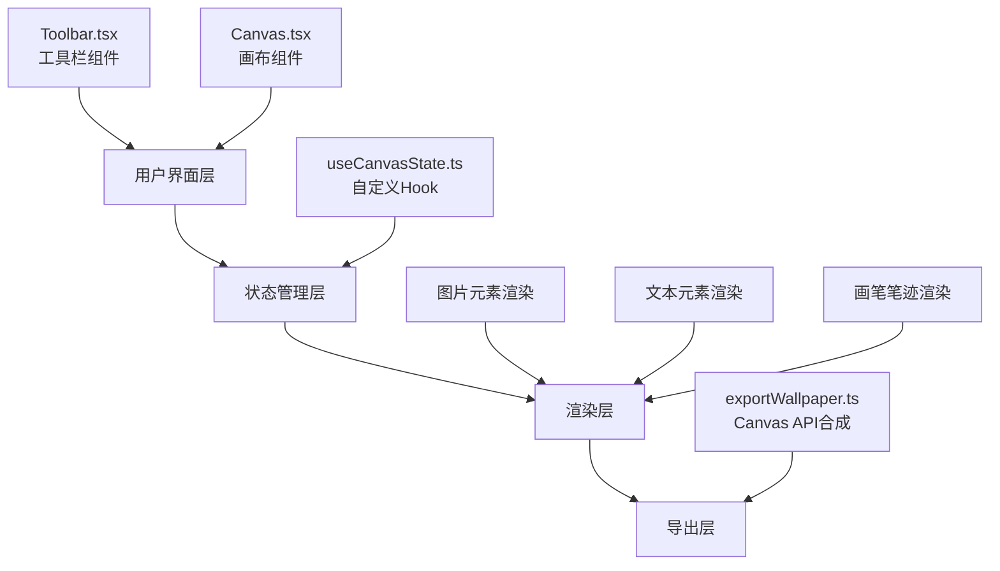

## 1. 架构设计



## 2. 技术描述

- 前端框架：React 18 + TypeScript
- 构建工具：Vite
- 状态管理：React Hooks (useState, useRef, useCallback)
- 渲染方式：混合渲染（DOM元素用于图片/文本，Canvas用于画笔笔迹和最终导出）
- 无后端，纯前端应用

## 3. 文件结构

```
├── package.json              # 项目依赖和脚本
├── vite.config.js            # Vite配置
├── tsconfig.json             # TypeScript配置
├── index.html                # 入口HTML
└── src/
    ├── types.ts              # 类型定义
    ├── useCanvasState.ts     # 状态管理Hook
    ├── Canvas.tsx            # 核心画布组件
    ├── Toolbar.tsx           # 工具栏组件
    └── exportWallpaper.ts    # 壁纸导出模块
```

## 4. 数据模型

### 4.1 核心类型定义

```typescript
// 元素基础类型
interface BaseElement {
  id: string;
  type: 'image' | 'text' | 'drawing';
  x: number;           // 画布坐标X
  y: number;           // 画布坐标Y
  width: number;
  height: number;
  rotation: number;    // 旋转角度（度）
  zIndex: number;      // Z轴层级
  locked: boolean;     // 是否锁定
}

// 图片元素
interface ImageElement extends BaseElement {
  type: 'image';
  src: string;         // base64图片数据
}

// 文本元素
interface TextElement extends BaseElement {
  type: 'text';
  content: string;
  fontSize: number;
  fontWeight: 'normal' | 'bold';
  fontStyle: 'normal' | 'italic';
}

// 画笔元素
interface DrawingElement extends BaseElement {
  type: 'drawing';
  points: { x: number; y: number }[];  // 笔迹点相对坐标
  strokeColor: string;
  strokeWidth: 2 | 4 | 6;
}

// 画布视图状态
interface CanvasView {
  offsetX: number;     // 平移X
  offsetY: number;     // 平移Y
  scale: number;       // 缩放比例
}
```

## 5. 关键实现方案

### 5.1 无限画布实现
- 使用 CSS transform (translate + scale) 实现画布视图变换
- 所有元素位置存储在画布坐标系中，渲染时根据视图状态转换
- 滚轮缩放：以鼠标位置为锚点计算新的 offset 和 scale
- 拖拽平移：记录速度实现惯性，减速系数 0.92

### 5.2 元素交互实现
- 拖拽：mousedown 记录起始位置，mousemove 更新元素坐标，mouseup 结束
- 缩放：右下角拖拽手柄，限制 50x50 ~ 300x300，0.5倍整数步进
- 旋转：顶部旋转手柄，每次点击 +45度，CSS transform-origin: center
- Z轴排序：维护全局 zIndex 计数器，新元素/置顶时自增

### 5.3 画笔实现
- 使用独立的 Canvas 层实时绘制笔迹
- 记录所有笔画的点序列，最终渲染时回放
- 淡入效果：笔画起始点逐步增加不透明度

### 5.4 壁纸导出实现
- 创建离屏 Canvas，尺寸 1920x1080 或 1080x1920
- 计算所有元素的包围盒，按比例缩放到目标分辨率
- 依次绘制：背景色 → 画笔笔迹 → 图片 → 文本
- 最终导出为 PNG Blob 触发下载
