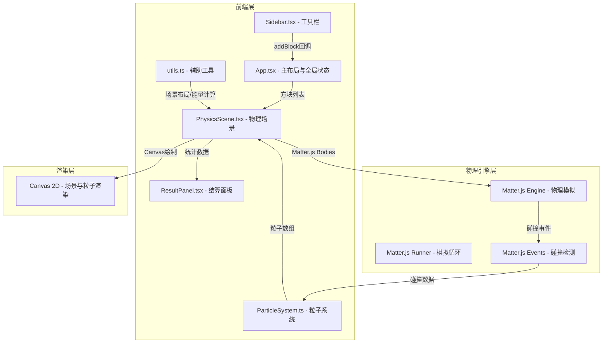

## 1. 架构设计



## 2. 技术说明
- 前端框架：React 18 + TypeScript
- 物理引擎：Matter.js（npm包 matter-js）
- 构建工具：Vite + @vitejs/plugin-react
- 状态管理：React useState/useCallback（组件间通过props传递）
- 渲染：Canvas 2D API（物理场景+粒子系统）
- 样式：内联CSS + CSS变量（深色科技感主题）
- 无后端依赖

## 3. 路由定义
| 路由 | 用途 |
|------|------|
| / | 主界面，包含工具栏、物理场景和结算面板 |

## 4. 数据流向

```mermaid
flowchart LR
    "Sidebar" -->|"addBlock(blockData)"| "App State"
    "App State" -->|"blocks[]"| "PhysicsScene"
    "PhysicsScene" -->|"Matter.Engine"| "物理模拟"
    "物理模拟" -->|"碰撞事件"| "ParticleSystem"
    "ParticleSystem" -->|"particles[]"| "PhysicsScene Canvas"
    "PhysicsScene" -->|"stats"| "ResultPanel"
    "utils.ts" -->|"场景生成/能量计算"| "PhysicsScene"
```

### 关键数据结构

```typescript
interface BlockData {
  id: string;
  material: 'wood' | 'iron' | 'glass' | 'explosive' | 'launcher';
  x: number;
  y: number;
  width: number;
  height: number;
  energy: number;
}

interface Particle {
  x: number;
  y: number;
  vx: number;
  vy: number;
  size: number;
  color: string;
  life: number;
  maxLife: number;
  type: 'debris' | 'spark' | 'shard' | 'droplet' | 'explosion';
  shape: 'circle' | 'polygon';
  points?: number[][];
  opacity: number;
}

interface SimulationStats {
  totalCollisions: number;
  maxTransferDistance: number;
  energyLossRate: number;
  destroyedCount: number;
}

interface MaterialConfig {
  color: string;
  iconColor: string;
  weight: number;
  restitution: number;
  friction: number;
  label: string;
}
```

## 5. 文件结构与调用关系

```
project/
├── package.json          # 依赖：react, react-dom, matter-js, typescript, vite, @vitejs/plugin-react
├── index.html            # 入口页面，<div id="root">
├── vite.config.js        # Vite构建配置，React插件
├── tsconfig.json         # TypeScript严格模式，ES2020，ESNext模块
└── src/
    ├── main.tsx          # React入口，渲染App，全局状态管理
    ├── App.tsx           # 主布局：Sidebar | PhysicsScene | ResultPanel
    ├── Sidebar.tsx       # 工具栏：材质图标、拖拽逻辑、addBlock回调
    ├── PhysicsScene.tsx  # 物理场景：Matter.Engine、碰撞检测、Canvas渲染
    ├── ParticleSystem.ts # 粒子系统：创建/更新/渲染粒子
    ├── ResultPanel.tsx   # 结算面板：统计数据、重置按钮
    └── utils.ts          # 辅助函数：场景生成算法、能量计算、材质配置
```

### 模块调用关系
- `main.tsx` → 渲染 `App.tsx`
- `App.tsx` → 包含 `Sidebar.tsx` + `PhysicsScene.tsx` + `ResultPanel.tsx`
- `Sidebar.tsx` → 调用 `App.addBlock()` → 更新App状态
- `App.tsx` → 将blocks传给 `PhysicsScene.tsx`
- `PhysicsScene.tsx` → 使用 `utils.ts` 创建场景布局
- `PhysicsScene.tsx` → 使用 `ParticleSystem.ts` 管理粒子
- `PhysicsScene.tsx` → 传stats给 `ResultPanel.tsx`

## 6. 关键算法

### 6.1 能量传递算法
- 初始冲击波能量：100%
- 每次碰撞能量损失：20%（转化为粒子效果）
- 能量<10%时停止传递
- 最大波及方块数：30

### 6.2 场景生成算法
- 镜像对称：沿中轴线生成左半部分，镜像到右半
- 螺旋嵌套：沿阿基米德螺旋线分布方块
- 随机散落：随机坐标+碰撞检测保证最小20px/最大120px间距且不重叠

### 6.3 粒子生命周期管理
- 每帧更新位置（vx/vy）、透明度（根据life/maxLife线性衰减）
- life<=0时移除粒子
- 粒子总数硬上限200，超出时移除最旧的粒子
