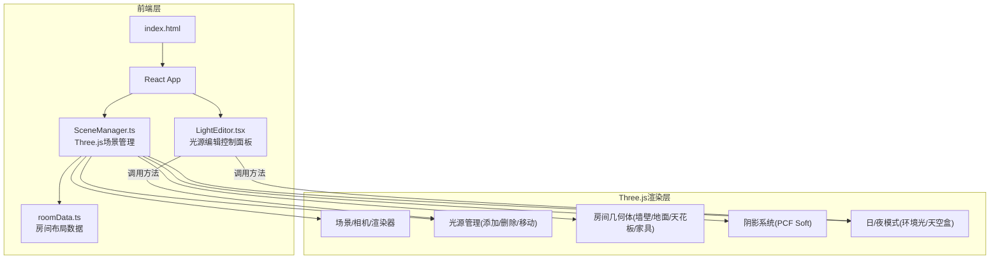
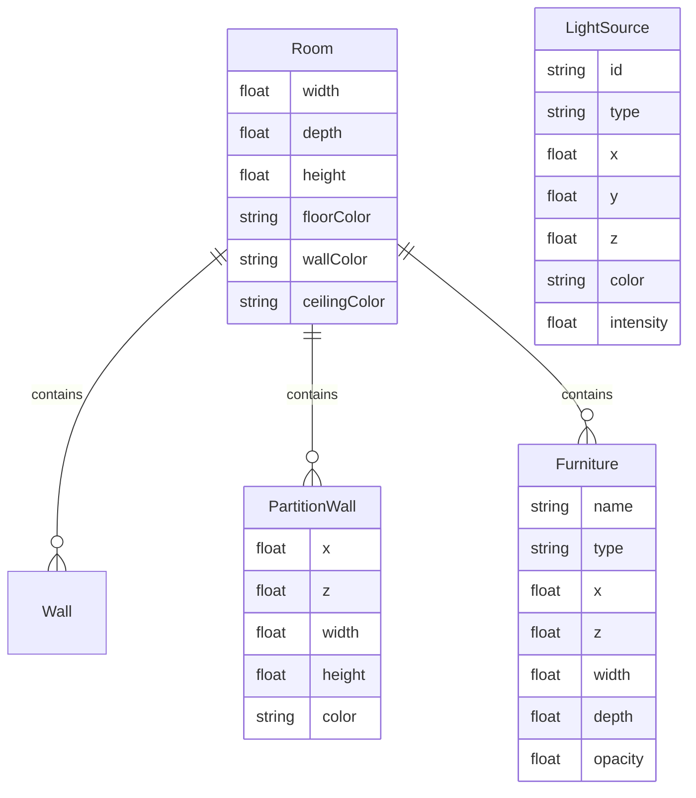

## 1. 架构设计



## 2. 技术说明

- 前端：React@18 + TypeScript + Vite
- 3D渲染：Three.js + OrbitControls
- 状态管理：React useState/useRef（场景状态由SceneManager管理，UI状态由React管理）
- 初始化工具：vite-init (react-ts模板)
- 后端：无
- 数据库：无

## 3. 路由定义

| 路由 | 用途 |
|------|------|
| / | 单页面应用，包含3D场景与控制面板 |

## 4. 数据模型

### 4.1 数据模型定义



## 5. 文件结构

```
├── package.json
├── index.html
├── vite.config.js
├── tsconfig.json
├── src/
│   ├── main.tsx          # React入口，挂载App
│   ├── App.tsx           # 主应用组件，整合场景与控制面板
│   ├── SceneManager.ts   # Three.js场景初始化与管理
│   ├── LightEditor.tsx   # 光源编辑控制面板组件
│   └── roomData.ts       # 房间布局静态数据
```

## 6. 核心模块职责

### SceneManager.ts
- 初始化Three.js场景、透视相机、WebGL渲染器
- 创建房间几何体（地面、墙壁、天花板、隔断墙、家具）
- 管理光源列表（添加/删除/移动/属性更新）
- 配置阴影系统（PCFSoftShadowMap）
- 管理日/夜模式切换（环境光插值、天空盒切换）
- 提供渲染循环（requestAnimationFrame）
- 提供快照导出方法（preserveDrawingBuffer + toDataURL）

### LightEditor.tsx
- 渲染浮动控制面板UI
- 光源选择下拉（点光源/聚光灯）
- 位置滑块X/Y/Z
- 颜色选择器
- 强度滑块
- 日/夜模式切换按钮
- 快照导出按钮（含进度动画）
- 通过props调用SceneManager方法

### roomData.ts
- 导出房间尺寸常量（5×4×3m）
- 导出隔断墙位置列表
- 导出家具多边形坐标列表
- 导出颜色常量

## 7. 性能优化策略

- 阴影贴图分辨率控制在1024×1024
- 使用PCFSoftShadowMap而非高精度VSM
- 家具使用简单平面几何体，不加载复杂模型
- 光源数量上限10个
- 渲染器使用antialias但关闭不必要的后处理
- 响应式像素比：Math.min(window.devicePixelRatio, 2)
