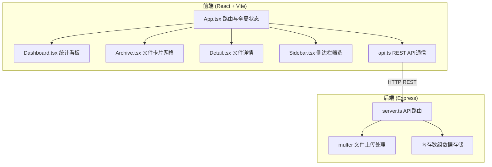
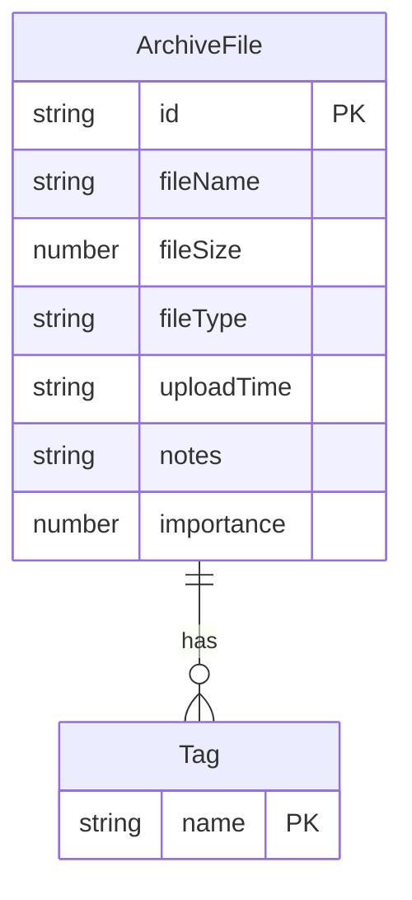

## 1. 架构设计



## 2. 技术说明

- **前端**：React@18 + TypeScript + Vite + Tailwind CSS
- **初始化工具**：vite-init (react-express-ts模板)
- **后端**：Express@4 + TypeScript + multer + cors + body-parser + uuid
- **数据库**：内存数组模拟持久化（无需外部数据库）
- **状态管理**：Zustand
- **路由**：react-router-dom

## 3. 路由定义

| 路由 | 用途 |
|------|------|
| `/` | 档案馆首页（统计看板 + 文件网格 + 侧边栏） |
| `/detail/:id` | 档案详情页（文件预览 + 标签/备注/星级编辑） |

## 4. API定义

### 4.1 TypeScript 类型定义

```typescript
interface ArchiveFile {
  id: string;
  fileName: string;
  fileSize: number;
  fileType: 'pdf' | 'jpg' | 'png' | 'svg' | 'txt';
  uploadTime: string;
  tags: string[];
  notes: string;
  importance: number; // 1-5
  dataUrl?: string;   // base64用于预览
}

interface SearchParams {
  fileTypes?: string[];
  tags?: string[];
  dateFrom?: string;
  dateTo?: string;
  importance?: number;
}

interface FileStats {
  total: number;
  todayCount: number;
  typeDistribution: Record<string, number>;
}
```

### 4.2 API端点

| 方法 | 路径 | 请求 | 响应 | 说明 |
|------|------|------|------|------|
| POST | `/api/files` | multipart/form-data (file) | `ArchiveFile` | 上传文件 |
| GET | `/api/files` | - | `ArchiveFile[]` | 获取全部文件 |
| GET | `/api/files/:id` | - | `ArchiveFile` | 获取单个文件 |
| PUT | `/api/files/:id` | `{ tags, notes, importance }` | `ArchiveFile` | 更新文件元信息 |
| POST | `/api/files/search` | `SearchParams` | `ArchiveFile[]` | 多条件组合搜索 |
| GET | `/api/files/stats` | - | `FileStats` | 获取统计数据 |

## 5. 服务器架构

```mermaid
graph LR
    "Controller 路由层" --> "Service 业务层" --> "Repository 数据层" --> "内存数组存储"
```

- **路由层**：定义REST API端点，参数校验
- **业务层**：文件元信息提取、搜索过滤、统计计算
- **数据层**：内存数组CRUD操作

## 6. 数据模型

### 6.1 数据模型定义



### 6.2 数据存储

使用后端内存数组存储，数据结构：

```typescript
const files: ArchiveFile[] = [];
```

文件内容使用multer的内存存储（MemoryStorage），以base64编码的dataUrl形式保存在ArchiveFile.dataUrl字段中，方便前端预览。
