## 1. 产品概述

家居软装搭配展示工具是一款面向装修前用户和租房群体的在线2D俯视图家居布置预览应用。用户可通过拖拽家具、切换墙面颜色，快速预览不同风格组合在房间内的整体效果，降低装修决策成本。

- 核心目标：提供直观、快速的家居软装搭配预览体验
- 目标用户：准备装修的业主、租房改造需求群体、室内设计爱好者

## 2. 核心功能

### 2.1 功能模块

1. **房间设置模块**：房型选择、地板材质切换、2D俯视图实时渲染
2. **家具拖拽模块**：家具库面板、拖拽放置、网格吸附、删除功能
3. **墙面配色模块**：墙体点击选色、颜色过渡动画、配色方案名称识别
4. **方案管理模块**：方案保存、缩略图生成、横向卡片列表、一键切换对比

### 2.2 页面详情

| 页面名称 | 模块名称 | 功能描述 |
|---------|---------|---------|
| 主页（单页应用） | 房间设置模块 | 3种房型选择（正方形12㎡、长方形20㎡、L形），3种地板材质（木地板、灰色瓷砖、浅色地毯），比例1:20渲染2D俯视图 |
| 主页（单页应用） | 家具拖拽模块 | 右侧280px家具面板（沙发、茶几、书架、床头柜、落地灯），拖拽跟随鼠标，松开吸附25px网格，左上角垃圾桶图标删除 |
| 主页（单页应用） | 墙面配色模块 | 点击墙体弹出8色选择器，0.3s颜色过渡，左侧显示配色方案名称（如奶油原木风、高级灰调） |
| 主页（单页应用） | 方案管理模块 | 底部70px工具栏，localStorage保存最多5个方案，120x90px缩略图卡片，0.5s淡入淡出切换动画 |

## 3. 核心流程

```mermaid
flowchart LR
    A["进入应用"] --> B["选择房型和地板"]
    B --> C["画布渲染房间"]
    C --> D["从右侧面板拖拽家具"]
    D --> E["家具跟随鼠标移动"]
    E --> F["松开吸附到网格"]
    F --> G["点击墙体选颜色"]
    G --> H["颜色过渡动画+方案名更新"]
    H --> I["点击保存方案按钮"]
    I --> J["底部生成缩略图卡片"]
    J --> K["点击卡片切换方案"]
    K --> L["0.5s淡入淡出过渡"]
```

## 4. 用户界面设计

### 4.1 设计风格

- **主背景色**：米白 #fdfaf6
- **主色调**：暖棕色 #8b5e3c（按钮填充）
- **墙线**：#666666 厚度3px，墙体填充 #f0f0f0（半透明灰）
- **网格线**：#e0e0e0，间距25px
- **面板风格**：白色 #ffffff 卡片，#e5e5e5 分隔线，圆角12px
- **按钮风格**：#8b5e3c 填充 + 白色文字，圆角8px
- **字体**：Inter
- **交互反馈**：悬停时亮度+5% + translateY(-2px) 轻微上浮

### 4.2 配色方案预设

| 颜色名称 | 色值 | 搭配风格名称 |
|---------|------|------------|
| 暖白 | #f5e6d0 | 奶油原木风 |
| 莫兰迪绿 | #a3b8a5 | 自然森系风 |
| 雾霾蓝 | #b0c4de | 清新北欧风 |
| 奶茶色 | #d2b48c | 温馨奶茶风 |
| 深灰 | #4a4a4a | 高级灰调 |
| 珊瑚粉 | #f4a460 | 温暖珊瑚风 |
| 芥末黄 | #d4b96a | 活力复古风 |
| 浅紫 | #c8b4d8 | 浪漫薰衣草风 |

### 4.3 响应式设计

- **桌面端（≥900px）**：右侧家具面板固定280px宽度，画布居中展示
- **移动端（<900px）**：家具面板折叠为底部浮层，画布区域占比增大

### 4.4 性能要求

- 拖拽和颜色切换操作：60fps流畅运行
- 页面首次加载时间：≤3秒
- 动画过渡使用CSS transform/opacity硬件加速
