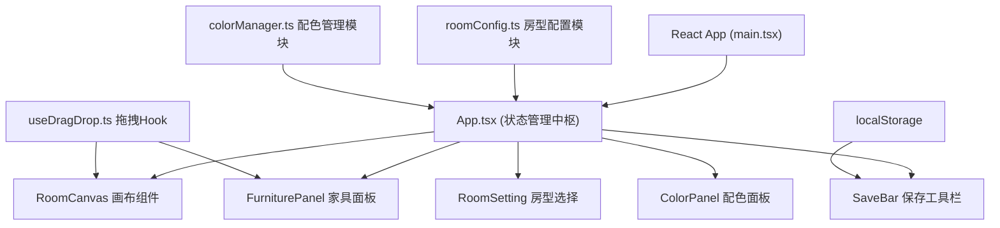

## 1. 架构设计



## 2. 技术描述

- **前端框架**：React 18 + TypeScript 5
- **构建工具**：Vite 5 + @vitejs/plugin-react
- **状态管理**：React useState/useReducer（组件内管理，无需额外状态库）
- **唯一ID生成**：uuid
- **样式方案**：原生CSS + CSS Modules（轻量级，避免额外依赖）
- **动画方案**：CSS Transition + transform/opacity（硬件加速，保证60fps）
- **存储方案**：localStorage（方案持久化）
- **缩略图生成**：html2canvas 或 SVG序列化（轻量方案）

## 3. 目录结构

```
auto3/
├── index.html
├── package.json
├── tsconfig.json
├── vite.config.js
└── src/
    ├── main.tsx              # ReactDOM挂载入口
    ├── App.tsx               # 主应用组件，状态管理
    ├── hooks/
    │   └── useDragDrop.ts    # 拖拽逻辑Hook（useDrag/useDrop）
    ├── modules/
    │   ├── roomConfig.ts     # 房型/网格/家具配置（getRoomLayout/getFurnitureList）
    │   └── colorManager.ts   # 墙面配色管理（useColor/applyColorTransition）
    └── components/
        ├── RoomCanvas.tsx    # 画布组件（房间+家具渲染）
        ├── FurniturePanel.tsx# 右侧家具库面板
        └── SaveBar.tsx       # 底部保存方案工具栏
```

## 4. 核心数据模型

### 4.1 TypeScript 类型定义

```typescript
// 房型类型
type RoomType = 'square' | 'rectangle' | 'lShape';
type FloorType = 'wood' | 'tile' | 'carpet';

// 墙体定义
interface Wall {
  id: string;
  x: number; y: number;
  width: number; height: number;
  color: string;
  name: string; // 'north' | 'south' | 'east' | 'west' | ...
}

// 房间布局
interface RoomLayout {
  type: RoomType;
  width: number;    // 画布内像素宽度（比例1:20）
  height: number;   // 画布内像素高度
  walls: Wall[];
  floorPattern: FloorType;
  windowPositions: { x: number; y: number; width: number }[];
}

// 家具定义
interface FurnitureItem {
  id: string;
  type: 'sofa' | 'table' | 'bookshelf' | 'nightstand' | 'lamp';
  name: string;
  width: number;    // 画布内像素宽度
  height: number;   // 画布内像素高度
  color: string;    // 家具块颜色
  x?: number;       // 放置后x坐标
  y?: number;       // 放置后y坐标
}

// 放置后的家具
interface PlacedFurniture extends FurnitureItem {
  instanceId: string;
  x: number;
  y: number;
}

// 配色方案
interface ColorScheme {
  walls: Record<string, string>; // wallId -> color
  schemeName: string;
}

// 保存的方案
interface SavedScheme {
  id: string;
  name: string;
  roomType: RoomType;
  floorType: FloorType;
  furniture: PlacedFurniture[];
  wallColors: Record<string, string>;
  thumbnail?: string; // base64缩略图
  createdAt: number;
}
```

## 5. 模块职责划分

### 5.1 roomConfig.ts
- `getRoomLayout(type: RoomType, floor: FloorType): RoomLayout` - 返回指定房型的墙体、窗户、地板配置
- `getFurnitureList(): FurnitureItem[]` - 返回可拖拽家具列表（含尺寸比例）
- 常量：GRID_SIZE=25, SCALE=1:20, 墙线颜色等配置

### 5.2 colorManager.ts
- `useColor(initialWalls: Wall[])` - Hook，管理墙体颜色状态
- `applyColorTransition(wallId: string, newColor: string)` - 执行0.3s颜色过渡动画
- `getSchemeName(wallColors: Record<string, string>): string` - 根据墙体配色返回风格名称
- 预设颜色列表 + 风格名称映射

### 5.3 useDragDrop.ts
- `useDrag(item: FurnitureItem)` - 绑定拖拽源（家具面板项）
- `useDrop(canvasRef, onDrop: (item, x, y) => void)` - 绑定放置目标（画布）
- 内部处理：鼠标跟随、坐标转换、网格吸附计算

## 6. 性能优化策略

1. **拖拽性能**：使用 pointerEvents + requestAnimationFrame，避免频繁 re-render
2. **动画性能**：仅使用 transform 和 opacity 属性，触发GPU合成层
3. **渲染优化**：家具列表使用 React.memo，避免不必要重渲染
4. **缩略图生成**：使用离屏Canvas或SVG序列化，异步生成不阻塞主线程
5. **localStorage读写**：防抖处理，避免频繁IO
