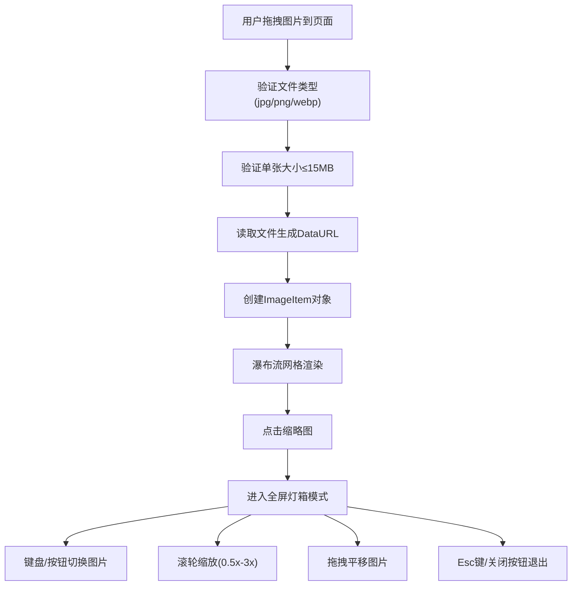

## 1. 产品概述

图览是一个浏览器端轻量级图片画廊与全屏查看工具，专为个人博客和作品集网站设计，解决传统图片展示单调、缺乏沉浸式浏览体验的问题。用户可从本地文件夹拖入多张图片，享受瀑布流浏览和全屏灯箱的沉浸式查看体验。

- **核心问题**：传统图片展示方式单调，用户无法快速切换和放大查看多张高清图片
- **目标用户**：个人博主、设计师、摄影师及需要展示作品集的创作者
- **产品价值**：提供零配置、即开即用的沉浸式图片浏览体验，全部前端逻辑，无需后端支持

## 2. 核心功能

### 2.1 用户角色
| 角色 | 注册方式 | 核心权限 |
|------|----------|----------|
| 普通用户 | 无需注册 | 拖拽上传图片、浏览瀑布流、全屏查看图片、缩放平移操作 |

### 2.2 功能模块
1. **图片拖入加载**：拖拽上传、文件验证、实时预览
2. **瀑布流网格展示**：三列自适应布局、卡片悬停效果、缩略图展示
3. **全屏灯箱浏览**：暗色遮罩、图片缩放、拖拽平移、键盘导航

### 2.3 页面详情
| 页面名称 | 模块名称 | 功能描述 |
|---------|----------|----------|
| 主页面 | 顶部标题栏 | 显示网站名称"图览"，简洁导航设计 |
| 主页面 | 拖放区域 | 半透明拖放提示，拖拽悬停时高亮反馈 |
| 主页面 | 瀑布流网格 | CSS columns 三列布局，卡片悬停动画效果 |
| 主页面 | 全屏灯箱 | 暗色遮罩，滚轮缩放，拖拽平移，键盘导航 |

## 3. 核心流程

用户从本地文件夹选择多张图片，拖拽到浏览器窗口任意位置，系统自动验证文件类型和大小，读取图片数据并生成缩略图，以瀑布流形式展示。用户点击任意缩略图进入全屏灯箱模式，可通过键盘左右键切换、滚轮缩放、拖拽平移查看图片细节，按 Esc 键退出全屏模式。



## 4. 用户界面设计

### 4.1 设计风格
- **主色调**：紫蓝色 #4f46e5
- **背景色**：浅灰 #f8f9fa
- **卡片背景**：白色 #ffffff
- **文字颜色**：深灰 #333333，次要文字 #666666
- **圆角**：12px（卡片），圆形（按钮）
- **阴影**：0 2px 8px rgba(0,0,0,0.08)，悬停时 0 6px 20px rgba(0,0,0,0.15)
- **字体**：Inter（400 常规，600 半粗）
- **布局风格**：卡片式瀑布流，顶部导航栏
- **动画风格**：0.25s ease 过渡，0.3s 淡入淡出

### 4.2 页面设计概述
| 页面名称 | 模块名称 | UI 元素 |
|---------|----------|---------|
| 主页面 | 顶部标题栏 | 高 56px，白色背景，底部 1px 浅灰边框，左侧"图览"文字 20px/600 |
| 主页面 | 拖放区域 | 宽 60%，高 200px，虚线边框 #aaa，背景 rgba(0,0,0,0.05)，悬停边框变 #4f46e5 |
| 主页面 | 瀑布流网格 | CSS columns 三列，列宽最小 280px，卡片间距 16px，圆角 12px |
| 主页面 | 图片卡片 | 白色背景，浅灰阴影，图片占满宽度，下方文件名 13px/#666，悬停放大 1.03x |
| 主页面 | 灯箱遮罩 | rgba(0,0,0,0.85)，0.3s 透明度渐变 |
| 主页面 | 灯箱导航 | 直径 48px 圆形按钮，背景 rgba(255,255,255,0.1)，悬停 0.3 |
| 主页面 | 灯箱关闭 | 右上角直径 40px 圆形按钮，X 图标，悬停背景加深 |

### 4.3 响应式设计
- **桌面端（≥768px）**：瀑布流三列，卡片间距 16px，灯箱导航按钮 48px
- **移动端（<768px）**：瀑布流两列，卡片间距 12px，灯箱导航按钮 36px
- **触摸优化**：确保按钮最小点击区域 40px，支持触摸滑动切换图片

### 4.4 性能指标
- 首次加载 30 张图片（≤50MB）：瀑布流渲染 ≤ 500ms
- 灯箱切换图片响应延迟 ≤ 100ms
- 图片数据全部在内存中管理，无后端依赖

## 5. 数据结构

### ImageItem 数据模型
```typescript
interface ImageItem {
  id: string;           // 唯一标识
  name: string;         // 文件名
  url: string;          // DataURL
  width: number;        // 原始宽度
  height: number;       // 原始高度
  size: number;         // 文件大小(字节)
  type: string;         // MIME类型
}
```
