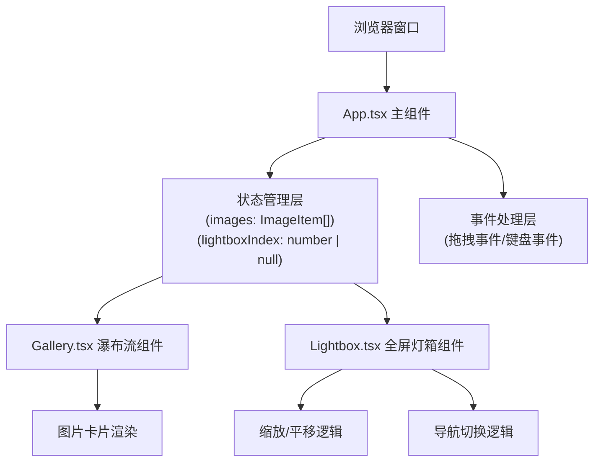

## 1. 架构设计

本项目为纯前端应用，无后端依赖，采用 React 组件化架构，数据全部在浏览器内存中管理。



## 2. 技术描述

- **前端框架**：React 18 + TypeScript
- **构建工具**：Vite 5
- **React 插件**：@vitejs/plugin-react
- **样式方案**：原生 CSS + CSS Variables + Media Queries（无第三方 CSS 框架）
- **状态管理**：React useState/useEffect（无需 Redux）
- **图片处理**：FileReader API + HTMLImageElement
- **动画方案**：CSS transitions + transforms

**文件结构与调用关系**：
```
auto32/
├── package.json          # 依赖与脚本配置
├── vite.config.js        # Vite 构建配置
├── tsconfig.json         # TypeScript 配置
├── index.html            # 入口 HTML
└── src/
    ├── App.tsx           # 主组件：管理全局状态，处理拖拽，传递给子组件
    │   ├── 定义 ImageItem 类型
    │   ├── 维护 images 状态数组
    │   ├── 维护 lightboxIndex 状态
    │   ├── 处理 onDragOver/onDrop 事件
    │   ├── 处理键盘事件
    │   └── 渲染 Gallery 和 Lightbox
    ├── Gallery.tsx       # 瀑布流组件：接收 ImageItem[]，渲染三列网格
    │   ├── 使用 CSS columns 布局
    │   ├── 渲染图片卡片
    │   └── 点击触发 onImageClick 回调
    ├── Lightbox.tsx      # 灯箱组件：接收当前索引，渲染全屏查看器
    │   ├── 渲染暗色遮罩
    │   ├── 处理滚轮缩放 (0.5x-3x)
    │   ├── 处理拖拽平移
    │   ├── 处理左右导航
    │   └── 处理 Esc 关闭
    └── index.css         # 全局样式与 CSS 变量
```

**数据流向**：
1. 用户拖拽文件 → App.tsx 接收 drop 事件 → FileReader 读取文件 → 创建 ImageItem → 更新 images 数组
2. images 数组 → 传递给 Gallery.tsx → 渲染瀑布流卡片
3. 用户点击卡片 → Gallery 触发 onImageClick(index) → App 更新 lightboxIndex
4. lightboxIndex → 传递给 Lightbox.tsx → 渲染对应图片
5. Lightbox 内切换/缩放 → 回调 App 更新状态 → 重新渲染

## 3. 核心类型定义

### ImageItem 接口
```typescript
interface ImageItem {
  id: string;
  name: string;
  url: string;
  width: number;
  height: number;
  size: number;
  type: string;
}
```

### Lightbox 状态
```typescript
interface LightboxState {
  scale: number;      // 缩放比例 0.5-3
  offsetX: number;    // X轴偏移
  offsetY: number;    // Y轴偏移
  isDragging: boolean;
  startX: number;
  startY: number;
}
```

## 4. 组件 Props 定义

### Gallery.tsx Props
```typescript
interface GalleryProps {
  images: ImageItem[];
  onImageClick: (index: number) => void;
}
```

### Lightbox.tsx Props
```typescript
interface LightboxProps {
  images: ImageItem[];
  currentIndex: number;
  onClose: () => void;
  onPrev: () => void;
  onNext: () => void;
}
```

## 5. 性能优化策略

1. **图片懒加载**：使用 loading="lazy" 属性延迟加载视口外图片
2. **FileReader 批量处理**：使用 Promise.all 并行读取多个文件
3. **React.memo**：Gallery 和 Lightbox 组件使用 memo 避免不必要重渲染
4. **事件防抖**：滚轮缩放事件使用 requestAnimationFrame 优化
5. **CSS 硬件加速**：transform 和 opacity 动画使用 GPU 加速
6. **内存管理**：组件卸载时 revokeObjectURL 释放内存

## 6. 浏览器兼容性

- Chrome/Edge 90+
- Firefox 88+
- Safari 14+
- 支持 FileReader API、CSS columns、CSS variables
