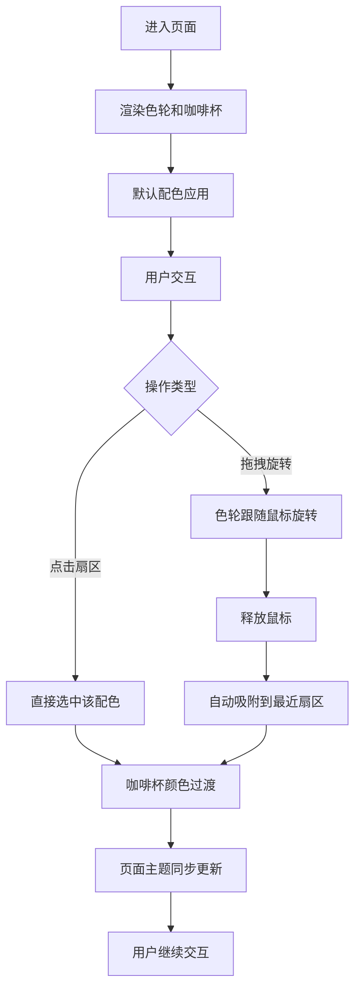

## 1. 产品概述

星巴克主题色轮盘是一个交互式配色预览工具，用户通过旋转色轮选择配色方案，实时预览应用在咖啡杯模型和整体页面主题上的效果。

- 核心目的：让用户直观体验星巴克绿色系衍生配色在实际场景中的应用效果，提供沉浸式主题预览体验
- 目标用户：设计师、品牌营销人员、星巴克爱好者

## 2. 核心功能

### 2.2 功能模块

1. **色轮交互区**：12扇区HSL配色轮盘，支持点击选择和拖拽旋转
2. **咖啡杯预览区**：3D CSS咖啡杯模型，实时展示选中配色
3. **主题实时切换**：页面背景、边框、按钮颜色随选中配色动态变化

### 2.3 页面详情

| 页面名称 | 模块名称 | 功能描述 |
|-----------|-------------|---------------------|
| 首页 | 色轮组件 | 直径320px圆形色轮，12个30度扇形，支持悬停弹出、点击选中、拖拽旋转 |
| 首页 | 预览面板 | 宽320px深色面板，3D咖啡杯自转，显示配色名称和十六进制色值 |
| 首页 | 主题指针 | 金色三角形指针，固定指向色轮外缘，标记当前选中扇区 |
| 首页 | 动态主题 | 背景色、按钮、边框随选中配色实时变化 |

## 3. 核心流程

用户进入页面 → 看到默认选中的配色应用在咖啡杯和页面上 → 点击色轮扇区直接选中配色 → 或拖拽色轮旋转 → 释放后自动吸附到最近扇区 → 咖啡杯颜色淡入淡出切换 → 页面主题同步更新

## 4. 用户界面设计

### 4.1 设计风格
- **主色调**：星巴克经典绿色 #006241，衍生12种HSL偏移配色
- **点缀色**：金色 #b8913c（指针、光晕、杯把），深绿色 #004d32（分隔线）
- **背景色**：动态变化，为选中扇区颜色的浅色版本（alpha 0.15）
- **字体**：无衬线字体，正文白色，标题16px
- **按钮风格**：透明背景+彩色边框，悬停时彩色填充，圆角设计

### 4.2 页面设计概述

| 页面名称 | 模块名称 | UI元素 |
|-----------|-------------|-------------|
| 首页 | 色轮组件 | 320px直径圆形，12个30度扇形，1px深绿分隔线，悬停弹出8px+亮度+15%，0.3s ease-out过渡，选中时金色光晕呼吸动画 |
| 首页 | 预览面板 | 320px宽，#1a1a1a背景，16px圆角，中央3D咖啡杯（上半部分配色色，下半部分#3a3a3a，金色杯把，12秒自转周期），顶部配色名称，底部十六进制色值 |
| 首页 | 布局结构 | 桌面端左右布局，色轮偏左，预览面板在右，顶部金色三角形指针 |
| 首页 | 动画效果 | 色轮旋转GPU加速，咖啡杯颜色0.6s ease-in-out淡入淡出，惯性缓冲0.2s |

### 4.3 响应式
- 桌面端优先，色轮和预览面板左右并排展示
- 移动端自动堆叠为上下布局，保持交互功能完整
- 触摸设备优化拖拽体验

### 4.4 3D场景指导
- **环境**：深色背景衬托咖啡杯模型
- **光照**：CSS 3D transform模拟，通过多层元素叠加营造立体感
- **相机设置**：固定透视视角，咖啡杯缓慢Y轴自转
- **交互**：选中配色时杯身颜色先淡出再淡入
- **性能**：所有动画使用transform和opacity属性，确保60fps帧率
