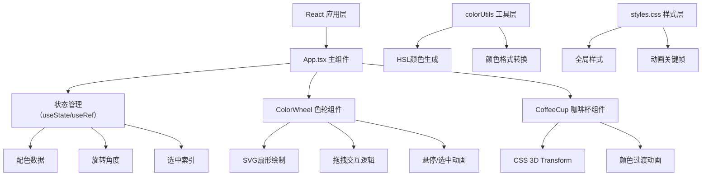
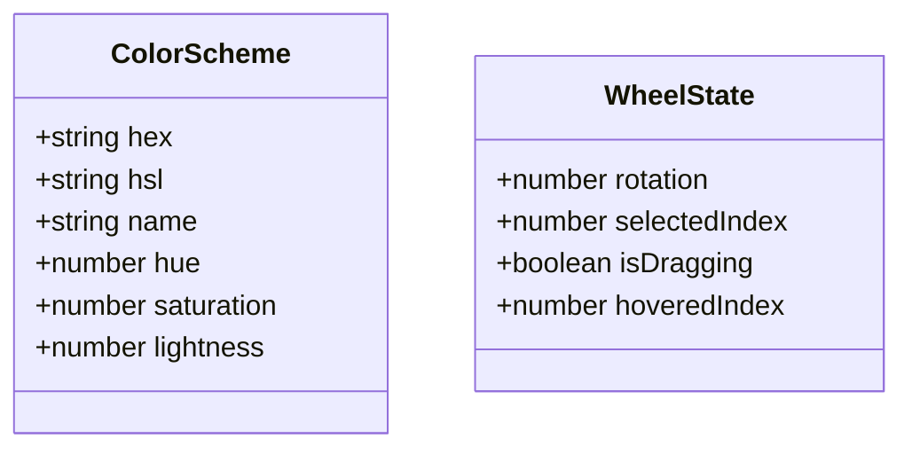

## 1. 架构设计



## 2. 技术描述

- **前端框架**：React@18 + TypeScript
- **构建工具**：Vite@5 + @vitejs/plugin-react
- **状态管理**：React Hooks (useState, useRef, useEffect, useCallback)
- **样式方案**：原生CSS + CSS变量，GPU加速动画
- **图形绘制**：SVG实现色轮扇形
- **3D效果**：CSS 3D Transform模拟咖啡杯旋转
- **性能优化**：transform/opacity动画，requestAnimationFrame处理拖拽

## 3. 路由定义

| 路由 | 用途 |
|-------|---------|
| / | 首页 - 色轮和咖啡杯预览主界面 |

## 6. 数据模型

### 6.1 数据模型定义



### 6.2 数据结构定义

```typescript
interface ColorScheme {
  hex: string;
  name: string;
  h: number;
  s: number;
  l: number;
}

interface WheelState {
  rotation: number;
  selectedIndex: number;
  isDragging: boolean;
  velocity: number;
}
```

## 7. 核心文件结构

```
.
├── package.json          # 项目依赖和脚本
├── index.html            # 入口HTML
├── tsconfig.json         # TypeScript配置
├── vite.config.js        # Vite配置
└── src/
    ├── App.tsx           # 主组件，状态管理
    ├── ColorWheel.tsx    # 色轮组件
    ├── CoffeeCup.tsx     # 咖啡杯组件
    ├── colorUtils.ts     # 颜色工具函数
    └── styles.css        # 全局样式
```

## 8. 性能要求

- 色轮旋转帧率：60fps
- 单次拖拽响应延迟：≤50ms
- 所有动画使用transform和opacity属性触发GPU加速
- 使用will-change优化动画性能
- 拖拽使用requestAnimationFrame确保平滑
