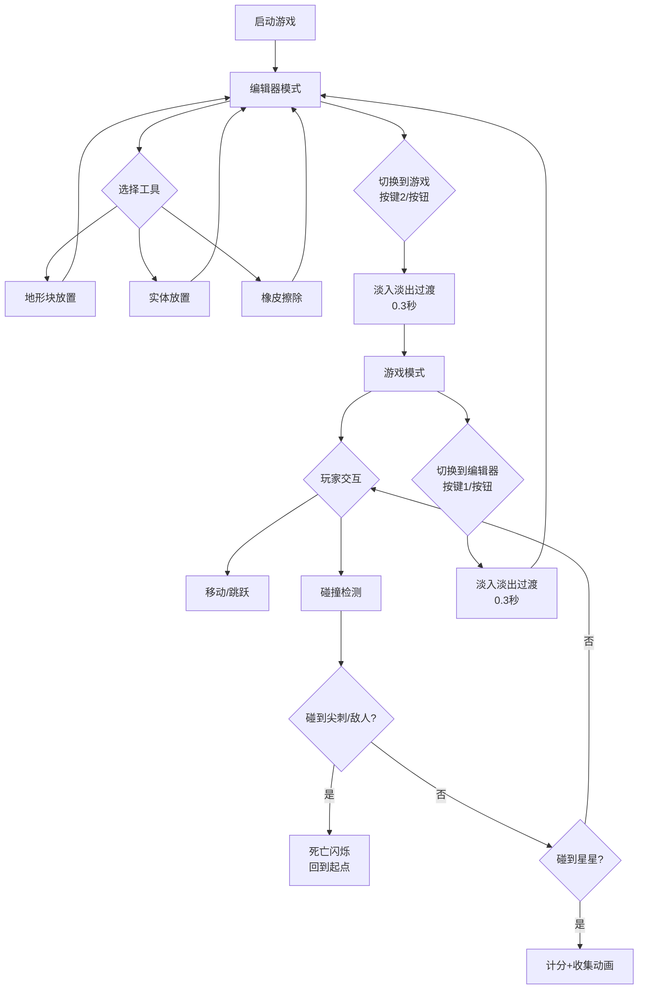

## 1. 产品概述

内置关卡编辑器的复古像素风格平台跳跃游戏原型，支持在编辑器与游戏模式间无缝切换，实时修改地形/敌人/收集品并立即试玩验证。目标用户为独立游戏开发者和关卡设计师，解决传统编辑器与游戏引擎分离导致的设计效率低下问题。

## 2. 核心功能

### 2.1 功能模块

1. **关卡编辑器**：20x15网格画布，地形块放置/擦除，实体放置，工具栏
2. **游戏模式**：玩家角色控制，物理模拟，碰撞检测，计分系统
3. **模式切换**：快捷键/按钮切换，淡入淡出过渡，实时数据同步

### 2.2 页面详情

| 页面名称 | 模块名称 | 功能描述 |
|---------|---------|---------|
| 编辑器视图 | 网格画布 | 20x15网格（40x40px/格），点击放置/擦除地形块，悬停高亮 |
| 编辑器视图 | 工具栏 | 右侧20%竖排按钮：砖块、草地、尖刺、平台、敌人、收集品、橡皮擦 |
| 编辑器视图 | 底部切换栏 | 底部中央"编辑"/"游玩"按钮，快捷键1/2切换 |
| 游戏视图 | 游戏画布 | 全屏Canvas，玩家角色操控，物理引擎，碰撞检测 |
| 游戏视图 | HUD | 右上角分数显示（#FFD700，20px），左上角生命/状态 |

## 3. 核心流程

用户打开页面 → 默认进入编辑器模式 → 在网格上放置地形和实体 → 点击"游玩"或按2键 → 淡入淡出过渡 → 进入游戏模式 → 操控角色试玩 → 按编辑或1键 → 淡入淡出过渡 → 返回编辑器继续修改 → 循环



## 4. 界面设计

### 4.1 设计风格

- **主色调**：砖红#8B4513、土黄#DAA520
- **背景色**：深灰#2F2F2F
- **字体**：monospace加粗，黑白像素风
- **按钮**：1px像素边框，悬停发光+向上位移2px（0.1秒）
- **布局**：编辑器左80%网格+右20%工具栏，游戏全屏覆盖

### 4.2 界面设计概述

| 页面名称 | 模块名称 | UI元素 |
|---------|---------|--------|
| 编辑器 | 网格画布 | 深灰背景，网格线，地形块纹理填充，悬停黄色半透明高亮 |
| 编辑器 | 工具栏 | 竖排48x48px按钮，像素边框，悬停发光，激活态土黄背景 |
| 编辑器 | 底部切换栏 | 两个30px高按钮，"编辑"/"游玩"，激活态土黄背景 |
| 游戏 | HUD | 右上角分数#FFD700 20px，像素风格 |
| 游戏 | 角色 | 16x32px像素小人，蓝色上衣#4169E1 |
| 游戏 | 敌人 | 红色史莱姆，行走动画 |
| 游戏 | 收集品 | 金色星星，旋转动画+光效 |

### 4.3 响应式适配

- 1280x720及以上：固定尺寸（800x600画布）
- 小于1280x720：整体缩放至75%，保持比例居中

### 4.4 数据流向

```
editor.ts ←→ main.ts → renderer.ts
(关卡数据)  (游戏状态)  (渲染指令)

editor.ts: 监听用户操作 → 生成/修改关卡数据 → 传递给main.ts
main.ts:   接收关卡数据 → 初始化物理世界 → 每帧更新逻辑 → 输出渲染指令给renderer.ts
renderer.ts: 接收渲染指令 → 绘制背景/地形/实体/粒子 → 输出到Canvas
```
