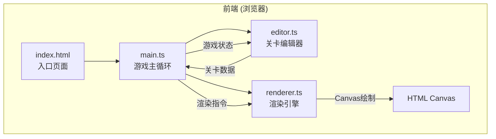

## 1. 架构设计



## 2. 技术说明

- **前端**：TypeScript + HTML Canvas（无框架，纯Canvas 2D渲染）
- **构建工具**：Vite + TypeScript
- **后端**：无（纯前端运行）
- **状态管理**：模块间直接函数调用和数据传递

## 3. 文件结构与职责

| 文件 | 职责 | 数据流向 |
|------|------|---------|
| package.json | 项目依赖和脚本 | - |
| vite.config.js | Vite构建配置 | - |
| tsconfig.json | TypeScript配置 | - |
| index.html | 入口页面，Canvas和UI容器 | - |
| src/main.ts | 游戏主循环、状态管理、物理引擎 | 接收editor关卡数据→初始化→更新→输出渲染指令 |
| src/editor.ts | 编辑器UI、交互逻辑、关卡数据管理 | 监听操作→修改关卡数据→传递给main |
| src/renderer.ts | Canvas渲染引擎 | 接收渲染指令→绘制→输出到Canvas |

## 4. 核心数据结构

```typescript
type TerrainType = 'brick' | 'grass' | 'spike' | 'platform';

interface Tile {
  x: number;
  y: number;
  type: TerrainType;
}

interface Enemy {
  x: number;
  y: number;
  patrolLeft: number;
  patrolRight: number;
  speed: number;
  direction: 1 | -1;
}

interface Collectible {
  x: number;
  y: number;
  collected: boolean;
  rotation: number;
}

interface LevelData {
  tiles: Tile[];
  enemies: Enemy[];
  collectibles: Collectible[];
  spawnPoint: { x: number; y: number };
}

interface Player {
  x: number;
  y: number;
  vx: number;
  vy: number;
  width: number;
  height: number;
  isDead: boolean;
  deathTimer: number;
}

interface Particle {
  x: number;
  y: number;
  vx: number;
  vy: number;
  life: number;
  maxLife: number;
  color: string;
  size: number;
}

interface GameState {
  mode: 'editor' | 'game';
  level: LevelData;
  player: Player;
  score: number;
  particles: Particle[];
  transitionAlpha: number;
  isTransitioning: boolean;
  targetMode: 'editor' | 'game';
}
```

## 5. 物理系统

- **重力**：0.5px/帧²
- **跳跃速度**：8px/帧
- **移动速度**：3px/帧
- **碰撞检测**：AABB矩形碰撞
- **地形碰撞**：逐格检测，区分实心块和尖刺

## 6. 性能策略

- 编辑模式：网格绘制响应 < 50ms
- 游戏模式：稳定60FPS（800x600分辨率）
- 粒子数量动态调整：正常10个，帧率下降时降至5个
- 使用requestAnimationFrame驱动主循环
- 离屏Canvas缓存静态地形
